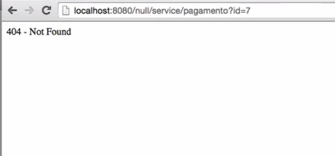

# Java EE parte 2: Sua loja online com HTML, REST e Cache


### Links
- [Melhorando a UX da Administração](#anc1)
- [Carrinho de Compras com HTML e JSF](#anc2)
- [Salvando a Compra com JSON](#anc3)
- [Usando serviços REST e requisições Assíncronas](#anc4)
- [Conhecendo e Utilizando Cache no JavaEE](#anc5)

- [Site](http://localhost:8080/casadocodigo/index.xhtml)
##

<a name="anc1"></a>

## Melhorando a UX da Administração 
- [Bootstrap](https://getbootstrap.com/docs/3.4/getting-started/)
- Descompacte e dentro da pasta descompactada você deve estar vendo css, fonts e js. Copei o conteúdo da pasta css baixada para dentro da nossa pasta src/main/webapp/resources/css. Faça o mesmo procedimento para a pasta js que também já temos em nosso projeto, dentro de src/main/webapp/resources/js. * Já a pasta fonts que não temos ainda no projeto, copie a pasta inteira para src/main/webapp/resources.
- Adicionando o boostrap via jsf
```
<h:head>
    <h:outputStylesheet library="css" name="bootstrap.min.css" />
</h:head>

```

<a name="anc2"></a>

## Carrinho de Compras com HTML e JSF
- Nesse botão de comprar, vamos chamar nosso Bean para o método add. Porém usando o HTML como sendo reconhecido pelo JSF, adicionando o jsf:action conforme abaixo.

- É importante que seja passado para o método o id do Livro, para que dessa forma seja possível recuperar a informação do livro que se deseja adicionar no carrinho:

```
jsf:action="#{carrinhoComprasBean.add(livroDetalheBean.id)}"
```

> Qual o propósito final do Passthrough?
- Permitir que componentes JSF possam usar atributos do HTML.

<a name="anc3"></a>

## Salvando a Compra com JSON
- Como o CDI vai saber quais itens estão no carrinho? itens.quantidade é um array, então precisamos de um índice que nos é entregue por meio do **varStatus**
```
<ui:repeat value="#{carrinhoCompras.item}" var="carrinhoItem" varStatus="loop">
```
- Desse modo conseguimos ter o status (índice) atual em que o loop está iterado, logo:
```
<input class="formularioDoCarrinho-item-quantidade" type="number" min="0" jsf:value="#{carrinhoCompras.itens[loop.index].quantidade}" />
```
-  vamos transformar os itens em JSON. Para isso será utilizada uma API disponível no [Java EE 7](https://javaee.github.io/jsonp/)

- Para que seja possível acessar as APIs enquanto desenvolvemos (o Wildfly possui uma implementação para quando formos executar o projeto), adicione a seguinte dependência no pom.xml:

```
<dependency>
    <groupId>javax</groupId>
    <artifactId>javaee-api</artifactId>
    <version>7.0</version>
    <scope>provided</scope>
</dependency>
```

- O primeiro passo é criar um JsonArrayBuilder por meio da chamada Json.createArrayBuilder().

- Em seguida é necessário iterar pelos itens do carrinho e adicioná-los ao builder. Para cada item do carrinho criamos um objeto JSON, e adicionamos os valores por meio de chamadas ao método add().

- Por fim construímos o builder por meio da chamada ao método build() e convertemos para String por meio da chamada ao toString():

```
private String toJson() {
    JsonArrayBuilder builder = Json.createArrayBuilder();

    for (CarrinhoItem item : itens) {
        builder.add(Json.createObjectBuilder()
            .add("titulo", item.getLivro().getTitulo())
            .add("preco", item.getLivro().getPreco())
            .add("quantidade", item.getQuantidade())
            .add("total", getTotal(item))
        );
    }

    return builder.build().toString();
}
```

> Qual atributo da tag ui:repeat podemos utilizar para obter informações sobre a iteração, como o índice?
- [varStatus](https://docs.oracle.com/javaee/7/javaserver-faces-2-2/vdldocs-facelets/ui/repeat.html)

<a name="anc4"></a>

## Usando serviços REST e requisições Assíncronas

### Fazendo a requisição para um servidor externo
- Primeiro precisamos de um cliente que faça tal requisição. Então, no CarrinhoCompras.java, dentro do finalizar()
- Vamos pegar esse client do JAX-RS e realizar o pagamento:
- Já já vamos trabalhar em cima desse Pagamento. Agora iremos dizer qual o target dele, que seria o endereço que utilizamos no DHC:
- A Classe "Entity" do JAX-RS é quem faz a transformação de um determinado objeto para Json para assim ser enviado:
- para que possamos fazer a ligação do alvo (target) com o Json, precisamos de uma requisição (request):

```
Client client = ClientBuilder.newClient();
Pagamento pagamento = new Pagamento(getTotal());
String target = "http://book-payment.herokuapp.com/payment";
Entity<Pagamento> json = Entity.json(pagamento);
WebTarget webTarget = client.target(target);
Builder request = webTarget.request();
request.post(json, String.class);
Builder request = webtarget.request();
String response = request.post(json, String.class);

```
- Refatorando

```
public String pagar(BigDecimal total) {
    Pagamento pagamento = new Pagamento(total);
    String target = "http://book-payment.herokuapp.com/payment";
    Client client = ClientBuilder.newClient();
    return client.target(target).request().post(Entity.json(pagamento), String.class);
}
```

- Quando clicamos em "Finalizar compra" após inserir os dados do cliente, as informações são enviadas para o banco de dados, a requisição é feita em um sistema externo de pagamento e retornando para nosso sistema. Este é um fluxo ao qual damos o nome de síncrono. A ideia aqui será transformá-lo em assíncrono.

- Acontece que o JSF não suporta esse tipo de fluxo, a não ser que criemos uma nova *Thread utilizando a criação de objeto dinâmico do Java 8:

- Essa solução é bem primitiva então não vamos utilizá-la. Em vez disso, façamos algumas alterações no código:
- A parte que retiramos do código irá para o CheckoutBean.java:
- o service/pagamento não será uma página do JSF. Não é pagamento.xhtml e o JSF só trata chamadas de um outro serviço se este for gerenciado pelo servlet do próprio JSF. Logo, o que queremos fazer de fato, é pegar o response, tratá-lo e enviá-lo para outro local. Para isso podemos usar o facesContext:
- Mas iremos utilizar o JSF para que ele possa nos entregar o response:
- O próximo passo é dizer para o response qual a URL:
- Para que o navegador não apresente para o usuário essa URL com o Id, podemos utilizar um código:
- O código 307 vai nos permitir fazer um redirect temporário mantendo o método que foi invocado.

- Apesar de não termos o serviço que atende a requisição service/pagamento - ficará para um segundo momento - vamos testar essa chamada de serviço. Passando por todo o processo de compra novamente caimos nessa tela:



- Perceba que se temos ali na URL id=7, provavelmente existirá ids com numeração mais baixa, por exemplo. Ou seja, podemos modificar a URL com outros ids e descobrir informações de pagamentos de outros usuários!

- Para resolver este problema de segurança podemos utilizar outro tipo de identificador, o uuid (Universally Unique Identifier):

- O UUID será gerado no momento em que pedimos para que o objeto compra persista. Existe uma Classe "UUID" no Java:
- Dessa forma será gerado o UUID de maneira aleatória e transformá-lo em String.

- Agora precsamos informar para o Entity Manager que, antes de persistir, é necessário chamar o método que acabamos de criar:

```
@PrePersist
public void createUUID() {
    this.uuid = UUID.randomUUID().toString();
}
```

- Isso é feito através da API de callback do Entity Manager, a qual possui outras diversas anotations.

- Testando e passando novamento por todo o processo de finalizar compra, temos o UUID na URL:

### COnfigurando o JAX-RS
- O @ApplicationPath indica o caminho que será atendido. E em finalizar(), não precisamos chamar manualmente o 307:

### Em Pagamento service
- Primeira parte, enviando o total para pagamentoGateway
- Enviar de onde estamos, no caso tela de "checkout" para o index
    - *fromPath* : de qual path vai enviar
- *seeOther* : para outra URI
- Isso tudo faz, pega a API do JAX-RS e cria uma resposta

```
@POST
public Response pagar(@QueryParam("uuid") String uuid) {
    System.out.println("Aqui");
    System.out.println(uuid);
    
    Compra compra = compraDao.buscaPorUuid(uuid);
    pagamentoGateway.pagar(compra.getTotal());
    
    URI reposnseUri = UriBuilder.fromPath("http://localhost:8080"+
            context.getContextPath()+"/index.xhtml")
            .queryParam("msg","Compra realizada com sucesso!")
            .build();
    Response response = Response.seeOther(reposnseUri).build();
            
    return response;
}
```

<a name="anc5"></a>

## Conhecendo e Utilizando Cache no JavaEE