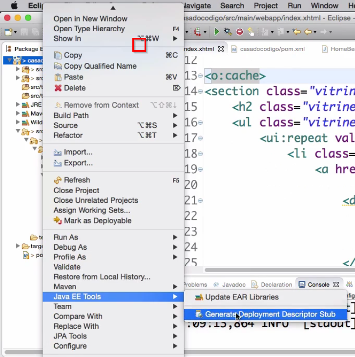

# Java EE parte 2: Sua loja online com HTML, REST e Cache


### Links
- [Melhorando a UX da Administração](#anc1)
- [Carrinho de Compras com HTML e JSF](#anc2)
- [Salvando a Compra com JSON](#anc3)
- [Usando serviços REST e requisições Assíncronas](#anc4)
- [Conhecendo e Utilizando Cache no JavaEE](#anc5)

- [Site](http://localhost:8080/casadocodigo/index.xhtml)
##

<a name="anc1"></a>

## Melhorando a UX da Administração 
- [Bootstrap](https://getbootstrap.com/docs/3.4/getting-started/)
- Descompacte e dentro da pasta descompactada você deve estar vendo css, fonts e js. Copei o conteúdo da pasta css baixada para dentro da nossa pasta src/main/webapp/resources/css. Faça o mesmo procedimento para a pasta js que também já temos em nosso projeto, dentro de src/main/webapp/resources/js. * Já a pasta fonts que não temos ainda no projeto, copie a pasta inteira para src/main/webapp/resources.
- Adicionando o boostrap via jsf
```
<h:head>
    <h:outputStylesheet library="css" name="bootstrap.min.css" />
</h:head>

```

<a name="anc2"></a>

## Carrinho de Compras com HTML e JSF
- Nesse botão de comprar, vamos chamar nosso Bean para o método add. Porém usando o HTML como sendo reconhecido pelo JSF, adicionando o jsf:action conforme abaixo.

- É importante que seja passado para o método o id do Livro, para que dessa forma seja possível recuperar a informação do livro que se deseja adicionar no carrinho:

```
jsf:action="#{carrinhoComprasBean.add(livroDetalheBean.id)}"
```

> Qual o propósito final do Passthrough?
- Permitir que componentes JSF possam usar atributos do HTML.

<a name="anc3"></a>

## Salvando a Compra com JSON
- Como o CDI vai saber quais itens estão no carrinho? itens.quantidade é um array, então precisamos de um índice que nos é entregue por meio do **varStatus**
```
<ui:repeat value="#{carrinhoCompras.item}" var="carrinhoItem" varStatus="loop">
```
- Desse modo conseguimos ter o status (índice) atual em que o loop está iterado, logo:
```
<input class="formularioDoCarrinho-item-quantidade" type="number" min="0" jsf:value="#{carrinhoCompras.itens[loop.index].quantidade}" />
```
-  vamos transformar os itens em JSON. Para isso será utilizada uma API disponível no [Java EE 7](https://javaee.github.io/jsonp/)

- Para que seja possível acessar as APIs enquanto desenvolvemos (o Wildfly possui uma implementação para quando formos executar o projeto), adicione a seguinte dependência no pom.xml:

```
<dependency>
    <groupId>javax</groupId>
    <artifactId>javaee-api</artifactId>
    <version>7.0</version>
    <scope>provided</scope>
</dependency>
```

- O primeiro passo é criar um JsonArrayBuilder por meio da chamada Json.createArrayBuilder().

- Em seguida é necessário iterar pelos itens do carrinho e adicioná-los ao builder. Para cada item do carrinho criamos um objeto JSON, e adicionamos os valores por meio de chamadas ao método add().

- Por fim construímos o builder por meio da chamada ao método build() e convertemos para String por meio da chamada ao toString():

```
private String toJson() {
    JsonArrayBuilder builder = Json.createArrayBuilder();

    for (CarrinhoItem item : itens) {
        builder.add(Json.createObjectBuilder()
            .add("titulo", item.getLivro().getTitulo())
            .add("preco", item.getLivro().getPreco())
            .add("quantidade", item.getQuantidade())
            .add("total", getTotal(item))
        );
    }

    return builder.build().toString();
}
```

> Qual atributo da tag ui:repeat podemos utilizar para obter informações sobre a iteração, como o índice?
- [varStatus](https://docs.oracle.com/javaee/7/javaserver-faces-2-2/vdldocs-facelets/ui/repeat.html)

<a name="anc4"></a>

## Usando serviços REST e requisições Assíncronas

### Fazendo a requisição para um servidor externo
- Primeiro precisamos de um cliente que faça tal requisição. Então, no CarrinhoCompras.java, dentro do finalizar()
- Vamos pegar esse client do JAX-RS e realizar o pagamento:
- Já já vamos trabalhar em cima desse Pagamento. Agora iremos dizer qual o target dele, que seria o endereço que utilizamos no DHC:
- A Classe "Entity" do JAX-RS é quem faz a transformação de um determinado objeto para Json para assim ser enviado:
- para que possamos fazer a ligação do alvo (target) com o Json, precisamos de uma requisição (request):

```
Client client = ClientBuilder.newClient();
Pagamento pagamento = new Pagamento(getTotal());
String target = "http://book-payment.herokuapp.com/payment";
Entity<Pagamento> json = Entity.json(pagamento);
WebTarget webTarget = client.target(target);
Builder request = webTarget.request();
request.post(json, String.class);
Builder request = webtarget.request();
String response = request.post(json, String.class);

```
- Refatorando

```
public String pagar(BigDecimal total) {
    Pagamento pagamento = new Pagamento(total);
    String target = "http://book-payment.herokuapp.com/payment";
    Client client = ClientBuilder.newClient();
    return client.target(target).request().post(Entity.json(pagamento), String.class);
}
```

- Quando clicamos em "Finalizar compra" após inserir os dados do cliente, as informações são enviadas para o banco de dados, a requisição é feita em um sistema externo de pagamento e retornando para nosso sistema. Este é um fluxo ao qual damos o nome de síncrono. A ideia aqui será transformá-lo em assíncrono.

- Acontece que o JSF não suporta esse tipo de fluxo, a não ser que criemos uma nova *Thread utilizando a criação de objeto dinâmico do Java 8:

- Essa solução é bem primitiva então não vamos utilizá-la. Em vez disso, façamos algumas alterações no código:
- A parte que retiramos do código irá para o CheckoutBean.java:
- o service/pagamento não será uma página do JSF. Não é pagamento.xhtml e o JSF só trata chamadas de um outro serviço se este for gerenciado pelo servlet do próprio JSF. Logo, o que queremos fazer de fato, é pegar o response, tratá-lo e enviá-lo para outro local. Para isso podemos usar o facesContext:
- Mas iremos utilizar o JSF para que ele possa nos entregar o response:
- O próximo passo é dizer para o response qual a URL:
- Para que o navegador não apresente para o usuário essa URL com o Id, podemos utilizar um código:
- O código 307 vai nos permitir fazer um redirect temporário mantendo o método que foi invocado.

- Apesar de não termos o serviço que atende a requisição service/pagamento - ficará para um segundo momento - vamos testar essa chamada de serviço. Passando por todo o processo de compra novamente caimos nessa tela:


- Perceba que se temos ali na URL id=7, provavelmente existirá ids com numeração mais baixa, por exemplo. Ou seja, podemos modificar a URL com outros ids e descobrir informações de pagamentos de outros usuários!

- Para resolver este problema de segurança podemos utilizar outro tipo de identificador, o uuid (Universally Unique Identifier):

- O UUID será gerado no momento em que pedimos para que o objeto compra persista. Existe uma Classe "UUID" no Java:
- Dessa forma será gerado o UUID de maneira aleatória e transformá-lo em String.

- Agora precsamos informar para o Entity Manager que, antes de persistir, é necessário chamar o método que acabamos de criar:

```
@PrePersist
public void createUUID() {
    this.uuid = UUID.randomUUID().toString();
}
```

- Isso é feito através da API de callback do Entity Manager, a qual possui outras diversas anotations.

- Testando e passando novamento por todo o processo de finalizar compra, temos o UUID na URL:

### COnfigurando o JAX-RS
- O @ApplicationPath indica o caminho que será atendido. E em finalizar(), não precisamos chamar manualmente o 307:

### Em Pagamento service
- Primeira parte, enviando o total para pagamentoGateway
- Enviar de onde estamos, no caso tela de "checkout" para o index
    - *fromPath* : de qual path vai enviar
- *seeOther* : para outra URI
- Isso tudo faz, pega a API do JAX-RS e cria uma resposta

```
@POST
public Response pagar(@QueryParam("uuid") String uuid) {
    System.out.println("Aqui");
    System.out.println(uuid);
    
    Compra compra = compraDao.buscaPorUuid(uuid);
    pagamentoGateway.pagar(compra.getTotal());
    
    URI reposnseUri = UriBuilder.fromPath("http://localhost:8080"+
            context.getContextPath()+"/index.xhtml")
            .queryParam("msg","Compra realizada com sucesso!")
            .build();
    Response response = Response.seeOther(reposnseUri).build();
            
    return response;
}
```

- Veremos como deixar o service executando de forma assíncrona! Para isso usaremos a API de assíncrono do Java EE 7. Ele já disponibiliza um objeto chamado Executor Service que nos deixará executar por meio de um pool de conexões.
- O 50 é a quantidade de Threads que queremos que sejam criadas pelo executor. Ele permite criar esse Pool de threads autogerenciável pelo Java.
```
private static ExecutorService executor = Executors.newFixedThreadPool(50);
```
- Porém, por si só, o executor não faz toda essa mágica. Precisamos chamá-lo dentro do método pagar() com um método submit() com um Runnable:
- Foi criado automaticamente o método run() através da classe anônima. No java 8 podemos fazer tudo isso através de Lambda Expressions:
- Agora que essa execução está sendo feita de forma assíncrona, precisamos notificar o servidor de que a requisição acabou. Fazemos isso atrave´s de um novo objeto que o método pagar()recebe como parâmetro: **@Suspended final AsyncResponse ar**
- Estamos integrando, de forma automática, a API de ocorrência do Java com o JAX-RS. Temos que dizer também que a Response pode controlar a suspenção:
- O **@Suspended** notifica o sevidor que tota a execução desse método deve ser feita em um contexto assíncrono, ou seja, vai liberar o servidor para executar outras tarefas. Depois de ser feita toda a requisição é chamado o ar.resume(response).


```
@POST
public void pagar(@Suspended final AsyncResponse ar,@QueryParam("uuid") String uuid) {
    Compra compra = compraDao.buscaPorUuid(uuid);
    executor.submit(() -> {
        try {
            pagamentoGateway.pagar(compra.getTotal());
            URI reposnseUri = UriBuilder
                    .fromPath("http://localhost:8080" + context.getContextPath() + "/index.xhtml")
                    .queryParam("msg", "Compra realizada com sucesso!").build();
            Response response = Response.seeOther(reposnseUri).build();
            ar.resume(response);
        } catch (Exception e) {
            ar.resume(new WebApplicationException(e));
        }
    });
}
```

<a name="anc5"></a>

## Conhecendo e Utilizando Cache no JavaEE

### Cacheando a aplicação
- Em LivroDao.java temos dois métodos, o ultimosLancamentos() e o demaisLivros(). Podemos fazer com que as queries vão para o cache, usando o setHint().

```
public List<Livro> ultimosLancamentos() {
    String jpql = "select l from Livro l order by l.id desc";
    return manager.createQuery(jpql, Livro.class)
    .setMaxResults(5)
    .setHint(QueryHintsHINT_CACHEABLE, true).getResultList();
}
```
- O JPA é o responsável por pegar os dados na nossa aplicação, mas a especificação é o Hibernate e ele precisa saber que queremos fazer cache desses dados na memória da aplicação. Por isso pedimos para que o resultado da query seja mantido. A Classe "QueryHints" não foi carregada, devemos então fazer isso no pom.xml colocando mais algumas dependências:

```
<dependency>
    <groupId>org.hibernate.javax.persistence</groupId>
    <artifactId>hibernate-jpa-2.1-api</artifactId>
    <version>1.0.0.Draft-16</version>
    <scope>provided</scope>
</dependency>

<dependency>
    <groupId>javax.transaction-api</groupId>
    <artifactId>javax.transaction-api</artifactId>
    <version>1.2</version>
    <scope>provided</scope>
</dependency>

<dependency>
    <groupId>org.hibernate</groupId>
    <artifactId>hibernate-core</artifactId>
    <version>4.3.10.Final</version>
    <scope>provided</scope>
</dependency>

<dependency>
    <groupId>org.hibernate</groupId>
    <artifactId>hibernate-entitymanager</artifactId>
    <version>4.3.10.Final</version>
    <scope>provided</scope>
</dependency>
```
- Todas as APIs que iremos carregar em cima das dependências já as temos de fato na aplicação porque o Wildfly já faz isso.

- Fazendo um teste, ainda vemos duas queries por acesso, o que queremos será sempre duas queries não importando quantos acessos existam. O Hibernate precisa que digamos explicitamente que queremos fazer cache com as queries.

- Vamos abrir o persistence.xml, que é onde fazemos as configurações de cache, e falar para o Hibernate que queremos fazer cache dessas queries, dentro de uma property:
- Dessa forma usaremos o cache para query. Mas o JPA também precisa saber que queremos cachear, então usamos a opção shared-cache-mode habilitando seletivamente:

``````
<shared-cache-mode>ENABLE_SELECTIVE</shared-cache-mode>
<properties>
    <property name="hibernate.cache.use_query_cache" value="true"/>
    //...
</property>
``````
- Para resolver esse problema precisamos falar que as entidades serão cacheadas, ou seja, os Livros. Logo, abrimos o Livro.java e anotamos a Classe "Livro" com @Cacheable:
```
@Entity
@Cacheable
public class Livro {
    //...
}
```

- Ok, conseguimos cachear os livros na página inicial. Porém ao entrarmos na página de detalhes de um livro, percebemos que é feito um SELECT fazendo join de autor. O livro não foi carregado novamente, mas o autor sim.

- Mudando completamente de assunto: habilitamos no video anterior, para o JPA, um shared-cache-mode marcado como ENABLE_SELECTIVE porque quisemos selecionar quem queremos cachear. Acontece que nós queremos cachear todas as entidades do sistema, logo:

```
<shared-cache-mode>ALL</shared-cache-mode>
```
- Dessa forma não precisamos ficar marcando uma a uma as entidades com o @Cacheable. Mas será que é uma boa? E se alguma entidade não pode ser cacheada por ter um tempo de atualização maior e necessita ter o dado sempre "fresco" (fresh data) do banco de dados?


### Configurações de Cache
- Outra propriedade bastante usada no cache-mode é o DISABLE_SELECTIVE a qual indica que todas as entidades usadas entraram no cache. As que não quisermos que entrem devemos marcá-las:
```
@Cacheable(false)
```
- Isso é muito útil quando queremos que o padrão seja todas as entidades cacheadas. Mas deixaremos como padrão o ENABLE_SELECTIVE, para de fato larcarmos explicitamente o que queremos cachear.

- Outra possibilidade para a qual devemos ficar atentos é que o framework precisa suportar o cache. Por exemplo, o Hibernate implementa a JPA, e ele suporta cache desde sua segunda versão. Porém se estivermos usando um framework que não suporta cache, não adianta o JPA suportar. Ou seja, tenhamos cuidado na escolha do framework. O Wildfly possui o infinispan que já faz o cache e se comunica com o Hibernate.

- Podemos passar para o infinispan quanto tempo queremos que ele guarde as entidades, dentro das propriedades:
```
<proprerty name="hibernate.cache.infinispan.entity.expiration.lifespan" value="900000"/>
```
- Colocamos 900000 milisegundos, ou seja, as entidades viverão por 15 minutos no cache. Depois desse tempo será feito um novo SELECT e atualizará a entidade.

- Outra propriedade importante é a quantidade máxima de tempo que o cache ficará inativo, sem uso:
```
<property name="hibernate.cache.infinispan.entity.expiration.max_idle" value="300000"/>
```
- Podemos acessar a documentação do JBoss para ver outras configurações do infinispan.

### Limpando o cache
- Com o getCache()conseguimos obter um objeto do próprio cache, e o método evict() passando o Livro para limpar seu cache. Vamos criar esse método que limpa o cache separadamente:

```
public void limpaCache() {
    Cache cache = manager.getEntityManagerFactory().getCache();
    cache.evict(Livro.class);
}
```
- Poderíamos usar outros evict(), como o evict(Livro.class, 1l) que pegaria apenas o primeiro livro da lista, por exemplo. Ou evictAll() o que limpa o cache de todos, seja livro, autor, etc. Estas são as possibilidades programáticas por meio do JPA. Como o hibernate é muito mais abrangente, temos outras possibilidades mais interessantes, como:

    - .unwrap(SessionFactory.class): dá a possibilidade de evitar partes do cache por regiões, fazendo:
    - factory.getCache().evictAllRegions(), para todas as regiões
    - factory.getCache().evictQueryRegion("home"), para uma região específica
- Mas como indicar essas regiões? Dentro das listas fazemos:

```
.setHint(QueryHints.HINT_CACHE_REGION, "home")
```
- Isso o Hibernate faz, porém o JPA ainda não.

- Existem ainda outros momentos os quais queremos que o cache seja evitado. Por exemplo quando adicionamos ou excluimos um livro das listas. Adicionaremos um novo livro, então, pelo localhost:8080/casadocodigo/livros/form.xhtml.

- Poderemos perceber que ao atualizar a página, novamente é feito um SELECT. Ou seja, o cache foi limpo para que seja feita a atualização! É algo automático feito pelo próprio servidor de cache ao perceber uma mudança das entidades (UPDATE ou INSERT).

- Agora se, por exemplo, deletarmos um livro diretamente do banco de dados, não tem como a aplicação saber que houve uma mudança, este é outro cuidado que se deve ter com o cache. Se seu banco de dados ou outro serviço externo passa por atualizações constantes talvez seja o caso, dependendo do seu negócio, de diminuir o tempo de cache ou implementar o código para que a aplicação chame os serviços necessários.

### Cache com Omnifaces
- Vamos continuar com o cache do Hibernate, chamado de Cache de segundo nível, no qual fazemos com que o JPA e o Hibernate passem funções para o infinispan. Mas um outro cache que ajuda bastante é o da página em si, a qual é renderizada pelo JSF. Cada livro da home está dentro de um loop renderizando não só os dados como as imagens e o código HTML gerado do resultado da busca no banco de dados. Vejamos como podemos melhor isso.

- Existe um projeto chamado OmniFaces o qual possui diversos componentes e possibilidade para ajudar o JSF a ser um framework mais completo. E um dos componentes é justamente o cache, que pode ser usado de uma forma bem simplificada.

- Primeiramente abrimos o index.xhtml. O Omnifaces vem atravez do namespace
```
xmlns:o="http://omnifaces.org/ui"
```
- Vamos colocá-lo em nossa aplicação pelo pom.xml:
```
<dependency>
    <groupId>javax.faces</groupId>
    <artifactId>javax.faces-api</artifactId>
    <version>2.2</version>
    <scope>provided</scope>
</dependency>
<dependency>
    <groupId>org.omnifaces</groupId>
    <artifactId>omnifaces</artifactId>
    <version>2.1</version>
</dependency>
```
- Iremos abrir e fechar com<o:cache> as duas seções de livros da nossa página, no index.xhtml`:
```
<o:cache>
    //Últimos Lançamentos

    //Todos os nossos livros
</o:cache>
```
- Se recarregarmos a aplicação não veremos nenhuma diferença em relação a antes pois já havíamos implementado o cache e a query do Hibernate não aparece mais. Porém façamos um teste.

- Entramos no HomeBean.java e façamos com que cada um dos métodos imprima no log o seguinte:
```
public List<Livro> ultimosLancamentos() {
    System.out.println("Entrando nos ultimos lancamentos")
    return dao.ultimosLancamentos();
}
```
- Se estamos fazendo o cache da tela, não é para entrar nos métodos, ou seja, se estiver tudo certo não veremos as mensagens no console. E de fato está tudo ok!

- Não deixe de pesquisar os inúmeros recursos do Omnifaces, os quais deixarão sua aplicação mais perfomática.

- Continuando, trabalharemos em cima de um escopo com o cache do Omnifaces. Quando não o definimos, ele é um escopo de sessão, ou seja, cada usuário terá o valor cacheado apenas para ele. Para nossa aplicação não faz muito sentido pois se por um lado um usuário talvez nem entre de novo na home, outro com certeza entrará.

- Quando fazemos:
```
<o:cache scope="application">
```
- A nossa home ficará cacheada para todos os usuários. Podemos testar isso carregando a home no navegador normal e no navegador em modo anônimo. Sem o código acima, o cache acontecerá apenas para a segunda vez que o primeiro usuário entrar. Para os outros usuários, na primeira vez que entrarem o html será renderizado novamente.

- Vamos agora definir o tempo de vida do cache do Omnifaces. Para isso devemos criar o web.xml. Fazemos isso clicando com o botão direito em cima do projeto vamos em "Java EE Tools > Generate Deployment Descriptor Stub":

- Generate Deployment Descriptor Stub



- O xml será criado dentro da pasta "src/main/webapp/WEB-INF". Dentro dele iremos definir um context-param que servirá para criarmos um parâmetro de inicialização indicando para o Omnifaces o tempo de cache:

```
<context-param>
    <param-name>org.omnifaces.CACHE_SETTINGS_APPLICATION_TTL</param-name>
    <param-value>900</param-value>
</context-param>
```