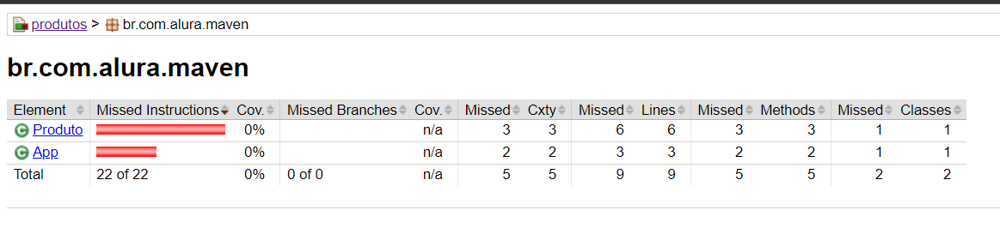
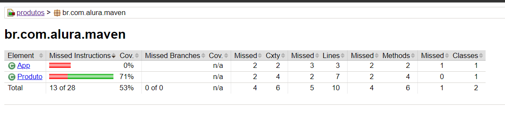

# JAVA EE

### Maven: Build do zero a web
- [Do zero aos relatórios](#anc1)
- [Maven no Eclipse](#anc2)
- [Repositório remoto e local](#anc3)
- [Relatórios de qualidade e cobertura](#anc4)
- [Criando um projeto web](#anc5)
- [Projeto web](#anc6)

<a name="anc1"></a>

## Do zero aos relatórios
- Compilar classe calculadora, passando para a pasta target
```
javac -sourcepath src -d target src/Calculadora.java 
```

- [Baixar Maven](https://maven.apache.org/)
- Ajuda `./mvn --help`
- No diretório original queremos editar um arquivo para configurar que o diretório /Users/alura/Documents/guilherme/workspace/apache-maven-3.3.9/bin irá para o path global de execução de arquivos. **No Linux**, fazemos isso por meio da variável de ambiente que podemos configurar diretamente neste diretório, utilizando o comando vi .bash_profile.
- Estamos prontos para editar o arquivo, portanto pressionaremos a tecla "A" para realizar a inserção de conteúdo. Escreveremos o comando export para exportar a configuração de PATH como sendo o atual ($PATH), e (:) o diretório :/Users/alura/Documents/guilherme/workspace/apache-maven-3.3.9/bin. Estamos afirmando que o novo path é composto pelo atual, e pelo novo diretório.
```
export PATH=$PATH:/Users/alura/Documents/guilherme/workspace/apache-maven-3.3.9/bin
```
- Solicitaremos que o Maven gere um novo projeto
- ID do nosso projeto
- Pacote básico da empresa
- Desabilitaremos o método interativo usando as informações padrão para configurarmos nosso projeto. Para isso, incluiremos -DinteractiveMode=false

```
mvn archetype:generate -DartifactId=produtos -DgroupId=br.com.alura.maven -DinteractiveMode=false -DarchetypeArtifactId=maven-archetype-quickstart
```
- Após pressionarmos o botão "Enter", será feito o download de várias informações. 

- Compilação manualmente
    - mvn compile
- Para compilarmos a classe de teste, basta usarmos `mvn test` no terminal. 
- Executamos o mvn clean em nosso terminal, o que faz com que todo o código de saída seja limpo, e fiquemos somente com o de fonte. Isso faz com que o diretório target seja removido
- Por exemplo, queremos gerar um relatório dos testes realizados. Por padrão, quando executamos mvn test, é gerado um arquivo TXT e uma versão XML, e ambos os formatos são desagradáveis para a leitura. Seria muito mais interessante que o relatório fosse exibido no navegador, e para isso utilizamos` mvn report`.
- Alguns comandos, como clean, test ou compile são de plugins padrão do Maven, e a instalação é realizada automaticamente. Alguns dos objetivos que queremos alcançar, como o report, não fazem parte dos plugins padrão, portanto o Maven não encontrará esse recurso de forma automática, sendo necessário declarar qual estamos utilizando.
```
mvn surefire-report:report
```

- Será realizado o download do que for necessário, e o relatório será gerado. Entraremos no diretório "produtos > target > site > surefire-report.html", e desse modo o teste será exibido no navegador.

- Para descobrirmos o nome de todos esses plugins, digitaremos no buscador do Google algo como "maven plugins", e várias informações serão disponibilizadas. Caso seja necessário realizar uma busca mais direcionada, como o plugin de geração de relatório, utilize "maven plugins test report".

-  Queremos transformar todo o conteúdo da nossa aplicação em um arquivo .jar. No arquivo pom.xml, vimos que o <packaging> é do tipo JAR.

- Para que o Maven "empacote" nosso programa, pediremos que o objetivo package seja executado.
```mvn package```

- Para executarmos produtos-1.0-SNAPSHOT.JAR, escreveremos java -cp produtos-1.0-SNAPSHOT.jar br.com.alura.maven.App, isto é, incluiremos o arquivo em um classpath -cp, e executaremos a classe br.com.alura.maven.App.

<a name="anc2"></a>

## Maven no Eclipse
### Importando projeto maven existente
- File > Import
    - Maven > Existing Maven Projects
- Atalho Eclipse
    - Ctrl + 3
        - Quick Access do Eclipse". Digite "IEMP"
             - Import Existing Maven Projects

- [Xstream](https://mvnrepository.com/artifact/com.thoughtworks.xstream/xstream)

> Uma alternativa para o gerenciamento de dependências
- ivy


<a name="anc3"></a>

## Repositório remoto e local

- [Dependência do GSON](http://mvnrepository.com/artifact/com.google.code.gson/gson)

- Quando fazemos o comando com a flag `-o` ele não faz uma busca pelas dependência na internet, ela busca apenas local, deixando o processo bem mais rápido.
```
mvn -o test
mvn -o compile
```

- Imaginemos a criação de um projeto chamado blog. Nós já baixamos todos esses plugins do Maven, portanto ele não irá realizar o download novamente, e criará o projeto pulando essa etapa.

```
mvn archetype:generate -DartifactId=blog -DgroupId=br.com.alura.maven -Dinteractive
Mode=false -DarchetypeArtifactId=maven-archetype-quickstart 
```
- Repositorio local onde ficam todas as dependências baixadas `.m2/repository`


<a name="anc4"></a>

## Relatórios de qualidade e cobertura
### As fases que um ciclo de vida build apresenta:
    - 1. Validação: verificamos se projeto possui todas as informações necessárias
    - 2. Compilação: compilar os conteúdos
    - 3. Teste: realizar testes diferentes no projeto
    - 4. Pacote: geração de um pacote do projeto
    - 5. Teste de integração: realizar testes de integração
    - 6. Verificação: checagem do pacote gerado
    - 7. Instalação: realizar a instalação do pacote no repositório local
    - 8. Implantação: realizar a implantação no ambiente adequado

- Quando acionamos o seguinte comando no terminal estamos executando duas fases do ciclo: validação e compilação.

```
cd Documents/guilherme/workspace/produtos
mvn compile
```

- Podemos forçar a ordem de etapas com opções da linha de comando, como não gerar testes, por meio do comando -DskipTests=true:
```
mvn -DskipTests=true package
```

### O  PMD, que analisa o código fonte e detecta possíveis margens de bug no código. Para gerar este relatório utilizamos o comando pmd:pmd no terminal
- [PMD](https://maven.apache.org/plugins/maven-pmd-plugin/)

```
mvn pmd:pmd
```
- Ao final, será gerado um arquivo pmd.html, armazenado no diretório: `produtos > target > site`

- [Documentação do Maven relativa ao relatório PDM](https://maven.apache.org/plugins/maven-pmd-plugin/pmd-mojo.html)

-Na documentação do Maven relativa ao relatório PDM encontraremos as configurações possíveis e exemplos de uso, tais como análise de código JavaScript, Java Server Pages (JSP), como usar Rule Sets, ou regras determinadas. Esse recurso pode ser usado de diferentes maneiras para detectar possíveis pontos problemáticos no programa em desenvolvimento.

- Com o comando pmd:pmd conseguimos gerar relatórios, mas de que forma verificamos a qualidade do nosso projeto? Lembrando que a verificação é uma fase do ciclo de vida do build.

- Se simplesmente utilizarmos o comando `mvn verify` no terminal, não teremos uma verificação efetiva, afinal não configuramos o PMD para ser utilizado no momento da verificação. Para isso, utilizaremos o comando `pmd:check`, que realiza uma varredura no build à procura de erros, inclusive interrompendo o projeto caso as regras definidas para o código não sejam cumpridas.

- Todas as vezes em que quisermos executar o PMD precisamos utilizar `pmd:check` no terminal, o que pode se tornar cansativo ao longo do desenvolvimento do programa. No arquivo pom.xml, podemos realizar configurações que permitam a execução automática do PDM durante o build do projeto.

- Indicando que ele alterará o ciclo de vida do projeto. No arquivo pom.xml, adicionaremos a tag <executions> para especificarmos quando o plugin deverá ser executado, afinal podem haver múltiplas execuções ao longo do build. Em nosso caso, será apenas uma execução na fase (<phase>) de verificação (verify), cujo objetivo (<goals>) é check.

```
<project>
  <!-- ... -->
  <build>
    <plugins>
      <plugin>
        <groupId>org.apache.maven.plugins</groupId>
        <artifactId>maven-pmd-plugin</artifactId>
        <version>3.10.0</version>
        <executions>
            <execution>
                <phase>verify</phase>
                    <goals>
                        <goal>check</goal>
                    </goals>
            </execution>
        </executions>
      </plugin>
    </plugins>
  </build>
  <!-- ... -->
</project>
```

### JACOCO
- O JaCoCo é o plugin padrão de cobertura de testes em Java.
- Adicione o plugin do JaCoCo ao projeto para que seja possível gerar relatórios sobre a cobertura de testes do projeto. Esse tipo de relatório é interessante pois é possível ver de uma forma fácil o que não testamos em nossa aplicação.
#### Usagem
```
...
<plugin>
    <groupId>org.jacoco</groupId>
    <artifactId>jacoco-maven-plugin</artifactId>
    <version>0.8.10</version>
    <executions>
        <execution>
        <goals>
            <goal>prepare-agent</goal>
            <goal>report</goal>
        </goals>
        </execution>
    </executions>
</plugin>
...
```
- Em nosso terminal executaremos o goal help — todos os goals do plugin estão registrados na documentação — por meio do comando `mvn jacoco:help`.
- Para o plugin gerar a cobertura do nosso código, existem duas fases a serem cumpridas: preparação do agente (**prepare-agent**) e a geração do relatório (**report**).
- Fase padrão dele é o `verify`
- No Eclipse, teremos o seguinte aviso de erro na parte inferior da tela: Maven Problems (1 item) > Project configuration is not up-to-date with pom.xml.. Ou seja, configuração do projeto não está atualizada com o arquivo pom.xml.
- Para resolvermos este problema acionaremos o atalho "Ctrl + 3" e acessaremos o buscador do Eclipse. Procuraremos pela opção "Update Project" e clicaremos sobre ela.

- Executaremos a verificação novamente, na linha de comando, por meio de mvn verify. Poderemos acessar o relatório de cobertura que foi armazenado em "produtos > target > site > jacoco > index.hrml".


- Após inclusão de um teste


### Em projetos com muitas dependências, com o passar do tempo elas podem ficar desatualizadas, caso você queira atualizar as dependências para suas versões mais atuais, poderá utilizar o seguinte comando:
```
mvn versions:use-latest-versions
```

- [Doc](https://www.mojohaus.org/versions/versions-maven-plugin/use-latest-versions-mojo.html)

- Existe um outro goal que verifica por atualizações sem de fato alterar o pom.xml:

```
mvn versions:display-dependency-updates
```
- [Versions Maven Plugin](https://www.mojohaus.org/versions/versions-maven-plugin/index.html)


<a name="anc5"></a>

## Criando um projeto web

cap 6
<a name="anc6"></a>

## Projeto web