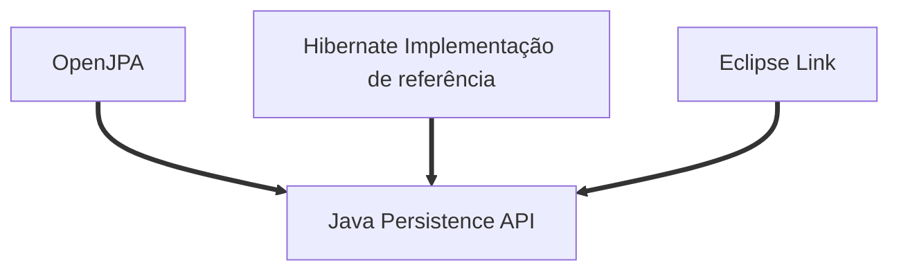
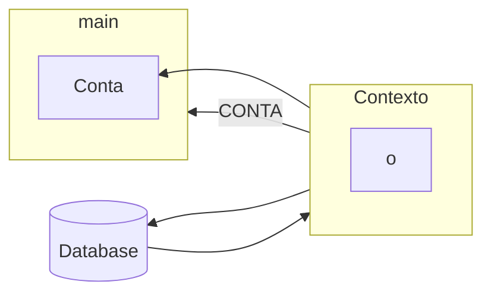

# JAVA EE


## jpa1
> Java e JPA: Persista seus objetos com a JPA2 e Hibernate

### Docker

- Criando container
```
docker container run --name java-ee-mysql-container -e MYSQL_USER=andre -e MYSQL_PASSWORD=123456 -e MYSQL_DATABASE=javaee -e MYSQL_ROOT_PASSWORD=123456 -d -p 3306:3306 mysql:8.0.33
```
- Acessando o banco
```
$ docker exec -it container_id bash
root@container_id:/# mysql -uroot -p
Enter password: 123456

show databases
use javaee;
show tables
select * from Conta
desc Conta;
```

### Módulo 01

- A JPA é um ORM (Object Relacional Mapper) Java
    - Um ORM mapeia as classes para tabelas e gera o SQL de forma automática
- Para inicializar a JPA, é preciso definir um arquivo de configuração, chamado **persistence.xml**
    - Nele, colocamos as configurações mais importantes, como o driver e os dados da conexão
- A classe Persistence lê a configuração e cria uma EntityManagerFactory
- Podemos usar a JPA para gerar e atualizar as tabelas no banco de dados
- Uma entidade deve usar as anotações @Entity e @Id
    - *@GeneratedValue* não é obrigatório, mas pode ser útil para definir uma chave **auto-increment**


> Mapeamento Objeto Relacional



- Um item muito importante da JPA é a interface EntityManager, onde, por meio dela, conseguimos abstrair o mundo relacional e focar apenas em objetos. Para conseguir uma instância de EntityManager, precisamos configurar propriedades no arquivo persistence.xml e obter a instância através da classe Persistence, como mostrado no código acima:
- O método createEntityManagerFactory irá gerar um EntityManagerFactory baseado nas configurações do persistence.xml. Baseado nisso, é fundamental que este método receba como argumento o nome de alguma unidade de persistência existente no arquivo
- As configurações relacionadas ao acesso banco de dados ficam dentro da sessão persistence-unit. A JPA não limita o número de unidades de persistência (o que é útil quando precisamos de mais de um banco por aplicação, como veremos no próximo exercício) e por isso precisamos escolher um para usar no método createEntityManagerFactor

### Módulo 02

#### Estado Managed
- Quando fazemos um find() no EntityManager, a JPA e o Hibernate buscarão no banco e criarão um objeto tipo Conta para ser devolvido, representando o registro buscado no database.
- Essa Conta devolvida ainda mantém uma referência, então a JPA ainda a conhece mesmo após a devolução. Sendo assim, costuma-se dizer que esta entidade Conta se encontra no estado Managed, ou seja, gerenciado pela JPA.

##### O que são transações?
- é um mecanismo para manter a consistência das alterações de estado no banco, visto que todas as operações precisam ser executadas com sucesso, para que a transação seja confirmada.

> Managed


- A característica do estado Managed é a sincronização automática.
- Nem toda conta com Id é necessariamente Managed

> Característica de uma entidade no estado Detached
- A entidade nesse estado possui um ID, apesar de não existir sincronização automática

>  A JPA tem o estado Transient para designar este tipo de objeto desvinculado. Sua característica é uma conta que existe na memória, possui informações e não tem Id nenhum, mas pode se tornar Managed futuramente.

- A JPA perceberá que a conta Transient acabou de ser criada, e portanto precisará inseri-la no database.
- Saida no console
```
Hibernate: 
    insert 
    into
        Conta
        (agencia, numero, saldo, titular) 
    values
        (?, ?, ?, ?)
Hibernate: 
    delete 
    from
        Conta 
    where
        id=?
```
> O estado Removed
- A entidade nesse estado possui um ID, apesar de não existir sincronização automática e não possuir registro no banco

> Por padrão, quando temos um relacionamento @OneToOne, ainda não obtemos a restrição que é esperada por um relacionamento @OneToOne.
- A anotação @JoinColumn só funciona na criação do schema, portanto é necessário deletar o banco e criá-lo novamente.

### JPQL
> JPQL é orientado a objetos, enquanto SQL não

##### Named Parameter Notation
- Essa notação de passar o valor do parâmetro, baseado na posição onde ele se encontra, também existe em JPA e se chama `Positional Parameter Notation`. No entanto, a presença de muitos parâmetros pode facilmente se tornar uma confusão.

- Para evitar isso, usamos a notação `Named Parameter Notation` que é mais expressiva. Usando ela, ganhamos como vantagem:

- A facilidade de identificar os parâmetros, diminuindo a probabilidade de erros

## JPA2
> Relacionamento em duas vias
```
Classe Conta
    @OneToMany
    private List<Movimentacao> movimentacao;

Classe Movimentacao
    @ManyToOne
    private Conta conta;

// Criando uma segunda tabela *conta_movimentacao*
```

> Relacionamento em apenas uma vi, bi-direcional
```
Classe Conta
    @OneToMany(mappedBy = "conta")
    private List<Movimentacao> movimentacao;

Classe Movimentacao
    @ManyToOne
    private Conta conta;

    private List<Movimentacao> movimentacao;

// Atributo forte será  da classe conta
```


### Lidando com queries N + 1


- Resolução
    - N + 1 ocorre quando precisamos disparar queries select para preencher os relacionamentos e pode ser resolvido com um join.
#### EAGER
- o Eager Loading carrega os dados mesmo que você não vá utilizá-los, mas é óbvio que você só utilizará esta técnica se de fato você for precisar com muita frequência dos dados carregados.

- Carregamento padrão, faz uma consulta, imprime o resultado depois faz outra e imprime o seu resultado


- Carregamento atencipado, faz as duas consutas e depois mostra o resultado para tudo
- Esse é o padrão para o Relacionamento `@*ToOne`
- Não é performatico para o Relacionamento `@*ToMany`
> fetch=FetchType.EAGER


- Para usar no Relacionamento `@*ToMany`e melhorar a performace usamos um join


```
- Trás apenas dados que tenham movimentações
String jpql = "select c from Conta c join fetch c.movimentacoes";

- Busca todos os dados
String jpql = "select c from Conta c left join fetch c.movimentacoes";
```

#### Lazyness
- Vantagem do Lazyness
    - Performance. Economizando recursos de rede e banda.
- o Lazy Loading faz com que determinados objetos não sejam carregados do banco até que você precise deles, ou seja, são carregados 'on demand' (apenas quando você solicitar explicitamente o carregamento destes).

### Criteria

- O Root é quem define qual entidade estamos buscando, então, ela seria análoga - na SQL - a cláusula from. Portanto, usamos a classe `CriteriaQuery`, que é a responsável em montar a query.

> API de Criteria como o CriteriaBuilder
- Usamos a CriteriaBuilder para criar a CriteriaQuery
- Usamos a CriteriaBuilder para aplicar funções como sum() e avg(), além de criar Expressions ou Predicates.

- Acho que ficou claro que o JPQL é muito mais fácil de ler e entender. Isso faz sentido pois JPQL é uma DSL, uma linguagem especifica para consultas. A Criteria por sua vez é puramente Java e por isso mais verboso. Ou seja, devemos usar a JPQL sempre?

- A resposta é: depende. Só devemos usar a API de Criteria quando a consulta é dinâmica. Ai sim ele fica mais flexível e a JPQL perde toda legibilidade e simplicidade. E sempre devemos usar a JPQL quando a pesquisa é estática, pois ela é muito mais legível e enxuta.

- Resumindo:
    - as consultas JPQL são mais fáceis de escrever e ler quando a consulta é estática.
    - as consultas com a API de Criteria são superiores na hora de construir consultas dinâmicas.

## Introdução ao EJB
- Hoje em dia, a grande maioria das aplicações são desenvolvidas para executar na web. Ou seja, usamos um navegador para acessar o servidor através do protocolo HTTP. Para fazer isso funcionar basta termos um servidor como o Apache Tomcat, bastante utilizado em outros treinamentos no Alura. Com ele podemos executar uma aplicação feita com JavaServer Faces (JSF) ou outros frameworks MVC (Model-View-Controller).

> POOL
- A maioria das aplicações utilizam um banco de dados como o MySQL ou Oracle, entre várias outras opções do mercado. Nesse caso, a nossa aplicação deve se preocupar em gerenciar as conexões com o banco, o que normalmente é feito através de um pools de conexões. A escolha e configuração correta do Pool é de grande importância para qualquer aplicação e afeta diretamente o desempenho e escalabilidade.
> PERSISTÊNCIA
- Para persistirmos e acessarmos dados usando o paradigma orientado a objetos podemos usar frameworks de Mapeamento-Objetos-Relacional (MOR) como o Hibernate ou EclipseLink, que seguem a especificação JPA (Java Persistence API). A integração do framework deve ser feita da melhor maneira possível para evitar desperdício de recursos e mau uso do banco de dados.
> GERENCIAMENTO DE TX (TRANSAÇÕES)
- Alteração de dados no banco mesmo com JPA envolve transações que precisam ser gerenciadas, tarefa difícil de se fazer de maneira robusta. O mau gerenciamento das transações é um problema comum nas aplicações e pode causar problemas nas consistência dos dados.
> ERRO HANDLING / LOGGING
- Ao trabalhar com todos esses recursos, erros ou exceções podem aparecer. Ou seja, sempre devemos ter uma estratégia para lidar com as possíveis exceções que a aplicação pode causar.
> SINCRONIZAÇÃO DE ACESSO
- As classes da aplicação, como os Data Access Objects (DAOs) e as classes de serviços, serão utilizadas quando ocorrer uma requisição HTTP. A pergunta é: como podemos garantir que não há problemas de acesso e sincronização quando a quantidade de requisições crescer? Não é raro ver aplicações que começam a gerar problemas quando a demanda cresce.
> AGENDAMENTO
- Outra tarefa comum é executar tarefas periodicamente. Há aplicações que precisam agendar a execução de processos. Por exemplo, pode ser necessário enviar um email cada dia, ou verificar uma tabela no banco de dados a cada hora. O agendamento correto, no tempo exato é essencial para várias aplicações, e não é algo fácil de se implementar.
> WEB SERVICES
- Durante o desenvolvimento de uma aplicação surgem várias outras preocupações, tais como o uso de Web Services ou mesmo a segurança da aplicação, ambos importantíssimos. Em geral, todas essas preocupações listadas são agnósticas às regras de negócio. É algo que faz parte do desenvolvimento, mas não deveriam ser a preocupação principal.


- A tarefa de um servidor de aplicações é justamente livrar o desenvolvedor dessas preocupações e fornecer uma infra-estrutura pronta para que ele possa utilizar. Ou seja, não é a aplicação que vai gerenciar a transação ou se preocupar com o agendamento de tarefas. Vamos inverter o controle e deixar o servidor de aplicações fazer essa parte.

- Por isso, essas preocupações também se chamam serviços do container ou serviços do servidor. Transação, persistência, etc. são serviços que o servidor de aplicações fornece.


- Por exemplo, a classe DAO da minha aplicação deve ter acesso ao JPA sem se preocupar em como inicializa-lo. Para isso funcionar o Enterprise Java Beans (EJB) fornece o componente ( Entity Bean ), que é responsável pelo controle de transações de persistência de dados. O próprio DAO vai ser um EJB e assim poderá utilizar a JPA sem problemas.

- Em outras palavras, é através dos EJBs que temos acesso aos serviços que o servidor oferece sem nos preocuparmos em como cada um deles foi inicializado. Então, para usar os EJBs, sempre precisamos de um servidor de aplicações.

- Falta saber qual servidor de aplicação usaremos no treinamento. O Apache Tomcat não serve, pois não é um servidor de aplicações completo. Contudo há outras opções como RedHat JBoss AS, Oracle Glassfish, Apache Geronimo ou Oracle WebLogic, entre outros. Usaremos o JBoss AS, o servidor Java EE mais popular, opensource e totalmente gratuito.


> Preparação do ambiente de desenvolvimento
1) Baixar o JBoss Application Server para começar a usar os EJBs. Para tal, acesse o site [JBOSS](https://jbossas.jboss.org/downloads);
2) Na página principal escolha a opção Downloads, depois selecione a versão JBoss AS 7.1.1.Final no formato ZIP.

### Instalação do Server Adapter
- Na aba servers
- Clique em No `servers ...`
    - Se não aparecer JBOSS 7 na aba do jboss, então clique em `Download aditional server adapter`
        - Selecioner `JBOSS AS TOLLS`
        - depois da instalação aparecerá jboss AS 7.1
    - Selecone a pasta onde baixou o servidor
    - selecione a versão (1.7 do java)[https://www.oracle.com/br/java/technologies/javase/javase7-archive-downloads.html], se não tiver instale!.


### Primeira aplicação com EJB
- Esse projeto nada mais é do que um Dynamic Web Project. Nele já foram criadas algumas classes e a interface web, mas não há nada especifico do EJB ainda. Criamos este projeto apenas por fins didáticos.

- Ao importá-lo, verifique se todas as classes estão compilando. Veja que no projeto existe um problema, pois as biblioteca do JBoss ainda não fazem parte do projeto web.

- Vamos configurar isso: 
    - botão direito no projeto livraria
    - Java Build Path. 
        - Na aba Libraries aperte o botão Add Library
            - escolha Server Runtime e o JBoss 7. 
        - Através dessa configuração as bibliotecas no JBoss fazem parte do classpath.

- Falta ainda associar o projeto com JBoss. 
    - Na aba Servers
    - Botão direito Add and Remove...
    - Escolha o projeto livraria. 

### Apresentação do projeto
- Vamos testar a aplicação acessando no navegador:

```
http://localhost:8080/livraria/login.xhtml
```
- Há uma página de login: 
    - o login é admin 
    - a senha é pass
- Caso o encoding esteja com caracteres especiais
    - No Eclipse, 
        - nas propriedades do projeto
        - selecionar UTF-8 no item Resource.

### O primeiro Session Bean
- Ao usar EJB, teremos acesso aos serviços do servidor de aplicação, como transação, persistência com JPA ou tratamento de erro. Para transformar a classe AutorDao em um EJB basta uma configuração simples. Só precisamos anotá-la com @Stateless:

```
@Stateless
public class AutorDao{
```
- O EJB Container - achou aquela anotação @Stateless e registrou esse EJB dentro de um registro disponível no servidor. Aquele registro se chama JNDI e o que estamos vendo na saída é o endereço do EJB nesse registro JNDI. O servidor usa por baixo dos panos esse registro JNDI para organizar os componentes que ele administra.

### Injeção de dependências
- Na nossa aplicação, os DAOs são utilizados através das classes que ficam dentro do pacote bean. Abra a classe AutorBean. Essa classe é utilizada através da interface JSF, ela é chamada pelos componentes JSF definidos no arquivo autor.xhtml.
- Na classe AutorBean, podemos ver que estamos usando a classe AutorDao para gravar e listar autores. Repare também que estamos instanciando a classe AutorDao:

```
public class AutorBean {

  private AutorDao dao = new AutorDao();
}
```

- É justamente essa a linha que precisa ser alterada. Ao usar EJB, não podemos mais instanciar o AutorDao na mão. Estamos assumindo o controle ao criar o DAO naquela linha. Nesse caso não estamos usando o AutorDao como um EJB.

- O DAO está sendo administrado pelo EJB Container. Portanto, quem cria o DAO é o EJB Container e não a minha classe. Consequentemente precisamos pedir ao EJB Container passar aquela instancia que ele está administrando. Felizmente, isso é fácil de fazer, basta usar a anotação @Inject:

```
public class AutorBean {

  @Inject
  private AutorDao dao;
}
```

- Pronto, o EJB será injetado! Essa parte da `inversão de controle` também é chamado *Injeção de dependências*. O DAO é uma dependência que será injetada pelo container.

> Adotando um Servidor de Aplicações que implemente as especificações da arquitetura Java Enterprise Edition (JEE).
- A tarefa de um servidor de aplicações é justamente livrar o desenvolvedor dessas preocupações e fornecer uma infra-estrutura pronta para que o desenvolvedor possa aproveitar. Ou seja, não é a aplicação que vai gerenciar a transação, a conexão com o banco de dados ou se preocupar com o agendamento de tarefas. Vamos inverter o controle e deixar o servidor de aplicação fazer toda essa parte.

> O servidor Apache Tomcat não pode ser considerado um servidor de aplicações completo porque não implementa toda a especificação Java Enterprise Edition (Java EE).

> Utilizando a arquitetura EJB, as regras de negócio são implementadas em componentes específicos que são chamados de Session Beans. O EJB Container administra esses componentes oferecendo diversos recursos a eles.

> Do Stateless Session Bean é o primeiro tipo de Session Bean. Os Stateless Session Bean não mantém estado de conversação com o cliente, não têm compromisso de manter uma sessão, são intercambiáveis e podem ser alocados de um pool e são EJBs econômicos;
- Não mantém estado de conversação com o cliente;
- Não tem compromisso de manter uma sessão;
- São intercambiáveis e podem ser alocados de um pool;
- É um EJB econômico;
> Na versão 3.1, quando o acesso a um EJB Stateless Session Bean é local, não é mais necessário definir uma interface java nem utilizar a anotação @Local. Então, bastaria criar uma classe java com a anotação @Stateless.
> Ao usar EJB, não podemos mais instanciar o AutorDaoe o LivroDao na mão. Estamos assumindo o controle ao criar o DAO naquelas linhas (1) e (2). Nesse caso não estamos usando o AutorDao e o LivroDao como EJBs.
- O DAO está sendo administrado pelo EJB Container. Portanto, quem cria o DAO é o EJB Container e não a minha classe. Consequentemente precisamos pedir ao EJB Container para passar aquela instância que ele está administrando. Felizmente, isso é fácil de fazer, basta usar a anotação @Inject:

## Capítulo 2
- Nas classes Bean usamos a anotação @Inject para receber o EJB pronto para ser utilizado. Chamamos de Injeção de dependência essa forma de receber uma instância.
Ao iniciar o servidor podemos ver no console os endereços dos 3 EJB Session Beans que já configuramos.

### Callbacks
- Vamos voltar à classe AutorDao e adicionar um método que chamaremos aposCriacao. Nele faremos um simples sys para imprimir uma mensagem:
```
void aposCriacao() {
    System.out.println("AutorDao foi criado");
}
```
- Este método não precisa ser público, pois ele não será chamado pela classe AutorBean. Basta anotá-lo com @PostConstruct e ele será chamado pelo próprio EJB Container:
```
@PostConstruct
void aposCriacao() {
    System.out.println("AutorDao foi criado");
}
```
- Assim que o Container cria e inicializa o Session Bean, o método aposCriacao é executado. Esse tipo de método ligado ao ciclo de vida do Session Bean também é chamado de Callback.


- Vamos testar a funcionalidade e publicar a aplicação. Assim que o servidor recarregá-la, - vamos limpar o console e chamá-la pela interface.

- Ao acessar a URI pelo navegador e passar pela tela de login, podemos ver que o combobox com os autores está populado, ou seja, o EJB Container já criou o AutorBean. Isso fica claro no console do Eclipse. Repare que aparece a saída AutorDao foi criado. O EJB Container instanciou o Session Bean e chamou o método callback.

### Thread safety
Vamos testar mais um pouco a aplicação e acessar pela interface web a página dos autores, navegando entre as abas. Muito bem. Voltando ao Eclipse, podemos ver no console que continua apenas uma saída do nosso método callback. Isso significa que apenas um Session Bean foi criado, já que o container sempre chama o callback na criação.

Vamos testar isso melhor e simular um pouco a execução lenta do método salva no AutorDao.

Primeiro colocaremos um Syso no inicio do método e um Syso no final do método para saber quando a execução começou e quando terminou.

Segundo, vamos travar a execução da thread atual usando o comando Thread.sleep(..). No nosso exemplo, o thread atual vai dormir por 20 segundos. O método sleep(..) exige um tratamento de erro, por isso é preciso fazer um try-catch e podemos gerá-lo pelo Eclipse. Pronto.

Depois da alteração, faremos o publish obrigatório para recarregar a aplicação. Depois de ter limpado o console, vamos acessar a aplicação web pelo navegador. Logo após login, vamos para a página de autores para cadastrar um autor.

Ao salvar, podemos perceber que o nome do autor não aparece imediatamente na lista de autores abaixo. Isso acontece, pois a thread para salvar o autor ainda está em execução. Travamos por 20 segundos. Repare no console que o AutorDao foi criado e o método salva(), que está sendo executado, não terminou ainda.

Vamos rapidamente abrir uma nova aba e recarregar a aplicação para cadastrar mais um autor. Ao salvar novamente a thread parou, mas podemos observar no console que mais um AutorDao foi criado, pois apareceu a saída do callback. Ou seja, como o primeiro objeto Session Bean estava em uso, o EJB Container decidiu criar mais um para atender a chamada. Só depois, quando os 20s passaram, aparece a última mensagem no console e consequentemente o autor é listado na interface.

Esse pequeno exemplo mostrou que um Session Bean não é compartilhado entre Threads. Apenas uma thread pode usar o nosso AutorDao ao mesmo tempo. Um Session Bean é automaticamente Thread safe. Thread safety é um dos serviços que ganhamos de graça ao usarmos EJBs.


### Pool de Objetos
Vimos que o EJB Container criou um segundo objeto do tipo AutorDao, pois o primeiro estava sendo usado. EJB Container fez isso para melhorar o desempenho, já que o Sesson Bean não é compartilhado.

A pergunta é, quantos objetos o EJB Container serão criados? Se eu tiver 100 threads ao mesmo tempo, 100 objetos AutorDao serão criados em memória?


O EJB Container automaticamente fornece um pool de objetos que gerencia a quantidade do Session Beans. A configuração desse pool se encontra no arquivo de configuração do JBoss AS, ou seja, é totalmente específico.


Vamos abrir o arquivo `standalone.xml` da pasta de `standalone/configuration`. Nele procuraremos o elemento `<pools>`. Dentro desse elemento, encontraremos a configuração do pool para session beans. Repare o atributo max-pool-size que define a quantidade de objetos no pool. No nosso caso são 20 instancias.
```
<pools>
    <bean-instance-pools>
        <strict-max-pool name="slsb-strict-max-pool" max-pool-size="20" instance-acquisition-timeout="5" instance-acquisition-timeout-unit="MINUTES"/>
        <!-- outros elementos omitidos -->
    </bean-instance-pools>
</pools>
```
Vamos fazer um teste e configurar o pool com apenas 1 instancia. Basta colocar o valor no atributo max-pool-size. Como alteramos o arquivo principal de configuração é necessário reiniciar o servidor. No final limparemos o console para acompanhar melhor o trabalho do EJB Container.

```
<pools>
    <bean-instance-pools>
        <strict-max-pool name="slsb-strict-max-pool" max-pool-size="1" instance-acquisition-timeout="5" instance-acquisition-timeout-unit="MINUTES"/>
        <!-- outros elementos omitidos -->
    </bean-instance-pools>
</pools>
```
Vamos fazer o mesmo teste, ou seja, acessar a nossa aplicação através de duas abas, simulando duas ações de usuário executado ao mesmo tempo. Após ter feito o login, vamos para a aba autores. Não podemos esquecer de atualizar a outra aba também. Quando estiver pronto podemos salvar o primeiro autor.

No console, aparecem as mensagens do callback e do método salva(...). Até aqui tudo igual. Vamos para a segunda aba para salvar um outro autor. Ao salvar e analisar o console NÃO aparece a mensagem do callback. Isso faz sentido, pois configuramos para que exista apenas um objeto AutorDao. Enquanto a primeira ação não finalizar, não é possível acessar esse objeto, pois, como já mencionamos, os Session Beans são thread safe. Repare que o console mostra que na execução foi um depois do outro, já que existe apenas um objeto do tipo AutorDao em memória.

Repare que a configuração do tamanho do pool influencia diretamente na escalabilidade da aplicação. Ter apenas um objeto AutorDao em memória significa que só podemos atender um chamado por vez. Por isso faz sentido, para objeto DAO, aumentar a quantidade de objetos no pool.

Por fim, vamos desfazer a alteração no arquivo standalone.xml e configurar novamente 20 instancias no pool. Como mexemos no xml, não podemos esquecer de reiniciar o servidor. No método salva(..) também vamos comentar o código que mandou o Thread atual dormir. Pronto.

### Singleton Beans
Já aprendemos como configurar as classes DAOs, agora vamos atacar a classe Banco. O Banco ainda não é um EJB Session Bean. Podemos facilmente mudar isso e colocar a anotação @Stateless em cima da classe como vimos nos exemplos anteriores

```
@Stateless
public class Banco {
```
E, por exemplo, no AutorDao, vamos injetar o banco. Para tal, não devemos instanciar o Banco e sim, usar a anotação @Inject:

```
@Inject
private Banco banco;
```
Voltando para classe Banco, vimos, no exemplo anterior, que existe um pool de objetos para Session Beans. Ou seja, como o Banco é um Session Bean, teremos, no máximo, 20 instancias em memória.

Nesse caso pode surgir a pergunta, faz sentido ter todas essas instancias dessa classe? Claro que não! Apesar do fato de que essa classe só existe para simular um banco de dados, não faz sentido nenhum ter mais do que um objeto dessa classe. É preciso ter apenas um único objeto para simular o banco.

Felizmente podemos configurar isso sem mexer na configuração XML do JBoss AS. Basta usar a anotação `@Singleton`:

```
@Singleton  // do package javax.ejb
public class Banco {
```
Para ter certeza que não existem mais instâncias, vamos fazer o mesmo teste. Na classe Banco adicionaremos um método de callback usando a anotação @PostConstruct:

```
@PostConstruct
void aposCriacao() {
    System.out.println("acabou de criar o Banco");
}
```

Se tudo estiver configurado, podemos iniciar o JBoss AS para testar a aplicação com o novo Singleton Session Bean. Na saída do console, podemos ver que o EJB Container já entrou e carregou o Banco. Repare que existe uma saída parecida com a dos outros Session Beans.

Só falta limpar o console e acessar a interface web. Após o login, o conteúdo de ambos os callbacks é impresso no console; aquele do AutorDao e esse novo do Banco.

Vamos cadastrar uma vez um Autor pela interface para verificar se realmente existe uma única instancia do Banco. Como esperado, o console indica que o callback foi só uma vez.

### Eager Initialization
Session Beans do tipo Singleton são tipicamente usados para inicializar alguma configuração ou agendar algum serviço. Fazer isso só faz sentido no inicio da aplicação, ou seja, quando o JBoss AS carrega a aplicação e já queremos que o Session Bean seja criado para carregar todas as configurações.

Por padrão um EJB é carregado sob demanda (lazy), mas através da anotação @Startup podemos definir que queremos usar o Singleton Bean desde o início da aplicação:

```
@Singleton //do package javax.ejb
@Startup
public class Banco {
```

Para testar, vamos recarregar a aplicação, ou seja, Full Publish aba Servers do Eclipse. Após ter carregado a aplicação, aparece no console a saída do callback. O Banco já é criado e inicializado pelo EJB Container.

Aquela inicialização com `@Startup` também é chamada **eager initialization** e a testaremos nos exercícios.

> EJB Container cria e inicializa o Session Bean, o método anotado com @PostConstruct é executado. Esse tipo de comportamento está ligado ao ciclo de vida do Session Bean e também é chamado de Callbacks.

> **Thread Safety** Significa que um EJB Session Bean não é compartilhado entre Threads. Ou seja, quando um Session Bean estiver em uso, o EJB Container decide criar mais um Session Bean para atender uma nova chamada. Uma estratégia usada pelos servidores de aplicação para isso é o Pooling for Stateless Session EJBs.

> O atributo é max-pool-size, que por default está configurado para 20 objetos Stateless Session Bean (SLSB) no pool.

> Qual a principal característica do Singleton Session Bean? Ele garante que haverá somente uma instância do Session Bean.

> Por padrão um EJB é carregado sob demanda (`lazy`), mas através da anotação @Startup podemos definir que queremos usar o Singleton Bean desde o início da aplicação. Inicialização com `@Startup` também é chamada eager initialization.

### Session Bean Stateful (SBSF)
Há mais um tipo de EJB Session Bean. Além dos Session Beans Stateless e Singleton, existe um Session Bean do tipo Stateful. Basta anotar a classe com @Stateful, por exemplo:
```
@Stateful
public class CarrinhoDeCompras {
 //...
}
```
Um Session Bean Stateful (SBSF) também é um objeto administrado pelo EJB Container. Assim ele ganha os serviços oferecidos pelo Container como injeção de dependências, transação ou JPA (como veremos mais para frente).

Qual é a diferença entre `Stateful` e `Stateless` então?

Vimos que Session Beans `Stateless` são objetos que fazem parte de um pool. Esse pool não existe para Session Bean `Stateful`. Um SBSF funciona parecido com o objeto HttpSession do mundo de Servlets. É um objeto exclusivo de um cliente, apenas um cliente usará este objeto.

Podemos imaginar que um Session Bean `Stateful` funciona como um carrinho de compras. Cada cliente possui o seu carrinho e ele utilizará o mesmo carrinho o tempo todo. Não queremos compartilhar esse carrinho com ninguém (as compras são nossas). Um Session Bean `Stateful` garante esse comportamento.

No entanto, no dia a dia os SBSF são pouco usados. Isto porque normalmente se usa o objeto HttpSession para guardar dados do cliente (como o carrinho de compras ou as permissões do usuário). Como já usamos esse objeto dentro do servlet container não é preciso repetir essas informações através do EJB Container. Assim muitos arquitetos preferem usar apenas Stateless/Singleton em conjunto com o HttpSession.

> O Session Bean Stateful (SBSF) tem uma funcionalidade muito parecida com a do objeto HttpSession: representa um objeto para o cliente. Ideal para guardar informações que só dizem respeito ao cliente. Exemplos disso são carrinhos de compras ou permissões.

> A diferença entre Session Bean Stateful e HttpSession é que o primeiro é administrado pelo EJB Container e o segundo pelo Servlet Container.