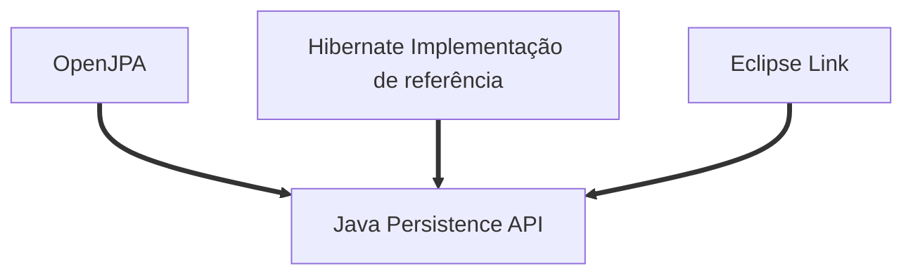
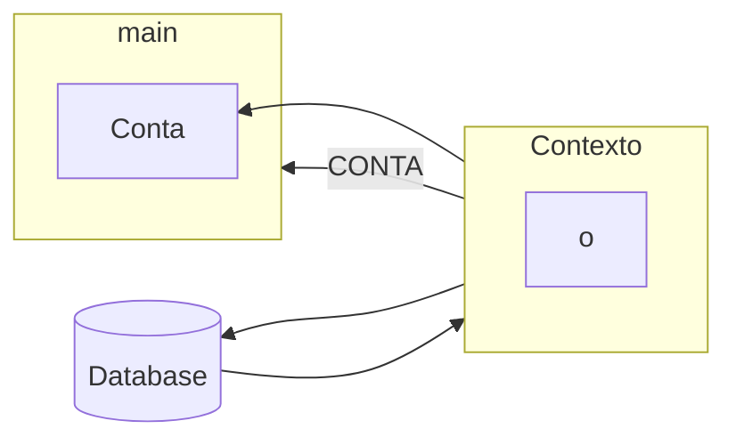

# JAVA EE


## jpa1
> Java e JPA: Persista seus objetos com a JPA2 e Hibernate

### Docker

- Criando container
```
docker container run --name java-ee-mysql-container -e MYSQL_USER=andre -e MYSQL_PASSWORD=123456 -e MYSQL_DATABASE=javaee -e MYSQL_ROOT_PASSWORD=123456 -d -p 3306:3306 mysql:8.0.33
```
- Acessando o banco
```
$ docker exec -it container_id bash
root@container_id:/# mysql -uroot -p
Enter password: 123456

show databases
use javaee;
show tables
select * from Conta
desc Conta;
```

### Módulo 01

- A JPA é um ORM (Object Relacional Mapper) Java
    - Um ORM mapeia as classes para tabelas e gera o SQL de forma automática
- Para inicializar a JPA, é preciso definir um arquivo de configuração, chamado **persistence.xml**
    - Nele, colocamos as configurações mais importantes, como o driver e os dados da conexão
- A classe Persistence lê a configuração e cria uma EntityManagerFactory
- Podemos usar a JPA para gerar e atualizar as tabelas no banco de dados
- Uma entidade deve usar as anotações @Entity e @Id
    - *@GeneratedValue* não é obrigatório, mas pode ser útil para definir uma chave **auto-increment**


> Mapeamento Objeto Relacional



- Um item muito importante da JPA é a interface EntityManager, onde, por meio dela, conseguimos abstrair o mundo relacional e focar apenas em objetos. Para conseguir uma instância de EntityManager, precisamos configurar propriedades no arquivo persistence.xml e obter a instância através da classe Persistence, como mostrado no código acima:
- O método createEntityManagerFactory irá gerar um EntityManagerFactory baseado nas configurações do persistence.xml. Baseado nisso, é fundamental que este método receba como argumento o nome de alguma unidade de persistência existente no arquivo
- As configurações relacionadas ao acesso banco de dados ficam dentro da sessão persistence-unit. A JPA não limita o número de unidades de persistência (o que é útil quando precisamos de mais de um banco por aplicação, como veremos no próximo exercício) e por isso precisamos escolher um para usar no método createEntityManagerFactor

### Módulo 02

#### Estado Managed
- Quando fazemos um find() no EntityManager, a JPA e o Hibernate buscarão no banco e criarão um objeto tipo Conta para ser devolvido, representando o registro buscado no database.
- Essa Conta devolvida ainda mantém uma referência, então a JPA ainda a conhece mesmo após a devolução. Sendo assim, costuma-se dizer que esta entidade Conta se encontra no estado Managed, ou seja, gerenciado pela JPA.

##### O que são transações?
- é um mecanismo para manter a consistência das alterações de estado no banco, visto que todas as operações precisam ser executadas com sucesso, para que a transação seja confirmada.

> Managed


- A característica do estado Managed é a sincronização automática.
- Nem toda conta com Id é necessariamente Managed

> Característica de uma entidade no estado Detached
- A entidade nesse estado possui um ID, apesar de não existir sincronização automática

>  A JPA tem o estado Transient para designar este tipo de objeto desvinculado. Sua característica é uma conta que existe na memória, possui informações e não tem Id nenhum, mas pode se tornar Managed futuramente.

- A JPA perceberá que a conta Transient acabou de ser criada, e portanto precisará inseri-la no database.
- Saida no console
```
Hibernate: 
    insert 
    into
        Conta
        (agencia, numero, saldo, titular) 
    values
        (?, ?, ?, ?)
Hibernate: 
    delete 
    from
        Conta 
    where
        id=?
```
> O estado Removed
- A entidade nesse estado possui um ID, apesar de não existir sincronização automática e não possuir registro no banco

> Por padrão, quando temos um relacionamento @OneToOne, ainda não obtemos a restrição que é esperada por um relacionamento @OneToOne.
- A anotação @JoinColumn só funciona na criação do schema, portanto é necessário deletar o banco e criá-lo novamente.

### JPQL
> JPQL é orientado a objetos, enquanto SQL não

##### Named Parameter Notation
- Essa notação de passar o valor do parâmetro, baseado na posição onde ele se encontra, também existe em JPA e se chama `Positional Parameter Notation`. No entanto, a presença de muitos parâmetros pode facilmente se tornar uma confusão.

- Para evitar isso, usamos a notação `Named Parameter Notation` que é mais expressiva. Usando ela, ganhamos como vantagem:

- A facilidade de identificar os parâmetros, diminuindo a probabilidade de erros