# JAVA EE


## jpa1
> Java e JPA: Persista seus objetos com a JPA2 e Hibernate

### Docker

- Criando container
```
docker container run --name java-ee-mysql-container -e MYSQL_USER=andre -e MYSQL_PASSWORD=123456 -e MYSQL_DATABASE=javaee -e MYSQL_ROOT_PASSWORD=123456 -d -p 3306:3306 mysql:8.0.33
```
- Acessando o banco
```
$ docker exec -it container_id bash
root@container_id:/# mysql -uroot -p
Enter password: 123456

show databases
use javaee;
show tables
select * from Conta
desc Conta;
```

### Módulo 01

- A JPA é um ORM (Object Relacional Mapper) Java
    - Um ORM mapeia as classes para tabelas e gera o SQL de forma automática
- Para inicializar a JPA, é preciso definir um arquivo de configuração, chamado **persistence.xml**
    - Nele, colocamos as configurações mais importantes, como o driver e os dados da conexão
- A classe Persistence lê a configuração e cria uma EntityManagerFactory
- Podemos usar a JPA para gerar e atualizar as tabelas no banco de dados
- Uma entidade deve usar as anotações @Entity e @Id
    - *@GeneratedValue* não é obrigatório, mas pode ser útil para definir uma chave **auto-increment**


> Mapeamento Objeto Relacional

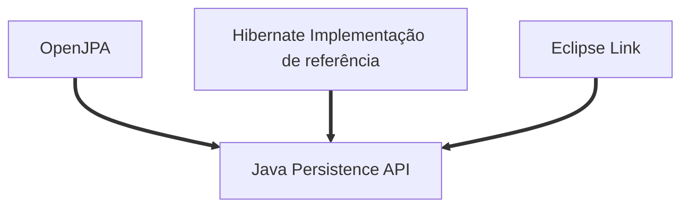

- Um item muito importante da JPA é a interface EntityManager, onde, por meio dela, conseguimos abstrair o mundo relacional e focar apenas em objetos. Para conseguir uma instância de EntityManager, precisamos configurar propriedades no arquivo persistence.xml e obter a instância através da classe Persistence, como mostrado no código acima:
- O método createEntityManagerFactory irá gerar um EntityManagerFactory baseado nas configurações do persistence.xml. Baseado nisso, é fundamental que este método receba como argumento o nome de alguma unidade de persistência existente no arquivo
- As configurações relacionadas ao acesso banco de dados ficam dentro da sessão persistence-unit. A JPA não limita o número de unidades de persistência (o que é útil quando precisamos de mais de um banco por aplicação, como veremos no próximo exercício) e por isso precisamos escolher um para usar no método createEntityManagerFactor

### Módulo 02

#### Estado Managed
- Quando fazemos um find() no EntityManager, a JPA e o Hibernate buscarão no banco e criarão um objeto tipo Conta para ser devolvido, representando o registro buscado no database.
- Essa Conta devolvida ainda mantém uma referência, então a JPA ainda a conhece mesmo após a devolução. Sendo assim, costuma-se dizer que esta entidade Conta se encontra no estado Managed, ou seja, gerenciado pela JPA.

##### O que são transações?
- é um mecanismo para manter a consistência das alterações de estado no banco, visto que todas as operações precisam ser executadas com sucesso, para que a transação seja confirmada.

> Managed

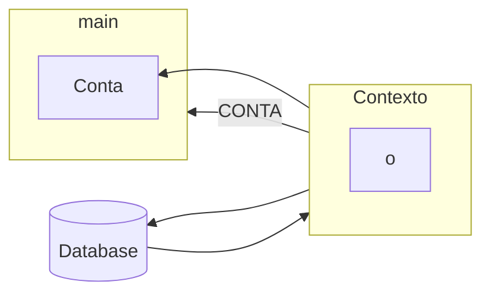
- A característica do estado Managed é a sincronização automática.
- Nem toda conta com Id é necessariamente Managed

> Característica de uma entidade no estado Detached
- A entidade nesse estado possui um ID, apesar de não existir sincronização automática

>  A JPA tem o estado Transient para designar este tipo de objeto desvinculado. Sua característica é uma conta que existe na memória, possui informações e não tem Id nenhum, mas pode se tornar Managed futuramente.

- A JPA perceberá que a conta Transient acabou de ser criada, e portanto precisará inseri-la no database.
- Saida no console
```
Hibernate: 
    insert 
    into
        Conta
        (agencia, numero, saldo, titular) 
    values
        (?, ?, ?, ?)
Hibernate: 
    delete 
    from
        Conta 
    where
        id=?
```
> O estado Removed
- A entidade nesse estado possui um ID, apesar de não existir sincronização automática e não possuir registro no banco

> Por padrão, quando temos um relacionamento @OneToOne, ainda não obtemos a restrição que é esperada por um relacionamento @OneToOne.
- A anotação @JoinColumn só funciona na criação do schema, portanto é necessário deletar o banco e criá-lo novamente.

### JPQL
> JPQL é orientado a objetos, enquanto SQL não

##### Named Parameter Notation
- Essa notação de passar o valor do parâmetro, baseado na posição onde ele se encontra, também existe em JPA e se chama `Positional Parameter Notation`. No entanto, a presença de muitos parâmetros pode facilmente se tornar uma confusão.

- Para evitar isso, usamos a notação `Named Parameter Notation` que é mais expressiva. Usando ela, ganhamos como vantagem:

- A facilidade de identificar os parâmetros, diminuindo a probabilidade de erros

## JPA2
> Relacionamento em duas vias
```
Classe Conta
    @OneToMany
    private List<Movimentacao> movimentacao;

Classe Movimentacao
    @ManyToOne
    private Conta conta;

// Criando uma segunda tabela *conta_movimentacao*
```
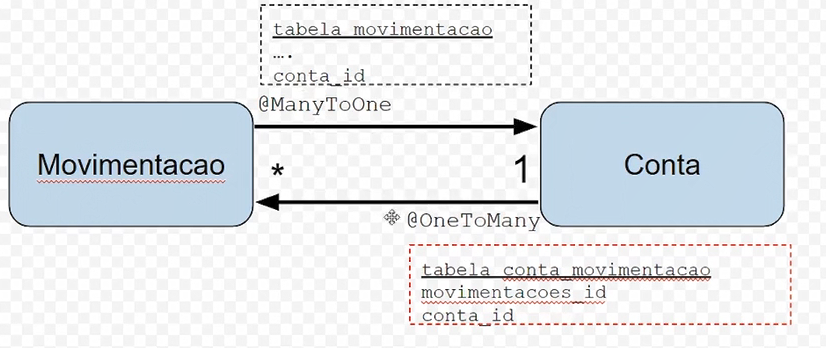
> Relacionamento em apenas uma vi, bi-direcional
```
Classe Conta
    @OneToMany(mappedBy = "conta")
    private List<Movimentacao> movimentacao;

Classe Movimentacao
    @ManyToOne
    private Conta conta;

    private List<Movimentacao> movimentacao;

// Atributo forte será  da classe conta
```

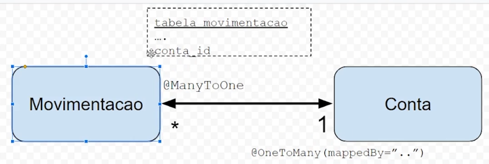

### Lidando com queries N + 1

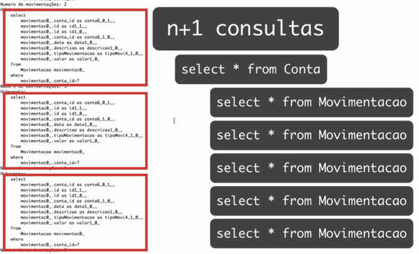

- Resolução
    - N + 1 ocorre quando precisamos disparar queries select para preencher os relacionamentos e pode ser resolvido com um join.
#### EAGER
- o Eager Loading carrega os dados mesmo que você não vá utilizá-los, mas é óbvio que você só utilizará esta técnica se de fato você for precisar com muita frequência dos dados carregados.

- Carregamento padrão, faz uma consulta, imprime o resultado depois faz outra e imprime o seu resultado


- Carregamento atencipado, faz as duas consutas e depois mostra o resultado para tudo
- Esse é o padrão para o Relacionamento `@*ToOne`
- Não é performatico para o Relacionamento `@*ToMany`
> fetch=FetchType.EAGER

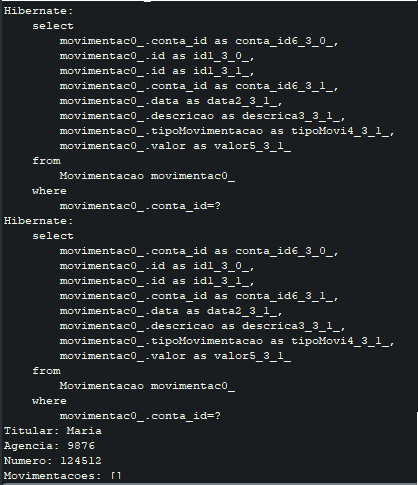

- Para usar no Relacionamento `@*ToMany`e melhorar a performace usamos um join

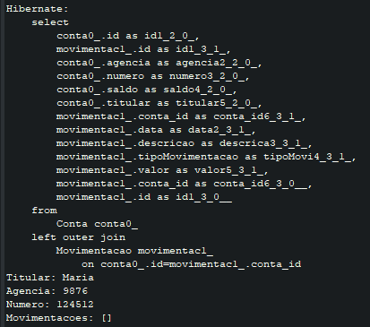

```
- Trás apenas dados que tenham movimentações
String jpql = "select c from Conta c join fetch c.movimentacoes";

- Busca todos os dados
String jpql = "select c from Conta c left join fetch c.movimentacoes";
```

#### Lazyness
- Vantagem do Lazyness
    - Performance. Economizando recursos de rede e banda.
- o Lazy Loading faz com que determinados objetos não sejam carregados do banco até que você precise deles, ou seja, são carregados 'on demand' (apenas quando você solicitar explicitamente o carregamento destes).

### Criteria

- O Root é quem define qual entidade estamos buscando, então, ela seria análoga - na SQL - a cláusula from. Portanto, usamos a classe `CriteriaQuery`, que é a responsável em montar a query.

> API de Criteria como o CriteriaBuilder
- Usamos a CriteriaBuilder para criar a CriteriaQuery
- Usamos a CriteriaBuilder para aplicar funções como sum() e avg(), além de criar Expressions ou Predicates.

- Acho que ficou claro que o JPQL é muito mais fácil de ler e entender. Isso faz sentido pois JPQL é uma DSL, uma linguagem especifica para consultas. A Criteria por sua vez é puramente Java e por isso mais verboso. Ou seja, devemos usar a JPQL sempre?

- A resposta é: depende. Só devemos usar a API de Criteria quando a consulta é dinâmica. Ai sim ele fica mais flexível e a JPQL perde toda legibilidade e simplicidade. E sempre devemos usar a JPQL quando a pesquisa é estática, pois ela é muito mais legível e enxuta.

- Resumindo:
    - as consultas JPQL são mais fáceis de escrever e ler quando a consulta é estática.
    - as consultas com a API de Criteria são superiores na hora de construir consultas dinâmicas.

## Introdução ao EJB
- Hoje em dia, a grande maioria das aplicações são desenvolvidas para executar na web. Ou seja, usamos um navegador para acessar o servidor através do protocolo HTTP. Para fazer isso funcionar basta termos um servidor como o Apache Tomcat, bastante utilizado em outros treinamentos no Alura. Com ele podemos executar uma aplicação feita com JavaServer Faces (JSF) ou outros frameworks MVC (Model-View-Controller).

> POOL
- A maioria das aplicações utilizam um banco de dados como o MySQL ou Oracle, entre várias outras opções do mercado. Nesse caso, a nossa aplicação deve se preocupar em gerenciar as conexões com o banco, o que normalmente é feito através de um pools de conexões. A escolha e configuração correta do Pool é de grande importância para qualquer aplicação e afeta diretamente o desempenho e escalabilidade.
> PERSISTÊNCIA
- Para persistirmos e acessarmos dados usando o paradigma orientado a objetos podemos usar frameworks de Mapeamento-Objetos-Relacional (MOR) como o Hibernate ou EclipseLink, que seguem a especificação JPA (Java Persistence API). A integração do framework deve ser feita da melhor maneira possível para evitar desperdício de recursos e mau uso do banco de dados.
> GERENCIAMENTO DE TX (TRANSAÇÕES)
- Alteração de dados no banco mesmo com JPA envolve transações que precisam ser gerenciadas, tarefa difícil de se fazer de maneira robusta. O mau gerenciamento das transações é um problema comum nas aplicações e pode causar problemas nas consistência dos dados.
> ERRO HANDLING / LOGGING
- Ao trabalhar com todos esses recursos, erros ou exceções podem aparecer. Ou seja, sempre devemos ter uma estratégia para lidar com as possíveis exceções que a aplicação pode causar.
> SINCRONIZAÇÃO DE ACESSO
- As classes da aplicação, como os Data Access Objects (DAOs) e as classes de serviços, serão utilizadas quando ocorrer uma requisição HTTP. A pergunta é: como podemos garantir que não há problemas de acesso e sincronização quando a quantidade de requisições crescer? Não é raro ver aplicações que começam a gerar problemas quando a demanda cresce.
> AGENDAMENTO
- Outra tarefa comum é executar tarefas periodicamente. Há aplicações que precisam agendar a execução de processos. Por exemplo, pode ser necessário enviar um email cada dia, ou verificar uma tabela no banco de dados a cada hora. O agendamento correto, no tempo exato é essencial para várias aplicações, e não é algo fácil de se implementar.
> WEB SERVICES
- Durante o desenvolvimento de uma aplicação surgem várias outras preocupações, tais como o uso de Web Services ou mesmo a segurança da aplicação, ambos importantíssimos. Em geral, todas essas preocupações listadas são agnósticas às regras de negócio. É algo que faz parte do desenvolvimento, mas não deveriam ser a preocupação principal.

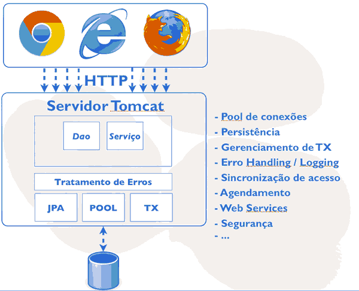

- A tarefa de um servidor de aplicações é justamente livrar o desenvolvedor dessas preocupações e fornecer uma infra-estrutura pronta para que ele possa utilizar. Ou seja, não é a aplicação que vai gerenciar a transação ou se preocupar com o agendamento de tarefas. Vamos inverter o controle e deixar o servidor de aplicações fazer essa parte.

- Por isso, essas preocupações também se chamam serviços do container ou serviços do servidor. Transação, persistência, etc. são serviços que o servidor de aplicações fornece.

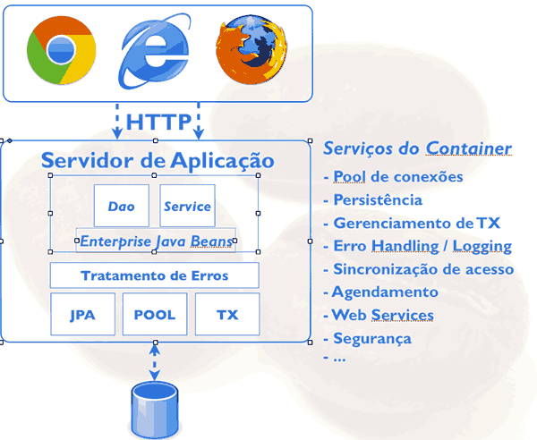

- Por exemplo, a classe DAO da minha aplicação deve ter acesso ao JPA sem se preocupar em como inicializa-lo. Para isso funcionar o Enterprise Java Beans (EJB) fornece o componente ( Entity Bean ), que é responsável pelo controle de transações de persistência de dados. O próprio DAO vai ser um EJB e assim poderá utilizar a JPA sem problemas.

- Em outras palavras, é através dos EJBs que temos acesso aos serviços que o servidor oferece sem nos preocuparmos em como cada um deles foi inicializado. Então, para usar os EJBs, sempre precisamos de um servidor de aplicações.

- Falta saber qual servidor de aplicação usaremos no treinamento. O Apache Tomcat não serve, pois não é um servidor de aplicações completo. Contudo há outras opções como RedHat JBoss AS, Oracle Glassfish, Apache Geronimo ou Oracle WebLogic, entre outros. Usaremos o JBoss AS, o servidor Java EE mais popular, opensource e totalmente gratuito.

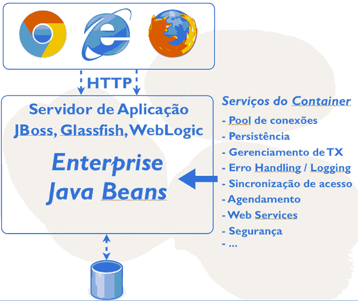

> Preparação do ambiente de desenvolvimento
1) Baixar o JBoss Application Server para começar a usar os EJBs. Para tal, acesse o site [JBOSS](https://jbossas.jboss.org/downloads);
2) Na página principal escolha a opção Downloads, depois selecione a versão JBoss AS 7.1.1.Final no formato ZIP.

### Instalação do Server Adapter
- Na aba servers
- Clique em No `servers ...`
    - Se não aparecer JBOSS 7 na aba do jboss, então clique em `Download aditional server adapter`
        - Selecioner `JBOSS AS TOLLS`
        - depois da instalação aparecerá jboss AS 7.1
    - Selecone a pasta onde baixou o servidor
    - selecione a versão (1.7 do java)[https://www.oracle.com/br/java/technologies/javase/javase7-archive-downloads.html], se não tiver instale!.


### Primeira aplicação com EJB
- Esse projeto nada mais é do que um Dynamic Web Project. Nele já foram criadas algumas classes e a interface web, mas não há nada especifico do EJB ainda. Criamos este projeto apenas por fins didáticos.

- Ao importá-lo, verifique se todas as classes estão compilando. Veja que no projeto existe um problema, pois as biblioteca do JBoss ainda não fazem parte do projeto web.

- Vamos configurar isso: 
    - botão direito no projeto livraria
    - Java Build Path. 
        - Na aba Libraries aperte o botão Add Library
            - escolha Server Runtime e o JBoss 7. 
        - Através dessa configuração as bibliotecas no JBoss fazem parte do classpath.

- Falta ainda associar o projeto com JBoss. 
    - Na aba Servers
    - Botão direito Add and Remove...
    - Escolha o projeto livraria. 

### Apresentação do projeto
- Vamos testar a aplicação acessando no navegador:

```
http://localhost:8080/livraria/login.xhtml
```
- Há uma página de login: 
    - o login é admin 
    - a senha é pass
- Caso o encoding esteja com caracteres especiais
    - No Eclipse, 
        - nas propriedades do projeto
        - selecionar UTF-8 no item Resource.

### O primeiro Session Bean
- Ao usar EJB, teremos acesso aos serviços do servidor de aplicação, como transação, persistência com JPA ou tratamento de erro. Para transformar a classe AutorDao em um EJB basta uma configuração simples. Só precisamos anotá-la com @Stateless:

```
@Stateless
public class AutorDao{
```
- O EJB Container - achou aquela anotação @Stateless e registrou esse EJB dentro de um registro disponível no servidor. Aquele registro se chama JNDI e o que estamos vendo na saída é o endereço do EJB nesse registro JNDI. O servidor usa por baixo dos panos esse registro JNDI para organizar os componentes que ele administra.

### Injeção de dependências
- Na nossa aplicação, os DAOs são utilizados através das classes que ficam dentro do pacote bean. Abra a classe AutorBean. Essa classe é utilizada através da interface JSF, ela é chamada pelos componentes JSF definidos no arquivo autor.xhtml.
- Na classe AutorBean, podemos ver que estamos usando a classe AutorDao para gravar e listar autores. Repare também que estamos instanciando a classe AutorDao:

```
public class AutorBean {

  private AutorDao dao = new AutorDao();
}
```

- É justamente essa a linha que precisa ser alterada. Ao usar EJB, não podemos mais instanciar o AutorDao na mão. Estamos assumindo o controle ao criar o DAO naquela linha. Nesse caso não estamos usando o AutorDao como um EJB.

- O DAO está sendo administrado pelo EJB Container. Portanto, quem cria o DAO é o EJB Container e não a minha classe. Consequentemente precisamos pedir ao EJB Container passar aquela instancia que ele está administrando. Felizmente, isso é fácil de fazer, basta usar a anotação @Inject:

```
public class AutorBean {

  @Inject
  private AutorDao dao;
}
```

- Pronto, o EJB será injetado! Essa parte da `inversão de controle` também é chamado *Injeção de dependências*. O DAO é uma dependência que será injetada pelo container.

> Adotando um Servidor de Aplicações que implemente as especificações da arquitetura Java Enterprise Edition (JEE).
- A tarefa de um servidor de aplicações é justamente livrar o desenvolvedor dessas preocupações e fornecer uma infra-estrutura pronta para que o desenvolvedor possa aproveitar. Ou seja, não é a aplicação que vai gerenciar a transação, a conexão com o banco de dados ou se preocupar com o agendamento de tarefas. Vamos inverter o controle e deixar o servidor de aplicação fazer toda essa parte.

> O servidor Apache Tomcat não pode ser considerado um servidor de aplicações completo porque não implementa toda a especificação Java Enterprise Edition (Java EE).

> Utilizando a arquitetura EJB, as regras de negócio são implementadas em componentes específicos que são chamados de Session Beans. O EJB Container administra esses componentes oferecendo diversos recursos a eles.

> Do Stateless Session Bean é o primeiro tipo de Session Bean. Os Stateless Session Bean não mantém estado de conversação com o cliente, não têm compromisso de manter uma sessão, são intercambiáveis e podem ser alocados de um pool e são EJBs econômicos;
- Não mantém estado de conversação com o cliente;
- Não tem compromisso de manter uma sessão;
- São intercambiáveis e podem ser alocados de um pool;
- É um EJB econômico;
> Na versão 3.1, quando o acesso a um EJB Stateless Session Bean é local, não é mais necessário definir uma interface java nem utilizar a anotação @Local. Então, bastaria criar uma classe java com a anotação @Stateless.
> Ao usar EJB, não podemos mais instanciar o AutorDaoe o LivroDao na mão. Estamos assumindo o controle ao criar o DAO naquelas linhas (1) e (2). Nesse caso não estamos usando o AutorDao e o LivroDao como EJBs.
- O DAO está sendo administrado pelo EJB Container. Portanto, quem cria o DAO é o EJB Container e não a minha classe. Consequentemente precisamos pedir ao EJB Container para passar aquela instância que ele está administrando. Felizmente, isso é fácil de fazer, basta usar a anotação @Inject:

## Capítulo 2
- Nas classes Bean usamos a anotação @Inject para receber o EJB pronto para ser utilizado. Chamamos de Injeção de dependência essa forma de receber uma instância.
Ao iniciar o servidor podemos ver no console os endereços dos 3 EJB Session Beans que já configuramos.

### Callbacks
- Este método não precisa ser público, pois ele não será chamado pela classe AutorBean. Basta anotá-lo com @PostConstruct e ele será chamado pelo próprio EJB Container:
```
@PostConstruct
void aposCriacao() {
    System.out.println("AutorDao foi criado");
}
```
- Assim que o Container cria e inicializa o Session Bean, o método aposCriacao é executado. Esse tipo de método ligado ao ciclo de vida do Session Bean também é chamado de Callback.

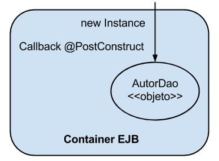
- Vamos testar a funcionalidade e publicar a aplicação. Assim que o servidor recarregá-la, - vamos limpar o console e chamá-la pela interface.

- Ao acessar a URI pelo navegador e passar pela tela de login, podemos ver que o combobox com os autores está populado, ou seja, o EJB Container já criou o AutorBean. Isso fica claro no console do Eclipse. Repare que aparece a saída AutorDao foi criado. O EJB Container instanciou o Session Bean e chamou o método callback.

### Thread safety
- Vamos testar isso melhor e simular um pouco a execução lenta do método salva no AutorDao.
- Vamos travar a execução da thread atual usando o comando Thread.sleep(..). No nosso exemplo, o thread atual vai dormir por 5 segundos. O método sleep(..) exige um tratamento de erro, por isso é preciso fazer um try-catch e podemos gerá-lo pelo Eclipse. Pronto.
- Ao salvar, podemos perceber que o nome do autor não aparece imediatamente na lista de autores abaixo. Isso acontece, pois a thread para salvar o autor ainda está em execução. Travamos por 5 segundos. Repare no console que o AutorDao foi criado e o método salva(), que está sendo executado, não terminou ainda.

- Vamos rapidamente abrir uma nova aba e recarregar a aplicação para cadastrar mais um autor. Ao salvar novamente a thread parou, mas podemos observar no console que mais um AutorDao foi criado, pois apareceu a saída do callback. Ou seja, como o primeiro objeto Session Bean estava em uso, o EJB Container decidiu criar mais um para atender a chamada. Só depois, quando os 5s passaram, aparece a última mensagem no console e consequentemente o autor é listado na interface.

- Esse pequeno exemplo mostrou que um Session Bean não é compartilhado entre Threads. *Apenas uma thread pode usar o nosso AutorDao ao mesmo tempo*. Um Session Bean é automaticamente Thread safe. `Thread safety` é um dos serviços que ganhamos de graça ao usarmos EJBs.

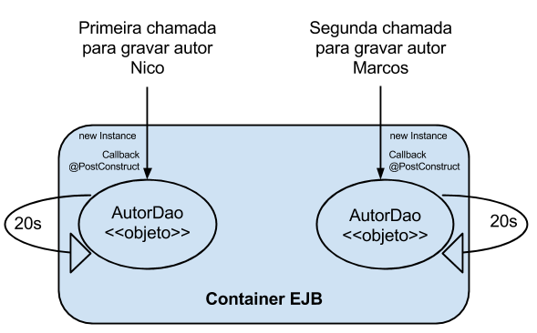

### Pool de Objetos
- Vimos que o EJB Container criou um segundo objeto do tipo AutorDao, pois o primeiro estava sendo usado. EJB Container fez isso para melhorar o desempenho, já que o Sesson Bean não é compartilhado.

- A pergunta é, quantos objetos o EJB Container serão criados? Se eu tiver 100 threads ao mesmo tempo, 100 objetos AutorDao serão criados em memória?

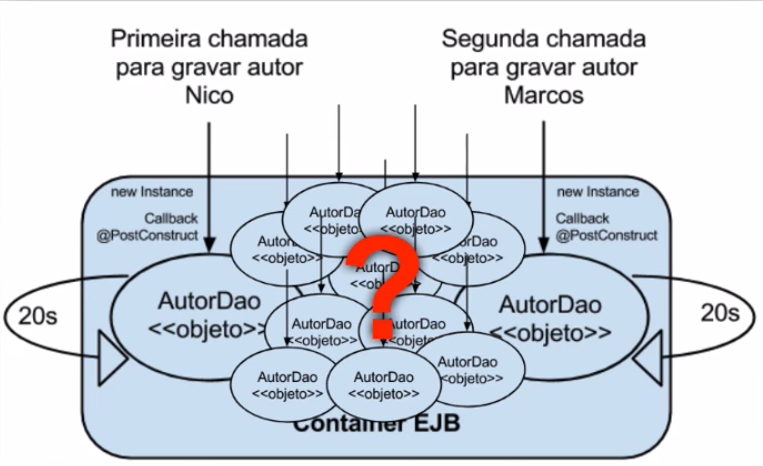

- O EJB Container automaticamente fornece um pool de objetos que gerencia a quantidade do Session Beans. A configuração desse pool se encontra no arquivo de configuração do JBoss AS, ou seja, é totalmente específico.

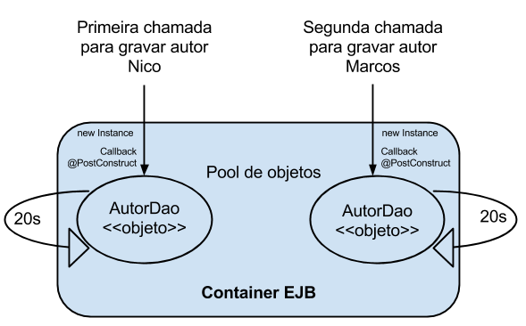

- Vamos abrir o arquivo `standalone.xml` da pasta de `standalone/configuration`. Nele procuraremos o elemento `<pools>`. Dentro desse elemento, encontraremos a configuração do pool para session beans. Repare o atributo max-pool-size que define a quantidade de objetos no pool. No nosso caso são 20 instancias.
```
<pools>
    <bean-instance-pools>
        <strict-max-pool name="slsb-strict-max-pool" max-pool-size="20" instance-acquisition-timeout="5" instance-acquisition-timeout-unit="MINUTES"/>
        <!-- outros elementos omitidos -->
    </bean-instance-pools>
</pools>
```
- O `max-pool-size` define as transações em paralelo, se tiver só uma, então a outra só será iniciada quando a primeira terminar, os Session Beans são thread safe. Repare que o console mostra que na execução foi um depois do outro, já que existe apenas um objeto do tipo AutorDao em memória.

- Repare que a configuração do tamanho do pool influencia diretamente na escalabilidade da aplicação. Ter apenas um objeto AutorDao em memória significa que `só podemos atender um chamado por vez`. Por isso faz sentido, para objeto DAO, aumentar a quantidade de objetos no pool.

### Singleton Beans
- Já aprendemos como configurar as classes DAOs, agora vamos atacar a classe Banco. O Banco ainda não é um EJB Session Bean. Podemos facilmente mudar isso e colocar a anotação @Stateless em cima da classe como vimos nos exemplos anteriores

```
@Stateless
public class Banco {
```
- E, por exemplo, no AutorDao, vamos injetar o banco. Para tal, não devemos instanciar o Banco e sim, usar a anotação @Inject:

```
@Inject
private Banco banco;
```
- Voltando para classe Banco, vimos, no exemplo anterior, que existe um pool de objetos para Session Beans. Ou seja, como o Banco é um Session Bean, teremos, no máximo, 20 instancias em memória.

- Nesse caso pode surgir a pergunta, faz sentido ter todas essas instancias dessa classe? Claro que não! Apesar do fato de que essa classe só existe para simular um banco de dados, não faz sentido nenhum ter mais do que um objeto dessa classe. É preciso ter apenas um único objeto para simular o banco.

> Felizmente podemos configurar isso sem mexer na configuração XML do JBoss AS. Basta usar a anotação `@Singleton`:

```
@Singleton  // do package javax.ejb
public class Banco {
```
### Eager Initialization
- Session Beans do tipo Singleton são tipicamente usados para inicializar alguma configuração ou agendar algum serviço. Fazer isso só faz sentido no inicio da aplicação, ou seja, quando o JBoss AS carrega a aplicação e já queremos que o Session Bean seja criado para carregar todas as configurações.

- Por padrão um EJB é carregado sob demanda (`lazy`), mas através da anotação @Startup podemos definir que queremos usar o Singleton Bean desde o início da aplicação:

```
@Singleton //do package javax.ejb
@Startup
public class Banco {
```
- Ao iniciar a aplicação o Banco já é criado e inicializado pelo EJB Container.

- Aquela inicialização com `@Startup` também é chamada **eager initialization** e a testaremos nos exercícios.

> EJB Container cria e inicializa o Session Bean, o método anotado com @PostConstruct é executado. Esse tipo de comportamento está ligado ao ciclo de vida do Session Bean e também é chamado de Callbacks.

> **Thread Safety** Significa que um EJB Session Bean não é compartilhado entre Threads. Ou seja, quando um Session Bean estiver em uso, o EJB Container decide criar mais um Session Bean para atender uma nova chamada. Uma estratégia usada pelos servidores de aplicação para isso é o Pooling for Stateless Session EJBs.

> O atributo é max-pool-size, que por default está configurado para 20 objetos Stateless Session Bean (SLSB) no pool.

> A principal característica do Singleton Session Bean é garantir que haverá somente uma instância do Session Bean.

### Session Bean Stateful (SBSF)
- Há mais um tipo de EJB Session Bean. Além dos Session Beans Stateless e Singleton, existe um Session Bean do tipo Stateful. Basta anotar a classe com @Stateful, por exemplo:
```
@Stateful
public class CarrinhoDeCompras {
 //...
}
```
- Um Session Bean Stateful (SBSF) também é um objeto administrado pelo EJB Container. Assim ele ganha os serviços oferecidos pelo Container como injeção de dependências, transação ou JPA (como veremos mais para frente).

> Qual é a diferença entre `Stateful` e `Stateless` então?

- Vimos que Session Beans `Stateless` são objetos que fazem parte de um pool. Esse pool não existe para Session Bean `Stateful`. Um SBSF funciona parecido com o objeto HttpSession do mundo de Servlets. *É um objeto exclusivo de um cliente*, apenas um cliente usará este objeto.

- Podemos imaginar que um Session Bean `Stateful` funciona como um carrinho de compras. Cada cliente possui o seu carrinho e ele utilizará o mesmo carrinho o tempo todo. Não queremos compartilhar esse carrinho com ninguém (as compras são nossas). Um Session Bean `Stateful` garante esse comportamento.

- No entanto, no dia a dia os SBSF são pouco usados. Isto porque normalmente se usa o objeto HttpSession para guardar dados do cliente (como o carrinho de compras ou as permissões do usuário). Como já usamos esse objeto dentro do servlet container não é preciso repetir essas informações através do EJB Container. Assim muitos arquitetos preferem usar apenas Stateless/Singleton em conjunto com o HttpSession.

> O Session Bean Stateful (SBSF) tem uma funcionalidade muito parecida com a do objeto HttpSession: representa um objeto para o cliente. Ideal para guardar informações que só dizem respeito ao cliente. Exemplos disso são carrinhos de compras ou permissões.

> A diferença entre Session Bean Stateful e HttpSession é que o primeiro é administrado pelo EJB Container e o segundo pelo Servlet Container.

## Integração do JPA com Pool e DataSource

> Injetando o EntityManager
- O EntityManager possui métodos de alto nível para trabalharmos com objetos. Para salvar o autor podemos usar o método persist():
```
manager.persist(autor);
```
- Para listar todos os autores, basta executar uma query:

```
manager.createQuery("select a from Autor a", Autor.class).getResultList();
```
- Por último, podemos procurar um autor pelo id:

```
manager.find(Autor.class, autorId);
```

- Quando injetamos um EntityManager não podemos utilizar a anotação @Inject. Nesse caso, o Contexts and Dependency Injection (CDI), outra especificação com o foco na injeção de dependência, buscaria o EntityManager. No entanto não encontraria o objeto e causaria uma exceção. Como o EJB Container administrará o JPA, é preciso usar uma anotação especifica do mundo EJB, nesse caso @PersistenceContext:
```
@PersistenceContext
EntityManager manager;
```
- Isso fará com que o EJB Container injete o EntityManager. Mas qual banco de dados vamos utilizar e qual é o endereço desse banco? Para tudo isso realmente funcionar, temos que definir algumas configurações sobre o banco de dados.

> Configuração do banco de dados
- O arquivo persistence.xml possui algumas configurações específicas do mundo JPA como, o nome da unidade da persistência, o provedor de persistência e as entidades do projeto.

- Também há algumas propriedades sobre a conexão com o banco de dados, usuário, senha e o driver connector utilizadas. O problema é que não devemos configurar os dados da conexão dentro do persistence.xml. Quem é responsável por fornecer a conexão é o `EJB Container`! É um serviço que o servidor disponibilizará para a aplicação.

- A única coisa que deve ser feita dentro do persistence.xml é configurar o endereço do serviço. Para isso, existe a configuração *<jta-data-source>*. Vamos deixar o endereço ainda com interrogações para entender como configura-lo primeiro.

> Usando o datasource
- Como já falamos antes, é responsabilidade do servidor fornecer a conexão com o banco de dados. Uma conexão é feita através de um driver connector, por isso precisamos registrar o driver do banco MySQL como módulo no JBoss AS.

- Dentro da pasta resources nos downloads já temos o módulo preparado, que consiste de um arquivo XML e um JAR do connector. Esses dois arquivos devem ser copiados para a pasta modules do JBoss AS.

- Internamente o JBoss AS organiza seus módulos em pacotes, por isso devemos navegar para a pasta modules/com. Dentro da pasta com criaremos uma nova pasta mysql e dentro dela uma pasta main. Dentro da pasta main colocaremos o arquivo XML e o JAR (hierarquia final das pastas: jboss/modules/com/mysql/main).

- Ao iniciar o JBoss AS, ele já carregará o novo módulo. Agora falta dizer ao JBoss AS que esse módulo representa um driver connector. Isso é feito no arquivo de configurações standalone.xml.

- Vamos abrir o XML dentro de um editor de texto qualquer e procurar pelo elemento *<drivers>*. Dentro desse elemento vamos copiar a configuração do driver que já está disponível na pasta resources.

```
<driver name="com.mysql" module="com.mysql">
    <xa-datasource-class>
        com.mysql.jdbc.jdbc2.optional.MysqlXADataSource
    </xa-datasource-class>
</driver>
```

- A configuração do driver refere-se ao módulo definido anteriormente e fornece um nome para esse driver, além de especificar o nome da classe.

- Por último, falta configurar o componente que no JavaEE chamamos de DataSource. Em uma aplicação mais robusta, é boa prática utilizar um pool de conexões. Cabe ao pool gerenciar e verificar as conexões disponíveis. Como existem várias implementações de pool no mercado, o JavaEE define um padrão que se chama DataSource. Podemos dizer de maneira simplificada que um DataSource é a interface do pool de conexões.

- Podemos ver no arquivo XML que até já existe um datasource dentro do JBoss AS. Nele podemos ver o min e max de conexões definidos, além do nome do driver responsável e os dados sobre o usuário e senha do banco.

- Agora só precisamos definir o nosso próprio datasource. Isso também já está preparado dentro da pasta resources. Basta copiar e colar a definição do datasource para o arquivo standalone.xml.
```
<datasource jndi-name="java:/livrariaDS" pool-name="livrariaDS"
    enabled="true" use-java-context="true">

    <connection-url>jdbc:mysql://localhost:3306/livraria</connection-url>
    <driver>com.mysql</driver>
    <pool>
        <min-pool-size>10</min-pool-size>
        <max-pool-size>100</max-pool-size>
        <prefill>true</prefill>
    </pool>
    <security>
        <user-name>root</user-name>
        <password></password>
    </security>
</datasource>
```

#### Docker
```
docker container run --name livraria-mysql-container -e MYSQL_USER=andre -e MYSQL_PASSWORD=123456 -e MYSQL_DATABASE=livraria -e MYSQL_ROOT_PASSWORD=123456 -d -p 3306:3306 mysql:5

```
- Repare que aquelas configurações do persistence.xml estão dentro do datasource agora. O servidor JBoss AS então criará o pool de conexões disponibilizando-o para as aplicações. A única coisa que as aplicações precisam saber é o endereço do serviço. Em nosso caso o endereço é java:/livrariaDS.

- Entrar via terminal para criar o banco
```
mysql -u root

create database livraria;
use livraria;
show tables;
```

- A principal interface da JPA que deve ser utilizada para gerenciar esses dados é o `EntityManager`.

- Como o EJB Container administrará o JPA, é preciso usar uma anotação especifica do mundo EJB para fazer a "injeção" do EntityManager, nesse caso, precisamos utilizar @PersistenceContext.


## Gerenciamento de Transações com JTA
- Vimos como usar o JPA com EJB. O uso dentro de uma aplicação foi bastante simples, basta injetar o EntityManager para utilizar os métodos que acessam a persistência com JPA.

- O JPA delega uma boa parte das configurações para o servidor JavaEE. É o JBoss quem fornece uma DataSource e que encapsula os detalhes da configuração do driver e do pool de conexão.

- Inserindo dados para login
```
insert into Usuario(login, senha) values('admin','pass');
```
#### Transação JTA
- Já conseguimos manipular os dados no banco através da nossa aplicação. Mas, como isso funcionou já que em nenhum momento nos preocupamos com o gerenciamento de uma transação? Isso é importante pois o MySQL precisa ter uma transação para realmente gravar os dados. 
    - A resposta é que o EJB Container automaticamente abriu e consolidou a transação sem ser necessário deixar isso explicito no código. Mais um serviço disponível para os EJBs!

- Isso é bem diferente caso utilizemos o JPA fora de um EJB Container. Nesse caso seria necessário gerenciar a transação na mão, ou seja, usando os método `begin() e rollback()`. Podemos testar isso rapidamente, basta tentar usar o método getTransaction() de EntityManager para chamar begin() e commit():

- É ilegal chamar getTransaction() dentro do EJB Container
```
manager.getTransaction().begin();
manager.persist(autor);
manager.getTransaction().commit();
```
- JTA significa `Java Transaction API` que é um padrão JavaEE que se preocupe com o gerenciamento da transação dentro de um servidor JavaEE. Para ser mais correto, o JTA é coordenador de transação e é ele quem vai coordenar a transação do JPA.

#### Gerenciamento da transação com JTA
- O JTA, então, é a forma padrão de gerenciar a transação dentro do servidor JavaEE e já funciona sem nenhuma configuração. Este padrão se chama CONTAINER MANAGED TRANSACTION (CMT).

- Podemos deixar a nossa intenção explicita e configurar o gerenciamento pelo container. Para tal existe a anotação `@TransactionManagement` que define o tipo de gerenciamento da transação, no nosso caso CONTAINER:
```
@Stateless
@TransactionManagement(TransactionManagementType.CONTAINER) //opcional
public class AutorDao {
```
- Essa configuração é totalmente opcional e serve apenas para fins didáticos. Igualmente, podemos deixar explicito o padrão da configuração (atributo) para cada método. Para isso existe a anotação 
`@TransactionAttribute`:

```
@TransactionAttribute(TransactionAttributeType.REQUIRED) //opcional
public void salva(Autor autor) {
```
- *REQUIRED* significa que o JTA garante uma transação rodando quando o método é chamado. Se não tiver nenhuma transação, uma nova é aberta. Caso já tenha uma rodando, a atual será utilizada. De qualquer forma, sempre é preciso ter uma transação (REQUIRED).

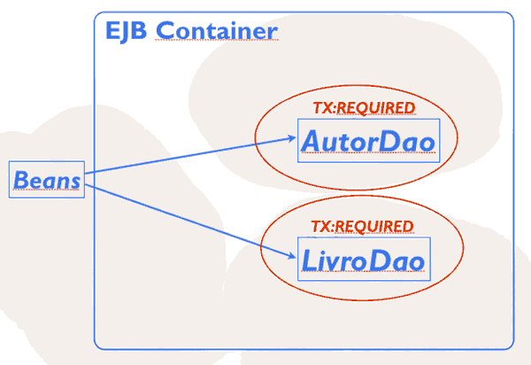

- É importante ressaltar que o tipo de gerenciamento CONTAINER e o atributo REQUIRED já é o padrão adotado para um Session Bean, então não é necessário configurar.

#### TransactionAttribute
- Através da anotação @TransactionAttribute, temos acesso a outras configurações. A primeira a testar é o MANDATORY. `MANDATORY` significa obrigatório. Nesse caso, o container verifica se já existe uma transação rodando, caso contrário, joga uma exceção. Ou seja, quem faz a chamada deve abrir uma transação.

- recebemos uma exceção. No console do Eclipse aparece o nome e a mensagem da exceção. Nesse caso foi lançado um EJBTransactionRequiredException.

- Então, quando e como devemos utilizar o MANDATORY?

- Normalmente, os DAOs não são o lugar ideal para abrir uma nova transação. Ao usar `um DAO é preciso ter uma transação rodando`. Quem faz a chamada precisa se preocupar com isso e abrir uma transação para o DAO funcionar.

#### Serviços como Transaction boundary
- Repare que na nossa aplicação são os BEANs que usam os DAOs, por exemplo o AutorBean. O problema aqui é que os BEANs não são EJBs (não são Session Beans) e por isso não têm acesso ao JTA.

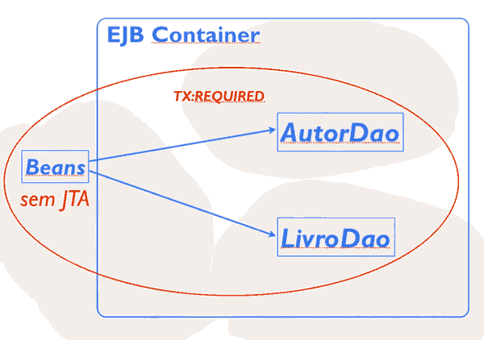

- Para resolver isso vamos criar uma classe intermediária, uma classe AutorService que fica entre os Beans e os DAOs. A classe *AutorService* também será um Session Bean e responsável por abrir uma nova transação. É ela quem recebe um AutorDao injetado e delega a chamada:


- Na classe AutorService, vamos primeiro injetar o AutorDao::
- O método adiciona(..) recebe um autor e delega a chamada para o DAO:
```
@Stateless
public class AutorService {

    @Inject AutorDao dao;

public void adiciona(Autor autor) {
    dao.salva(autor);
}
```
- Nesse método poderiam ficar mais regras ou chamadas de regras de negócios. É muito comum ter essa divisão de responsabilidade entre bean, serviço e DAO em um projeto real. O bean possui muito código relacionado ao JSF (view), o serviço é o controlador na regra de negócio e o DAO possui o código de infraestrutura.

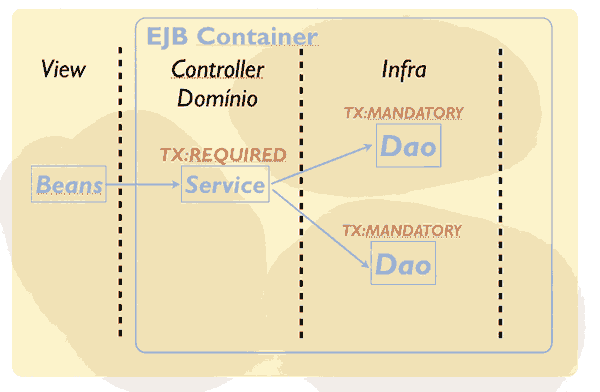

- Como já falamos, o padrão TransactionAttribute é REQUIRED, ou seja, ao chamar o método adiciona(..) será aberta, automaticamente, uma nova transação.
- Revisando, o bean recebe a chamada da tela, delega para o serviço que abre a transação e delega para o DAO.

#### Outros atributos
- Além do REQUIRED e MANDATORY, há outros atributos disponíveis. O *REQUIRES_NEW* indica que sempre deve ter uma nova transação rodando. Caso já exista, a transação atual será suspensa para abrir uma nova. Caso não tenha nenhuma rodando, será criada uma nova transação.

- Outro atributo *NEVER* é quem indica que jamais deve haver uma transação em execução. Isso pode ser útil para métodos que obrigatoriamente devem ser executados sem contexto transacional. Vamos testar isso uma vez para mostrar o funcionamento.

- Existem outros atributos como *SUPPORTS* e *NOT_SUPPORTED* que veremos nos exercícios.

#### Gerenciamento da transação programaticamente
- O gerenciamento da transação pelo container é uma das vantagens do EJB e sempre deve ser a maneira preferida de se trabalhar. Contudo existe uma outra forma, parecida com aquela mostrada baseado no EntityManager. Essa forma permite o controle programaticamente, chamando begin() ou commit() na mão.

- Para o EJB Container aceitar o gerenciamento da transação programaticamente, é preciso reconfigurar o padrão. Ou seja, ao invés de usar CONTAINER na anotação TransactionManagement usaremos BEAN, porque o Session Bean vai gerenciar a transação (também é chamado BEAN MANAGED TRANSACTION). Assim também podemos apagar a anotação @TransactionAttribute que não faz mais sentido.

- Para realmente gerenciar a transação, é preciso injetar um objeto com este papel. Para este propósito existe a interface UserTransaction do JTA. Basta injetar o objeto através da anotação @Inject:
```
@Inject UserTransaction tx;
```
- `UserTransaction` possui os métodos clássicos relacionados com o gerenciamento da transação como begin(), commit() e rollback(). O problema é que exige um tratamento excessivo de exceções checked que poluem muito o código.

- Vamos colocar as chamadas dos métodos begin() e commit() dentro de um try-catch. O Eclipse ajuda nessa tarefa e gera automaticamente o bloco de tratamento. No nosso exemplo, para simplificar o entendimento, vamos capturar qualquer exceção, ou seja, fazer um catch(Exception):
```
public void salva(Autor autor) {
    //...
    try {
        tx.begin();
        manager.persist(autor);
        tx.commit();
    }catch(Exception e) {
        e.printStackTrace();
    }
    //...
}
```
> O Java Transaction API é a forma padrão de gerenciar transações com bases de dados dentro do servidor Java EE e já funciona sem nenhuma configuração adicional.
- Este padrão se chama Container Managed Transaction (CMT)

> Configuração adicional para gerenciar transações dentro do servidor Java EE, explícita
- Bastaria utilizar a anotação @TransactionManagement(...) que define o tipo de gerenciamento da transação, no nosso caso TransactionManagementType.CONTAINER.

> Qual a principal diferença entre os atributos de transação REQUIRED e REQUIRES_NEW?
- Utilizando tanto o atributo REQUIRED quanto REQUIRES_NEW, o JTA garante uma transação rodando quando o método é chamado. Porém, a principal diferença está no fato de que, utilizando o atributo REQUIRED, caso já tenha uma transação rodando, ela será utilizada. Já no caso do atributo REQUIRES_NEW, caso já exista uma transação rodando, a transação atual será suspensa para abrir uma nova.

> Existem mais dois atributos dentro para definir o comportamento da transação:
- TransactionAttributeType.SUPPORTS
- TransactionAttributeType.NOT_SUPPORTED.
    -  Com o atributo configurado para SUPPORTS, o código será executado com ou sem transação. Já com NOT_SUPPORTED o código deverá ser executado sem transação, caso alguma transação esteja aberta, ela será suspensa temporariamente até a execução do método acabar.

## Lidando com Exceções
- Já percebemos que podem acontecer exceções durante a execução da aplicação, mas como o container EJB lida com elas? Além disso quais são as formas que o desenvolvedor tem para mitigar um problema?

- Vamos imaginar que dentro do DAO, além de cadastrar o autor no banco, também seja feito uma chamada para um serviço externo (um web service por exemplo). Nessa comunicação a rede pode falhar ou o serviço pode ficar desligado temporariamente. Esse são problemas que não dependem da aplicação.

- Ou seja, nesse caso inevitavelmente vai ocorrer uma exceção. Para simular este problema, vamos lançar uma exceção no fim do método salva() da classe AutorDao:

```
throw new RuntimeException("Serviço externo deu erro!");
```
- Vamos republicar a aplicação e acessá-la pela interface, algo nada novo pra nós. Depois do login, vamos testar o cadastro de autores que executa justamente o método que causa a RuntimeException.

- O resultado não é uma surpresa. No console do Eclipse aparece o Stacktrace, ou seja, a pilha de execução com a exceção em cima dela. Podemos ver que nossa exceção foi quem causou o problema.

- Ainda no console vamos subir mais um pouco, quase no início. Aí podemos ver que a nossa exceção foi "embrulhada" em uma outra do tipo EJBTransactionRollbackException. O nome indica que foi feito um rollback da transação.

- É importante deixar isso claro, pois antes de lançar a exceção já usamos o JPA para persistir o autor. Sem rollback o autor estaria salvo no banco. Para ter certeza disso, vamos verificar o MySQL no terminal. Nele executaremos um select para verificar a tabela Autor. Como já esperávamos, não foi salvo o autor por causa do lançamento da exceção.

#### Exceções da Aplicação
- Vamos comentar a RuntimeException dentro da classe AutorDao e abrir a classe AutorService. Em uma aplicação real, essas classes de serviços são utilizadas para coordenar as chamadas de regras de negócios.

- É claro que ao chamar alguma regra também podem aparecer alguns problemas. Alguns deles são previstos e farão parte do negócio. É comum que uma validação falhe e um valor não seja salvo, pois uma regra específica não permite. Repare que este tipo de problema não é relacionado com a infraestrutura e sim com o domínio da aplicação.

- Vamos simular isso uma vez e causar uma nova exceção, mas agora uma exceção do tipo LivrariaException:

```
throw new LivrariaException();
```
- Crie essa classe de exceção.

- No nosso caso vamos colocar o throws na assinatura do método. Isso significa que agora a classe AutorBean não compila mais, já que a chamada do serviço causa uma exceção checked. Faremos a mesma coisa usando na assinatura do método o throws. Pronto, tudo está compilando.

- Vamos tentar salvar o autor Mauricio Aniche.

- Já podemos ver que o autor não aparece na tabela da interface web. Como esperado, no Eclipse aparece a exceção igual ao exemplo anterior. Ao analisar o console podemos ver a LivrariaException, mas dessa vez ela não foi "embrulhada" dentro de uma `EJBTransactionRollbackException`.

- Para ter certeza, vamos verificar o banco de dados. Novamente selecionaremos todos os autores da tabela Autor. Para nossa surpresa o autor foi salvo! Mesmo sendo lançado uma exceção na pilha de execução, foi feito um commit na transação!

- Ao atualizar a interface web, podemos ver que realmente aparece o autor. Como, então, o container lida com as exceções?

#### System e Application Exceptions
- Vimos dois comportamentos diferentes do container referentes a exceção. 
    - O primeiro exemplo foi uma exceção do tipo unchecked que causou um rollback
    - Segundo exemplo usou uma exceção checked que não causou rollback.

- Pelo ponto de vista do container, o primeiro exemplo representa uma `System Exception`, algo grave e imprevisto. `System Exception` sempre causam rollback. Além disso, aquele Session Bean que lançou a exceção é invalidado e retirado do pool de objetos.

- O segundo exemplo representa uma `Application Exception`. Que é uma erro que pode acontecer durante a vida da aplicação e é relacionado ao domínio. Por isso não causa rollback e nem invalida o Session Bean.

- Por padrão, qualquer exceção unchecked é uma `System Exception` e qualquer exceção checked é uma `Application Exception`. Isso é o padrão do EJB Container, mas como já vimos anteriormente, esse padrão pode ser reconfigurado.

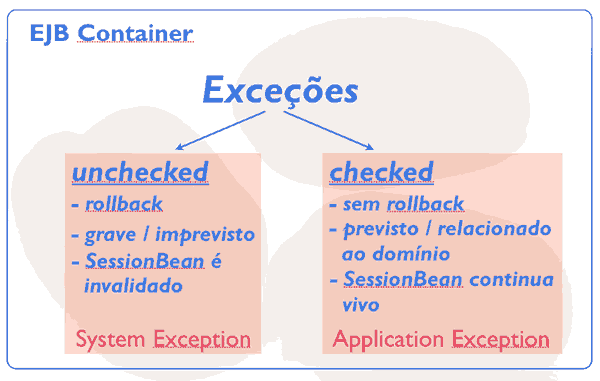

#### Configurando Application Exceptions
- Vamos abrir a classe LivrariaException e deixar explícito que ela é uma `Application Exception`. Para isso usaremos a anotação *@ApplicationException* que possui atributos para redefinir o comportamento referente a transação. Vamos fazer uma configuração para que essa `Application Exception` cause sim um rollback:

```
@ApplicationException(rollback=true)
public class LivrariaException extends Exception{

}
```
- Como sempre, vamos testar o novo comportamento. Ao cadastrar um autor pela interface web é lançado uma LivrariaException. Novamente a exceção aparece no console do Eclipse e repare também que essa exceção não foi embrulhada. Até aqui é tudo igual. No entanto, ao verificar o banco de dados, percebemos que o autor não foi salvo, ou seja, foi feito um rollback da transação.

- Por fim, uma vez declarado a LivrariaException como @ApplicationException, podemos deixar ela unchecked. Isso significa que não precisamos estender a classe Exception e sim RuntimeException. Assim, o compilador não obriga o desenvolvedor a fazer um tratamento explicito da exceção. Podemos, então, apagar aquelas declarações throws na assinatura dos métodos no AutorBean e no AutorService.

> O que acontece quando uma EJBTransactionRollbackException é lançada?
- Uma System Exception é lançada

> Uma Application Exception é do tipo checked, por padrão.

> Qual é a diferença entre System Exception (SE) e Application Exception (AE)?
- AE é relacionada ao domínio. SE é relacionada com problemas na infra-estrutura.

## Novos serviços com Interceptadores

## Integração com Web Services

## Agendamento e EAR
