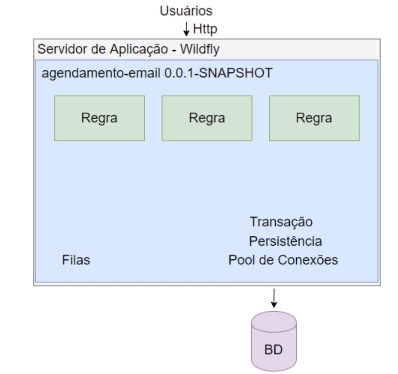
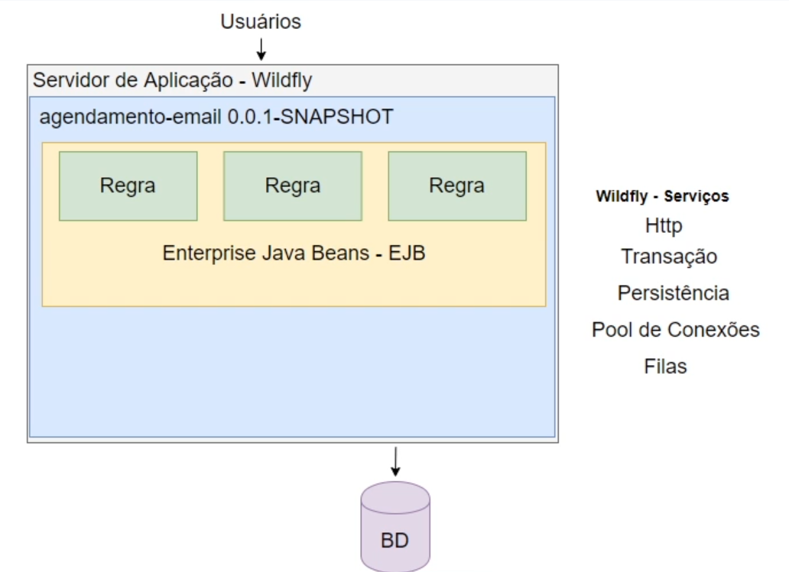
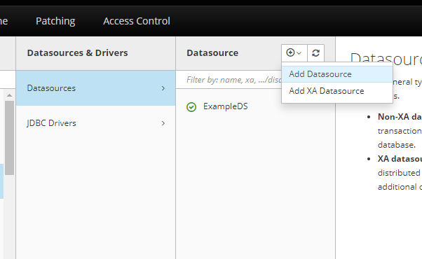

# JAVA EE

### Módulo 4
- [Do Java EE ao Jakarta EE Ver primeiro vídeo](#anc1)
- [Apresentando EJB’s e o projeto de agendamento de e-mails](#anc2)
- [Persistência com JPA](#anc3)
- [Fazendo requisição ao nosso EJB com JAX-RS](#anc4)
- [Agendamento com TimerService](#anc5)
- [Mensageria com JMS](#anc6)
- [Controle de transação com JTA](#anc7)

##

<a name="anc1"></a>

## Do Java EE ao Jakarta EE Ver primeiro vídeo
- Boas-vindas ao curso de EJB com Jakarta EE. Antes de partimos para o desenvolvimento da aplicação que será apresentada aqui no curso eu gostaria de passar com vocês nos slides e mostrar o que é o Jakarta EE.

- Tem tido muitas dúvidas sobre o assunto e sempre leva aquela famosa pergunta: o Java morreu? O Java vai morrer? 
    - A resposta é não. Na verdade, 
- o que houve foi uma *transição* entre empresas e foi necessária a troca do nome, mas para entender melhor essa troca nós vamos conhecer um pouco da história de como começou o Java EE.
    - História
    - Arquitetura
    - Sistema de API's
    - Containers

- Para isso eu trouxe alguns pontos que serão comentados: como surgiu o Java EE, a arquitetura, o que é esse sistema de API’s, o que são Containers, para entendermos todo esse cenário até chegar lá no Jakarta EE.

- Falando de história, como surgiu o Java EE? Na época a ASSAM era a atual detentora do Java e isso estou falando dos anos 90, e para suprir uma necessidade da Internet foi pensado um projeto Java corporativo para sistemas corporativos e o nome dele foi J2EE que era Java 2 Plataform Entrepise Edition.
    - Aplicações Desktop
    - Crescimento da internet
    - Projeto corporativo

- A ideia da ASSAM era escrever um conjunto de especificações onde pessoas poderiam implementar essas especificações e ter implementações para essas especificações criadas para o mundo corporativo.

### Arquitetura
- E para isso pensou-se em uma arquitetura, nós tínhamos o J2EE Platform, que era a plataforma que seguia um conjunto de API's, então essas especificações foram pensadas em API’s que teriam que ter as suas implementações. E poderia ser feito por terceiros ou por pessoas dentro da sua empresa que quisessem usar essas API's. 
        - J2EE Platform 
        - J2EE Compability Test Suit
        - J2EE Reference Implementation 

- Só que quando eu estou falando em seguir essas especificações, implementar essas API's, quando eu queria ter algo com implementação válida daquela minha especificação eu tinha o J2EE Compability Test Suit que testava se uma implementação era compatível com o padrão que eu tinha da minha API, da minha especificação.

- E também eu tinha mais um recurso nessa minha arquitetura que era a J2EE Reference Implementation que era uma implementação padrão. Porque, pensem bem, o Java EE tinha especificação mas aquela API precisava ser implementada, só que as empresas terceiras ainda iam ter acesso a especificação e iria levar um tempo para implementar aquela determinada API.

- Só que eu, desenvolvedor, muitas vezes já queria ter acesso aos recursos padronizados pela minha API, então eu já recebia essa implementação de referência. Depois se eu quisesse trocar por uma implementação de terceiros eu fazia isso de uma forma fácil porque a API é um conjunto de interfaces padronizadas de acordo com a necessidade dos sistemas corporativos.

- Então a ideia era justamente facilitar essa troca ou não ficar vinculado à uma empresa terceira, a uma implementação específica.

- Falando mais um pouco do sistema de API's nós podemos ver que o objetivo era desenvolver esse sistema e especificar um padrão de desenvolvimento. Então dessa forma nós poderíamos trocar de implementação sem muita dor no código.

### Sistema de API’s
- Esse sistema de API’s foi bem interessante para o Java EE e eu trouxe algumas que foram criadas, algumas API's, algumas especificações que fizeram parte das primeiras lições do Java EE.
    - Enterprise Java Beans (EJB)
    - JavaServer Pages (JSP)
    - Java Servlet
    - Java Database Connectivity

- Os EJB’s que são os Entreprise Java Jeans que são famosos até hoje e inclusive nós vamos falar sobre eles ao longo do curso. Nós tivemos o JSP (JavaServer Pages) e estão todas API's válidas, especificações válidas, algumas são bastante utilizadas outras nem tanto, mas ainda estão aí no Java EE até hoje. Nós temos o Java Servlet, Java Database Connectivity.

### Container
- Nós tínhamos a necessidade de deploiar essas aplicações corporativas em algum lugar, então temos Containers que são servidores de aplicações e eles são divididos em duas categorias: Web Container e EJB Container.
    - Web Container
    - EJB Container

- A diferença deles é que Web Container não vai ter a implementação de todos os serviços do Java EE, ele vai implementar alguns serviços mais voltados ali para o HTTP e a ideia dele é executar e controlar a execução das servlets.

- Já o EJB Container não, a aplicação EJB quando eu uso um Containers, um servidor de aplicação que implementa um EJB por exemplo, nós estamos falando de um Container muito mais robusto, então ele não vai me fornecer a implementação de todos os serviços do Java EE.

- Inclusive o GlassFish é o servidor de aplicação de referência, mas nada impede de você usar um WideFly, um Webson e todos eles vão ser esses servidores mais robustos e vão te entregar esses recursos todos implementados para facilitar a vida do desenvolvedor.

### Jakarta EE
- Agora conhecendo essas questões das API's, das especificações, das implementações você pode estar se perguntando porque houve essa troca para o Jakarta EE? A verdade é que a Oracle passou a focar e investir em outras tecnologias. O Java EE já estava ficando um pouco de lado. E é um plataforma extremamente utilizada mundialmente.

- Para que isso não viesse a atrasar a melhoria do Java e acompanhar as plataformas que estavam sendo atualizadas frequentemente, decidiu-se passar o direito do Java EE para a Eclipse Foundation. Só que o nome do Java é propriedade da Oracle, então o nome precisava ser alterado e por isso passou a ser Jakarta EE.

- A ideia é a mesma, é o projeto continuar com a ideia das especificações, das implementações só que agora com uma empresa que vai continuar levando o Jakarta como uma tecnologia de ponta trazendo API's que hoje cubram cenários, por exemplo, como a Cloud entre outras tecnologias mais atuais.

- Então para quem tinha essa dúvida sobre o Java estar morrendo, o Jakarta ser uma coisa totalmente diferente do Java não se preocupem. O Java continua mais vivo do que nunca e agora com ideia de que nós desenvolvedores temos os recursos mais novos só que com esse nome agora Jakarta que nada mais é só uma questão de direito autoral.

> servidor de aplicação J2EE
- Os servidores de aplicação implementam os serviços do Java/Jakarta EE.

- Use a versão 14 do Java

- Então começando pela versão do Eclipse como falado a versão do Java que nós vamos utilizar é a 14, então se você vir no menu superior em “Window > Preferences > Java > Installed JREs” nós vamos ver que o ‘jdk' é a 14.

- Agora a ideia do nosso projeto, a ideia do projeto do curso é ser desenvolvido um agendamento de e-mails. Vai ser um projeto Maven e ao longo das aulas nos vamos acrescentado os recursos do Jakarta EE nessa nossa aplicação.

- Importar projeto, “File > Import" nós vamos selecionar essa opção ‘Existing Maven Projects', o projeto Maven existente.

- Agora que temos uma aplicação nós precisamos de um lugar para deploiarmos essa aplicação. Chegou a hora de configurarmos o nosso servidor de aplicação.

- Para esse curso nós definimos que o servidor de aplicação vai ser o WildFly, ele é um servidor robusto, é gratuito e opensource.

- Mas para configurar o nosso servidor de aplicação nós podemos voltar para ideia é nos vamos na aba de "Servers". A sua pode não estar disponível para visualização, mas se não tiver você vai em "Window > Show View > Server" e se não tiver nas primeiras opções você pode ir em "other" e escrever "Server" que já vai aparecer, você seleciona e dar um "open" e vai aparecer essa aba para configurarmos o nosso servidor de aplicação.

- Para configurar nós vamos clicar nesse link que ele tá falando que não tem nenhum servidor disponível, se você quiser criar um novo é só clicar nesse link. É isso que nós vamos fazer. Baixamos a versão 20 do WildFly, só que aqui na nossa ideia só tem até a versão 19, só que não tem nenhum problema vamos poder selecionar ela sem nenhum problema.

- Dá um "next", essas duas opções do servidor local ou ‘Controlled by: Filesystem and shell operations’ podemos deixar selecionadas. O que vai valer para a gente é essa ‘Create new runtime' é a única opção que tem aqui a não ser que você já tenha configurado um outro ‘runtime’ anteriormente, mas se tiver vai ter a opção para você criar um novo e nós vamos selecionar aqui.

- Vou dar um next e ele vai dar um alerta falando “as versões são diferentes”, mas não tem problema nós podemos deixar dessa forma mesmo. A única coisa que nós vamos fazer é renomear para ‘WildFly 20 Runtime' ou o nome de preferência de vocês.

- Agora chegou o momento de selecionar o nosso servidor de aplicação, o download do nosso servidor de aplicação. O meu está em "downloads", então você vem em "downloads", "WildFly" seleciona ele, seleciona a pasta e vocês vão selecionar no diretório em que vocês salvaram.

- Chegou na hora de colocar o ‘Runtime JRE', então qual que a versão da JRE que vamos executar a nossa aplicação? Já vimos que é a versão 14, então eu vou botar ‘Alternate JRE’ e selecionar 'jdk-14' que é a minha que está configurada na minha máquina. Vamos ver aqui que é exatamente a da minha máquina local que está salvo, o meu Java.

- Nós vamos ver que no WildFly nós temos alguns arquivos de configuração e chamamos esses arquivos de ‘standalone', aqui o ‘standalone.xml' e se eu vim em ‘browse’ nós vamos ter outras opções.

- Nós vamos ter o ‘standalone' que é o que está selecionado, o ‘standalone-full, ‘standalone-ha'. Nós vamos usar o ‘standalone-full’ porque é o que tem mais configurações a que serem feitas. Nós vamos ver ao longo das aulas o que são essas configurações e em que momento nós vamos mexer nelas.

- Aperta o "next", chegou o momento de informar para o nosso servidor de aplicação qual aplicação que vai ser deploiada nele, no nosso caso é ‘agendamento-email’.

- Vamos ver isso nas próximas aulas. Configurei minha aplicação dou um "Finish". Aparentemente tudo certo, só que agora como nós vamos usar o Jakarta EE para desenvolver o nosso projeto, nada mais justo que pegarmos a API do Jakarta EE para colocarmos nas nossas dependências.

- Como que nós vamos fazer isso? Vamos aqui no nosso navegador e vamos lá no Maven repository e vamos procurar pelo Jakarta EE. A primeira que vai aparecer é o Jakarta EE Plataform API, nós vamos selecionar e eu quero a [versão 8.0](https://mvnrepository.com/artifact/jakarta.platform/jakarta.jakartaee-api).

- A única coisa que eu preciso fazer aqui é clicar nessa dependência abaixo, mandar copiar e aqui no meu ‘pom.xml’ abaixo de properties eu crio uma tag chamada <dependencies > e copio a dependência do Jakarta EE aqui dentro de dependências.

- Agora o que eu posso fazer é clicar com o botão direito na minha aplicação, vou na opção de “Maven > Update Project" e seleciono “Force Update of Snapshots/Releases.

<a name="anc2"></a>

## Apresentando EJB’s e o projeto de agendamento de e-mails



- Por exemplo, eu vou ter o meu usuário fazendo a requisição para nossa aplicação, geralmente esse usuário vai fazer a requisição via browser ou via um software como o Postman, que é um software de requisição http e essa requisição vai chegar na nossa aplicação.

- Só que a nossa aplicação vai precisar conhecer os detalhes do protocolo http porque a partir disso ela consegue transformar essa requisição como objeto Java e o objeto Java vai passar pelas nossas regras negociais que são as caixas verdes no desenho.

- Ele vai fazer alguma alteração com essa requisição e, por exemplo, se precisar persistir no banco de dados eu vou precisar abrir uma transação, usar os detalhes da implementação que nós escolhemos para persistir essa informação.

- Então, por exemplo, se eu estou usando um JPA, que é a especificação "Jakarta Persistence API", junto com o Hibernate que é o framework que a implementa, eu vou precisar chamar os métodos para eu conseguir persistir o meu objeto.

- Eu tenho que configurar um pool de Conexões porque o banco de dados é uma questão sensível de aplicação, então eu não posso sair abrindo conexões de forma descontrolada desse banco de dados Porque eu posso onerar meu banco de dados e assim derrubar, fazendo com que a nossa aplicação tenha um péssimo comportamento.

- Podemos ter também aqui detalhes de "Filas" e conforme nossa aplicação vai crescendo nós vamos ter detalhes de segurança, de Jobs, ou seja, são agendamentos ficam executando de tempos em tempos para executar alguma ação. Enfim, são vários detalhes que nós temos que ter domínio para criar uma aplicação corporativa.

- Só que uma coisa que eu gostaria de chamar atenção na nossa imagem é sobre o que nós estamos fazendo nela. Pelo que nós falamos teremos que ter conhecimento sobre protocolo "http", porque eu preciso transformar a requisição no objeto Java.

- Por isso eu tenho que ter conhecimento sobre como abro a transação com o banco de dados, tenho que ter o conhecimento sobre o JPA, tenho que configurar um pool de Conexões além de ter que configurar "Filas" e outros detalhes.

- São questões de infra da nossa aplicação, ou seja, elas não fazem parte das nossas regras negociais, nós apenas usamos esses detalhes para que as nossas regras negociais estejam de forma correta, digamos assim, para que nossa aplicação tenha um comportamento correto.

- Pensando bem, o interessante seria se tudo isso aqui que é infra como detalhes do protocolo http, abertura de uma transação, a configuração de uma "Fila" fosse fornecido para nossa aplicação e nós desenvolvedores tivéssemos que focar apenas nas regras negociais.

- E aqui tem a vantagem de se trabalhar com um servidor robusto porque quando eu tenho servidor igual ao WildFly, ele passa a nos fornecer esse tipo de serviço para que o desenvolvedor não me preocupe justamente com detalhes de implementação do que acabamos de ver como "Transação", pool de Conexões, Persistência.

- Então o WildFly vai ter esse serviço para me fornecer e todos esses que foram citados anteriormente saem da minha aplicação e passam a ser fornecidos por ele. O "protocolo http" agora é um serviço fornecido pelo WildFly, uma "transação" é aberta pelo WildFly, "persistência" também como detalhes da implementação do "JPA" vai ser do nosso WildFly, e as "Filas" também. Assim, nós temos todos os serviços configurados para nós.

- Agora nós estamos vendo a vantagem de trabalhar com um servidor mais robusto.

- Só que agora o que vocês devem estar pensando é: eu tenho minha aplicação com minhas regras negociais e eu tenho um servidor que me fornece serviços de infra, mas como que eu junto os dois? Como que minha transação vai usar um serviço de transação fornecido por um servidor de aplicação?

- Essa é a motivação dessa nossa aula, nós vamos ter um recurso que é uma especificação do Jakarta EE que se chama "**Enterprise Java Beans**", nós costumamos falar que os EJB's que vão ser classes normais, classes Java como nós estamos acostumados a trabalhar, só que com algumas configurações a mais. Nós vamos ter as nossas classes que tem as nossas regras negociais que agora são os nossos EJB's.



- Com o EJB eu vou ter uma forma de injetar esses serviços aqui, então através da injeção de dependências eu consigo injetar um serviço na minha classe, no meu EJB e quando eu precisar usar um serviço do meu servidor de aplicação a partir do meu EJB quando eu chamar esse serviço o servidor de aplicação vai me fornecer uma instância desse serviço.

- Fazemos a inversão de controle, ao invés de instanciar um serviço na mão usando o New objeto, agora quando eu injeto esse serviço no meu EJB e eu preciso usá-lo quem vai me fornecer a instância desse cara é o meu servidor de aplicação. Aqui é a beleza do EJB, pois todo o controle de detalhes sobre instanciação, sobre implementações, não passa mais a ser do domínio do desenvolvedor.

- Ele só precisa conhecer as regras negociais e quando precisar utilizar um serviço desse nós temos aí os EJB's juntamente com os serviços fornecidos pelo nosso servidor de aplicação para resolver essa situação para nós.

- Então o foco é cem por cento em regra negocial. Obviamente, pode ter ficado alguma dúvida, mas a ideia agora é sabermos qual que é a motivação de se usar o EJB e nas próximas aulas começar a codificar as nossas classes, os nossos EJB's e ver essas vantagens na prática.

> Qual a vantagem de se usar EJB?
- *O EJB inverte o controle e passa a responsabilidade, de instanciar objetos e fornecer serviços, para o servidor de aplicação.*

> Como podemos transformar esta classe em um EJB?
- *Anotando a classe com @Stateless.*

- No standalone-full
    - Usa as threds do processador, a gente fica sem muito controle
```
derive-size="from-worker-pools"
```
- Trocaremos por:
    - Terá até 20 instâncias
    - Evitar erros de `Out of memory`
```
max-pool-size="20"
```

<a name="anc3"></a>

## Persistência com JPA


### Docker

> No Dockerfile, ele cria o banco automaticamente, pois, lá ele conpia o script do banco para o entrypoint do banco, sendo executado assim que rodar o run.
#### Criando a imagem
    - docker build -t img-agenda .
#### Criando container
```
docker container run --name agenda-email-container -e MYSQL_USER=andre -e MYSQL_PASSWORD=123456 -e MYSQL_ROOT_PASSWORD=123456 -d -p 3306:3306 img-agenda
```
- Acessando o banco
```
$  docker exec -it agenda-email-container bash
root@container_id:/# mysql -u root -p
Enter password: 123456

show databases
use agendamentoemaildb;
show tables
 desc agendamentoemail;
```

### Criando um usuário no Wildfly
> Esses são os passos para criar um usuário no Wildfly
- Entra na pasta bin do servidor
    - Digita `add-user.bat`
    - Digita "a"
    - Coloca o username do usuário
    - Digita o password, confirma com yes e coloca novamente o password
    - pronto usuário criado
- Para testar, entre em [Painel Administrativo](http://localhost:9990/console/index.html)
- Já irá pedir usuário e senha.

```
C:\server\wildfly-20.0.0.Final\bin>add-user.bat

What type of user do you wish to add?
 a) Management User (mgmt-users.properties)
 b) Application User (application-users.properties)
(a): a

Enter the details of the new user to add.
Using realm 'ManagementRealm' as discovered from the existing property files.
Username : teste
Password recommendations are listed below. To modify these restrictions edit the add-user.properties configuration file.
 - The password should be different from the username
 - The password should not be one of the following restricted values {root, admin, administrator}
 - The password should contain at least 8 characters, 1 alphabetic character(s), 1 digit(s), 1 non-alphanumeric symbol(s)
Password :
WFLYDM0098: The password should be different from the username
Are you sure you want to use the password entered yes/no? yes
Re-enter Password :
What groups do you want this user to belong to? (Please enter a comma separated list, or leave blank for none)[  ]:
About to add user 'teste' for realm 'ManagementRealm'
Is this correct yes/no? yes
Added user 'teste' to file 'C:\server\wildfly-20.0.0.Final\standalone\configuration\mgmt-users.properties'
Added user 'teste' to file 'C:\server\wildfly-20.0.0.Final\domain\configuration\mgmt-users.properties'
Added user 'teste' with groups  to file 'C:\server\wildfly-20.0.0.Final\standalone\configuration\mgmt-groups.properties'
Added user 'teste' with groups  to file 'C:\server\wildfly-20.0.0.Final\domain\configuration\mgmt-groups.properties'
Is this new user going to be used for one AS process to connect to another AS process?
e.g. for a slave host controller connecting to the master or for a Remoting connection for server to server EJB calls.
yes/no? yes
To represent the user add the following to the server-identities definition <secret value="dGVzdGU=" />
Pressione qualquer tecla para continuar. . .
```

### Criação do módulo do Wildfly
- O `jar` do banco está na pasta extras
- Vai na pasta onde está o servidor JBOSS
- No meu caso: `C:\server\wildfly-20.0.0.Final\bin`
- Abre o terminal e digita
```
> jboss-cli.bat
> You are disconnected at the moment. Type 'connect' to connect to the server or 'help' for the list of supported commands.

> [disconnected /] connect
> [standalone@localhost:9990 /] module add --name=com.mysql --resources="C:\Users\andre\eclipse-workspace\Java-ee\extras\mysql-connector-j-8.0.32.jar" --dependencies=javax.api,javax.transaction.api

> [standalone@localhost:9990 /] /subsystem=datasources/jdbc-driver=mysql:add(driver-name=mysql,driver-module-name=com.mysql,driver-xa-datasource-class
-name=com.mysql.cj.jdbc.MysqlXADataSource
{"outcome" => "success"}
```
### Console de adinistração do Wildfly
- [Console](http://localhost:9990/console/index.html)
- A imagem mostra o acesso ao wildfly com o driver criado pelas linhas de comando acima.


#### Criando o Datasource
- Clicamos em Datasource
    - Add datasouce
        - Selecione o Banco de dados
        - Defina um `name` e `JNDI name`, pra essa caso foi **AgendamentoEmailDS**
            - **name** AgendamentoEmailDS
            - **JNDI name** java:/AgendamentoEmailDS
        - Ele já inserir o driver que configuramos acima
            - Driver name           : mysql
            - Driver module name    : com.mysql
            - Driver class name     : com.mysql.cj.jdbc.Driver
        - Colocar
            - URL: jdbc:mysql://localhost:3306/agendamentoemaildb
            - Usuário
            - Senha
        - Testa a conexão
        - Finish



- Agora temos que informar a aplicação qual datasource ele deve pegar as informações que foram criadas acima.
- Dentro da pasta src>main>java , crie a META-INF e dentro crie um arquivo persistence.xml
- E nele que devemos colocar o mapeamento JNDI

```
<?xml version="1.0" encoding="UTF-8"?>
<!DOCTYPE xml>
<persistence>
	<persistence-unit name="AgendamentoEmailDS">
		<jta-data-source>java:/AgendamentoEmailDS</jta-data-source>
	</persistence-unit>
</persistence>
```

> Como podemos tornar o EntityManager apto a ser utilizado no nosso EJB?
- *Utilizando a anotação @PersistenceContext na propriedade que representa a instância do EntityManager.*

> Como podemos configurar este datasource no persistence.xml?
- *Declarando a tag jta-data-source e colocando a JNDI do datasource dentro da tag.*

<a name="anc4"></a>

## Fazendo requisição ao nosso EJB com JAX-RS

<a name="anc5"></a>

## Agendamento com TimerService

<a name="anc6"></a>

## Mensageria com JMS

<a name="anc7"></a>

## Controle de transação com JTA

