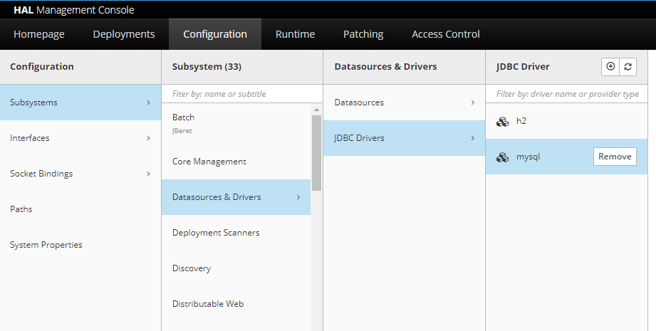

# JAVA EE

### Módulo 4
- [Do Java EE ao Jakarta EE Ver primeiro vídeo](#anc1)
- [Apresentando EJB’s e o projeto de agendamento de e-mails](#anc2)
- [Persistência com JPA](#anc3)
- [Fazendo requisição ao nosso EJB com JAX-RS](#anc4)
- [Agendamento com TimerService](#anc5)
- [Mensageria com JMS](#anc6)
- [Controle de transação com JTA](#anc7)

### Módulo 5 JSF
- [Introdução ao desenvolvimento web com JSF](#anc8)
- [Visão geral](#anc9)
- [Características do JSF](#anc10)
- [Especificação Java EE](#anc11)
- [Apresentações](#anc12)
- [Modelo básico](#anc13)
- [Extensões](#anc14)

## Módulo 4
<a name="anc1"></a>

## Do Java EE ao Jakarta EE Ver primeiro vídeo
- Boas-vindas ao curso de EJB com Jakarta EE. Antes de partimos para o desenvolvimento da aplicação que será apresentada aqui no curso eu gostaria de passar com vocês nos slides e mostrar o que é o Jakarta EE.

- Tem tido muitas dúvidas sobre o assunto e sempre leva aquela famosa pergunta: o Java morreu? O Java vai morrer? 
    - A resposta é não. Na verdade, 
- o que houve foi uma *transição* entre empresas e foi necessária a troca do nome, mas para entender melhor essa troca nós vamos conhecer um pouco da história de como começou o Java EE.
    - História
    - Arquitetura
    - Sistema de API's
    - Containers

- Para isso eu trouxe alguns pontos que serão comentados: como surgiu o Java EE, a arquitetura, o que é esse sistema de API’s, o que são Containers, para entendermos todo esse cenário até chegar lá no Jakarta EE.

- Falando de história, como surgiu o Java EE? Na época a ASSAM era a atual detentora do Java e isso estou falando dos anos 90, e para suprir uma necessidade da Internet foi pensado um projeto Java corporativo para sistemas corporativos e o nome dele foi J2EE que era Java 2 Plataform Entrepise Edition.
    - Aplicações Desktop
    - Crescimento da internet
    - Projeto corporativo

- A ideia da ASSAM era escrever um conjunto de especificações onde pessoas poderiam implementar essas especificações e ter implementações para essas especificações criadas para o mundo corporativo.

### Arquitetura
- E para isso pensou-se em uma arquitetura, nós tínhamos o J2EE Platform, que era a plataforma que seguia um conjunto de API's, então essas especificações foram pensadas em API’s que teriam que ter as suas implementações. E poderia ser feito por terceiros ou por pessoas dentro da sua empresa que quisessem usar essas API's. 
        - J2EE Platform 
        - J2EE Compability Test Suit
        - J2EE Reference Implementation 

- Só que quando eu estou falando em seguir essas especificações, implementar essas API's, quando eu queria ter algo com implementação válida daquela minha especificação eu tinha o J2EE Compability Test Suit que testava se uma implementação era compatível com o padrão que eu tinha da minha API, da minha especificação.

- E também eu tinha mais um recurso nessa minha arquitetura que era a J2EE Reference Implementation que era uma implementação padrão. Porque, pensem bem, o Java EE tinha especificação mas aquela API precisava ser implementada, só que as empresas terceiras ainda iam ter acesso a especificação e iria levar um tempo para implementar aquela determinada API.

- Só que eu, desenvolvedor, muitas vezes já queria ter acesso aos recursos padronizados pela minha API, então eu já recebia essa implementação de referência. Depois se eu quisesse trocar por uma implementação de terceiros eu fazia isso de uma forma fácil porque a API é um conjunto de interfaces padronizadas de acordo com a necessidade dos sistemas corporativos.

- Então a ideia era justamente facilitar essa troca ou não ficar vinculado à uma empresa terceira, a uma implementação específica.

- Falando mais um pouco do sistema de API's nós podemos ver que o objetivo era desenvolver esse sistema e especificar um padrão de desenvolvimento. Então dessa forma nós poderíamos trocar de implementação sem muita dor no código.

### Sistema de API’s
- Esse sistema de API’s foi bem interessante para o Java EE e eu trouxe algumas que foram criadas, algumas API's, algumas especificações que fizeram parte das primeiras lições do Java EE.
    - Enterprise Java Beans (EJB)
    - JavaServer Pages (JSP)
    - Java Servlet
    - Java Database Connectivity

- Os EJB’s que são os Entreprise Java Jeans que são famosos até hoje e inclusive nós vamos falar sobre eles ao longo do curso. Nós tivemos o JSP (JavaServer Pages) e estão todas API's válidas, especificações válidas, algumas são bastante utilizadas outras nem tanto, mas ainda estão aí no Java EE até hoje. Nós temos o Java Servlet, Java Database Connectivity.

### Container
- Nós tínhamos a necessidade de deploiar essas aplicações corporativas em algum lugar, então temos Containers que são servidores de aplicações e eles são divididos em duas categorias: Web Container e EJB Container.
    - Web Container
    - EJB Container

- A diferença deles é que Web Container não vai ter a implementação de todos os serviços do Java EE, ele vai implementar alguns serviços mais voltados ali para o HTTP e a ideia dele é executar e controlar a execução das servlets.

- Já o EJB Container não, a aplicação EJB quando eu uso um Containers, um servidor de aplicação que implementa um EJB por exemplo, nós estamos falando de um Container muito mais robusto, então ele não vai me fornecer a implementação de todos os serviços do Java EE.

- Inclusive o GlassFish é o servidor de aplicação de referência, mas nada impede de você usar um WideFly, um Webson e todos eles vão ser esses servidores mais robustos e vão te entregar esses recursos todos implementados para facilitar a vida do desenvolvedor.

### Jakarta EE
- Agora conhecendo essas questões das API's, das especificações, das implementações você pode estar se perguntando porque houve essa troca para o Jakarta EE? A verdade é que a Oracle passou a focar e investir em outras tecnologias. O Java EE já estava ficando um pouco de lado. E é um plataforma extremamente utilizada mundialmente.

- Para que isso não viesse a atrasar a melhoria do Java e acompanhar as plataformas que estavam sendo atualizadas frequentemente, decidiu-se passar o direito do Java EE para a Eclipse Foundation. Só que o nome do Java é propriedade da Oracle, então o nome precisava ser alterado e por isso passou a ser Jakarta EE.

- A ideia é a mesma, é o projeto continuar com a ideia das especificações, das implementações só que agora com uma empresa que vai continuar levando o Jakarta como uma tecnologia de ponta trazendo API's que hoje cubram cenários, por exemplo, como a Cloud entre outras tecnologias mais atuais.

- Então para quem tinha essa dúvida sobre o Java estar morrendo, o Jakarta ser uma coisa totalmente diferente do Java não se preocupem. O Java continua mais vivo do que nunca e agora com ideia de que nós desenvolvedores temos os recursos mais novos só que com esse nome agora Jakarta que nada mais é só uma questão de direito autoral.

> servidor de aplicação J2EE
- Os servidores de aplicação implementam os serviços do Java/Jakarta EE.

- Use a versão 14 do Java

- Então começando pela versão do Eclipse como falado a versão do Java que nós vamos utilizar é a 14, então se você vir no menu superior em “Window > Preferences > Java > Installed JREs” nós vamos ver que o ‘jdk' é a 14.

- Agora a ideia do nosso projeto, a ideia do projeto do curso é ser desenvolvido um agendamento de e-mails. Vai ser um projeto Maven e ao longo das aulas nos vamos acrescentado os recursos do Jakarta EE nessa nossa aplicação.

- Importar projeto, “File > Import" nós vamos selecionar essa opção ‘Existing Maven Projects', o projeto Maven existente.

- Agora que temos uma aplicação nós precisamos de um lugar para deploiarmos essa aplicação. Chegou a hora de configurarmos o nosso servidor de aplicação.

- Para esse curso nós definimos que o servidor de aplicação vai ser o WildFly, ele é um servidor robusto, é gratuito e opensource.

- Mas para configurar o nosso servidor de aplicação nós podemos voltar para ideia é nos vamos na aba de "Servers". A sua pode não estar disponível para visualização, mas se não tiver você vai em "Window > Show View > Server" e se não tiver nas primeiras opções você pode ir em "other" e escrever "Server" que já vai aparecer, você seleciona e dar um "open" e vai aparecer essa aba para configurarmos o nosso servidor de aplicação.

- Para configurar nós vamos clicar nesse link que ele tá falando que não tem nenhum servidor disponível, se você quiser criar um novo é só clicar nesse link. É isso que nós vamos fazer. Baixamos a versão 20 do WildFly, só que aqui na nossa ideia só tem até a versão 19, só que não tem nenhum problema vamos poder selecionar ela sem nenhum problema.

- Dá um "next", essas duas opções do servidor local ou ‘Controlled by: Filesystem and shell operations’ podemos deixar selecionadas. O que vai valer para a gente é essa ‘Create new runtime' é a única opção que tem aqui a não ser que você já tenha configurado um outro ‘runtime’ anteriormente, mas se tiver vai ter a opção para você criar um novo e nós vamos selecionar aqui.

- Vou dar um next e ele vai dar um alerta falando “as versões são diferentes”, mas não tem problema nós podemos deixar dessa forma mesmo. A única coisa que nós vamos fazer é renomear para ‘WildFly 20 Runtime' ou o nome de preferência de vocês.

- Agora chegou o momento de selecionar o nosso servidor de aplicação, o download do nosso servidor de aplicação. O meu está em "downloads", então você vem em "downloads", "WildFly" seleciona ele, seleciona a pasta e vocês vão selecionar no diretório em que vocês salvaram.

- Chegou na hora de colocar o ‘Runtime JRE', então qual que a versão da JRE que vamos executar a nossa aplicação? Já vimos que é a versão 14, então eu vou botar ‘Alternate JRE’ e selecionar 'jdk-14' que é a minha que está configurada na minha máquina. Vamos ver aqui que é exatamente a da minha máquina local que está salvo, o meu Java.

- Nós vamos ver que no WildFly nós temos alguns arquivos de configuração e chamamos esses arquivos de ‘standalone', aqui o ‘standalone.xml' e se eu vim em ‘browse’ nós vamos ter outras opções.

- Nós vamos ter o ‘standalone' que é o que está selecionado, o ‘standalone-full, ‘standalone-ha'. Nós vamos usar o ‘standalone-full’ porque é o que tem mais configurações a que serem feitas. Nós vamos ver ao longo das aulas o que são essas configurações e em que momento nós vamos mexer nelas.

- Aperta o "next", chegou o momento de informar para o nosso servidor de aplicação qual aplicação que vai ser deploiada nele, no nosso caso é ‘agendamento-email’.

- Vamos ver isso nas próximas aulas. Configurei minha aplicação dou um "Finish". Aparentemente tudo certo, só que agora como nós vamos usar o Jakarta EE para desenvolver o nosso projeto, nada mais justo que pegarmos a API do Jakarta EE para colocarmos nas nossas dependências.

- Como que nós vamos fazer isso? Vamos aqui no nosso navegador e vamos lá no Maven repository e vamos procurar pelo Jakarta EE. A primeira que vai aparecer é o Jakarta EE Plataform API, nós vamos selecionar e eu quero a [versão 8.0](https://mvnrepository.com/artifact/jakarta.platform/jakarta.jakartaee-api).

- A única coisa que eu preciso fazer aqui é clicar nessa dependência abaixo, mandar copiar e aqui no meu ‘pom.xml’ abaixo de properties eu crio uma tag chamada <dependencies > e copio a dependência do Jakarta EE aqui dentro de dependências.

- Agora o que eu posso fazer é clicar com o botão direito na minha aplicação, vou na opção de “Maven > Update Project" e seleciono “Force Update of Snapshots/Releases.

<a name="anc2"></a>

## Apresentando EJB’s e o projeto de agendamento de e-mails


- Por exemplo, eu vou ter o meu usuário fazendo a requisição para nossa aplicação, geralmente esse usuário vai fazer a requisição via browser ou via um software como o Postman, que é um software de requisição http e essa requisição vai chegar na nossa aplicação.

- Só que a nossa aplicação vai precisar conhecer os detalhes do protocolo http porque a partir disso ela consegue transformar essa requisição como objeto Java e o objeto Java vai passar pelas nossas regras negociais que são as caixas verdes no desenho.

- Ele vai fazer alguma alteração com essa requisição e, por exemplo, se precisar persistir no banco de dados eu vou precisar abrir uma transação, usar os detalhes da implementação que nós escolhemos para persistir essa informação.

- Então, por exemplo, se eu estou usando um JPA, que é a especificação "Jakarta Persistence API", junto com o Hibernate que é o framework que a implementa, eu vou precisar chamar os métodos para eu conseguir persistir o meu objeto.

- Eu tenho que configurar um pool de Conexões porque o banco de dados é uma questão sensível de aplicação, então eu não posso sair abrindo conexões de forma descontrolada desse banco de dados Porque eu posso onerar meu banco de dados e assim derrubar, fazendo com que a nossa aplicação tenha um péssimo comportamento.

- Podemos ter também aqui detalhes de "Filas" e conforme nossa aplicação vai crescendo nós vamos ter detalhes de segurança, de Jobs, ou seja, são agendamentos ficam executando de tempos em tempos para executar alguma ação. Enfim, são vários detalhes que nós temos que ter domínio para criar uma aplicação corporativa.

- Só que uma coisa que eu gostaria de chamar atenção na nossa imagem é sobre o que nós estamos fazendo nela. Pelo que nós falamos teremos que ter conhecimento sobre protocolo "http", porque eu preciso transformar a requisição no objeto Java.

- Por isso eu tenho que ter conhecimento sobre como abro a transação com o banco de dados, tenho que ter o conhecimento sobre o JPA, tenho que configurar um pool de Conexões além de ter que configurar "Filas" e outros detalhes.

- São questões de infra da nossa aplicação, ou seja, elas não fazem parte das nossas regras negociais, nós apenas usamos esses detalhes para que as nossas regras negociais estejam de forma correta, digamos assim, para que nossa aplicação tenha um comportamento correto.

- Pensando bem, o interessante seria se tudo isso aqui que é infra como detalhes do protocolo http, abertura de uma transação, a configuração de uma "Fila" fosse fornecido para nossa aplicação e nós desenvolvedores tivéssemos que focar apenas nas regras negociais.

- E aqui tem a vantagem de se trabalhar com um servidor robusto porque quando eu tenho servidor igual ao WildFly, ele passa a nos fornecer esse tipo de serviço para que o desenvolvedor não me preocupe justamente com detalhes de implementação do que acabamos de ver como "Transação", pool de Conexões, Persistência.

- Então o WildFly vai ter esse serviço para me fornecer e todos esses que foram citados anteriormente saem da minha aplicação e passam a ser fornecidos por ele. O "protocolo http" agora é um serviço fornecido pelo WildFly, uma "transação" é aberta pelo WildFly, "persistência" também como detalhes da implementação do "JPA" vai ser do nosso WildFly, e as "Filas" também. Assim, nós temos todos os serviços configurados para nós.

- Agora nós estamos vendo a vantagem de trabalhar com um servidor mais robusto.

- Só que agora o que vocês devem estar pensando é: eu tenho minha aplicação com minhas regras negociais e eu tenho um servidor que me fornece serviços de infra, mas como que eu junto os dois? Como que minha transação vai usar um serviço de transação fornecido por um servidor de aplicação?

- Essa é a motivação dessa nossa aula, nós vamos ter um recurso que é uma especificação do Jakarta EE que se chama "**Enterprise Java Beans**", nós costumamos falar que os EJB's que vão ser classes normais, classes Java como nós estamos acostumados a trabalhar, só que com algumas configurações a mais. Nós vamos ter as nossas classes que tem as nossas regras negociais que agora são os nossos EJB's.


- Com o EJB eu vou ter uma forma de injetar esses serviços aqui, então através da injeção de dependências eu consigo injetar um serviço na minha classe, no meu EJB e quando eu precisar usar um serviço do meu servidor de aplicação a partir do meu EJB quando eu chamar esse serviço o servidor de aplicação vai me fornecer uma instância desse serviço.

- Fazemos a inversão de controle, ao invés de instanciar um serviço na mão usando o New objeto, agora quando eu injeto esse serviço no meu EJB e eu preciso usá-lo quem vai me fornecer a instância desse cara é o meu servidor de aplicação. Aqui é a beleza do EJB, pois todo o controle de detalhes sobre instanciação, sobre implementações, não passa mais a ser do domínio do desenvolvedor.

- Ele só precisa conhecer as regras negociais e quando precisar utilizar um serviço desse nós temos aí os EJB's juntamente com os serviços fornecidos pelo nosso servidor de aplicação para resolver essa situação para nós.

- Então o foco é cem por cento em regra negocial. Obviamente, pode ter ficado alguma dúvida, mas a ideia agora é sabermos qual que é a motivação de se usar o EJB e nas próximas aulas começar a codificar as nossas classes, os nossos EJB's e ver essas vantagens na prática.

> Qual a vantagem de se usar EJB?
- *O EJB inverte o controle e passa a responsabilidade, de instanciar objetos e fornecer serviços, para o servidor de aplicação.*

> Como podemos transformar esta classe em um EJB?
- *Anotando a classe com @Stateless.*

- No standalone-full
    - Usa as threds do processador, a gente fica sem muito controle
```
derive-size="from-worker-pools"
```
- Trocaremos por:
    - Terá até 20 instâncias
    - Evitar erros de `Out of memory`
```
max-pool-size="20"
```

<a name="anc3"></a>

## Persistência com JPA


### Docker

> No Dockerfile, ele cria o banco automaticamente, pois, lá ele conpia o script do banco para o entrypoint do banco, sendo executado assim que rodar o run.
#### Criando a imagem
    - docker build -t img-agenda .
#### Criando container
```
docker container run --name agenda-email-container -e MYSQL_USER=andre -e MYSQL_PASSWORD=123456 -e MYSQL_ROOT_PASSWORD=123456 -d -p 3306:3306 img-agenda
```
- Acessando o banco
```
$  docker exec -it agenda-email-container bash
root@container_id:/# mysql -u root -p
Enter password: 123456

show databases
use agendamentoemaildb;
show tables
 desc agendamentoemail;
```

### Criando um usuário no Wildfly
> Esses são os passos para criar um usuário no Wildfly
- Entra na pasta bin do servidor
    - Digita `add-user.bat`
    - Digita "a"
    - Coloca o username do usuário
    - Digita o password, confirma com yes e coloca novamente o password
    - pronto usuário criado
- Para testar, entre em [Painel Administrativo](http://localhost:9990/console/index.html)
- Já irá pedir usuário e senha.

```
C:\server\wildfly-20.0.0.Final\bin>add-user.bat

What type of user do you wish to add?
 a) Management User (mgmt-users.properties)
 b) Application User (application-users.properties)
(a): a

Enter the details of the new user to add.
Using realm 'ManagementRealm' as discovered from the existing property files.
Username : teste
Password recommendations are listed below. To modify these restrictions edit the add-user.properties configuration file.
 - The password should be different from the username
 - The password should not be one of the following restricted values {root, admin, administrator}
 - The password should contain at least 8 characters, 1 alphabetic character(s), 1 digit(s), 1 non-alphanumeric symbol(s)
Password :
WFLYDM0098: The password should be different from the username
Are you sure you want to use the password entered yes/no? yes
Re-enter Password :
What groups do you want this user to belong to? (Please enter a comma separated list, or leave blank for none)[  ]:
About to add user 'teste' for realm 'ManagementRealm'
Is this correct yes/no? yes
Added user 'teste' to file 'C:\server\wildfly-20.0.0.Final\standalone\configuration\mgmt-users.properties'
Added user 'teste' to file 'C:\server\wildfly-20.0.0.Final\domain\configuration\mgmt-users.properties'
Added user 'teste' with groups  to file 'C:\server\wildfly-20.0.0.Final\standalone\configuration\mgmt-groups.properties'
Added user 'teste' with groups  to file 'C:\server\wildfly-20.0.0.Final\domain\configuration\mgmt-groups.properties'
Is this new user going to be used for one AS process to connect to another AS process?
e.g. for a slave host controller connecting to the master or for a Remoting connection for server to server EJB calls.
yes/no? yes
To represent the user add the following to the server-identities definition <secret value="dGVzdGU=" />
Pressione qualquer tecla para continuar. . .
```

### Criação do módulo do Wildfly
- O `jar` do banco está na pasta extras
- Vai na pasta onde está o servidor JBOSS
- No meu caso: `C:\server\wildfly-20.0.0.Final\bin`
- Abre o terminal e digita
```
> jboss-cli.bat
> You are disconnected at the moment. Type 'connect' to connect to the server or 'help' for the list of supported commands.

> [disconnected /] connect
> [standalone@localhost:9990 /] module add --name=com.mysql --resources="C:\Users\andre\eclipse-workspace\Java-ee\extras\mysql-connector-j-8.0.32.jar" --dependencies=javax.api,javax.transaction.api

> [standalone@localhost:9990 /] /subsystem=datasources/jdbc-driver=mysql:add(driver-name=mysql,driver-module-name=com.mysql,driver-xa-datasource-class
-name=com.mysql.cj.jdbc.MysqlXADataSource
{"outcome" => "success"}
```
### Console de adinistração do Wildfly
- [Console](http://localhost:9990/console/index.html)
- A imagem mostra o acesso ao wildfly com o driver criado pelas linhas de comando acima.



#### Criando o Datasource
- Clicamos em Datasource
    - Add datasouce
        - Selecione o Banco de dados
        - Defina um `name` e `JNDI name`, pra essa caso foi **AgendamentoEmailDS**
            - **name** AgendamentoEmailDS
            - **JNDI name** java:/AgendamentoEmailDS
        - Ele já inserir o driver que configuramos acima
            - Driver name           : mysql
            - Driver module name    : com.mysql
            - Driver class name     : com.mysql.cj.jdbc.Driver
        - Colocar
            - URL: jdbc:mysql://localhost:3306/agendamentoemaildb
            - Usuário
            - Senha
        - Testa a conexão
        - Finish


- Agora temos que informar a aplicação qual datasource ele deve pegar as informações que foram criadas acima.
- Dentro da pasta src>main>java , crie a META-INF e dentro crie um arquivo persistence.xml
- E nele que devemos colocar o mapeamento JNDI

```
<?xml version="1.0" encoding="UTF-8"?>
<!DOCTYPE xml>
<persistence>
	<persistence-unit name="AgendamentoEmailDS">
		<jta-data-source>java:/AgendamentoEmailDS</jta-data-source>
	</persistence-unit>
</persistence>
```

> Como podemos tornar o EntityManager apto a ser utilizado no nosso EJB?
- *Utilizando a anotação @PersistenceContext na propriedade que representa a instância do EntityManager.*

> Como podemos configurar este datasource no persistence.xml?
- *Declarando a tag jta-data-source e colocando a JNDI do datasource dentro da tag.*

> Qual método do EntityManager será necessário chamar para persistir a entidade?
- *O método em.persist() deverá ser chamado, passando a entidade como parâmetro*

<a name="anc4"></a>

## Fazendo requisição ao nosso EJB com JAX-RS
- Graças ao Jakarta EE temos uma especificação que vai nos auxiliar de uma maneira mais elegante a trabalhar com requisições http. Essa especificação é a “JAX-RS” e nós vamos começar o desenvolvimento do nosso projeto com ela.

- o nome dele vai ser “AgendamentoEmailApplication”, eu preciso desse cara aqui porque ela precisa ser uma subclasse de application que é uma do “JAX-RS”.

- A partir do momento que eu transformo essa classe da minha aplicação em uma subclasse de application eu consigo ter acesso a todos os recursos que eu tenho na especificação “JAX-RS”.

```
@ApplicationPath("/")
public class AgendamentoEmailApplication extends Application {}
```

- A `JAX-RS` é legal de trabalhar porque ela não precisa de uma biblioteca de terceiros para implementá-la, ela já me dá os recursos necessários para eu trabalhar apenas com ela.

- Nossa subclasse de application nós já podemos fazer a primeira configuração que é o @ApplicationPath. Esse "Application Path" é o path que fica entre o contexto da nossa aplicação e entre o recurso.

- Então no nosso caso o nosso caso é aquele “agendamento-email0.0.1.SNAPSHOT/” eu poderia ter um Path que poderia ser por exemplo API ou qualquer coisa aqui que eu quisesse colocar e depois esse example teria o "/emails" que é o nosso recurso.

- Mas também se eu não quiser definir nenhum eu não preciso colocar nada só boto uma barra vazia **("/")** a nossa subclasse de AgendamentoEmailApplication está pronta e agora nós podemos utilizar os recursos do JAX-RS nas nossas classes.

#### Criando a classe controller
- Path **recurso da aplicação**
- Injeção da dependência do serviço
- Método que deve ser retornado
    - tipo que será retornado no body, método de retorno
- URL da palicação nesse momento
    - http://localhost:8080/agendamento-email-0.0.1-SNAPSHOT/emails
```
@Path("emails")
public class AgendamentoEmailController {

	@Inject
	private AgendamentoEmailServico agendamentoEmailServico;

	@GET
	@Produces(value = MediaType.APPLICATION_JSON)
	public Response listar() {
		return Response.ok(agendamentoEmailServico.listar()).build();
	}
	
	@POST
	@Consumes(value = MediaType.APPLICATION_JSON)
	public Response inserir(AgendamentoEmail agendamentoEmail) {
		agendamentoEmailServico.inserir(agendamentoEmail);
		return Response.status(201).build();
	}
}
```

### Configurando o Context root

- Deverá criar o arquivo para mudar a url de contexto
- `jboss-web.xml`
- Ficará nessa estrutura de pastas


```
<?xml version='1.0' encoding='UTF-8'?>
<!DOCTYPE xml>
<jboss-web>
	<context-root>agendamento</context-root>
</jboss-web>
```
- Após a alteração do context root, nossa URL ficará assim:
    - http://localhost:8080/agendamento/emails

<a name="anc5"></a>

## Agendamento com TimerService

- E nós precisamos definir a nossa lógica, a primeira coisa que nós vamos precisar fazer é recuperar os e-mails que não foram enviados, ou seja, que está com aquela tag de agendado como false.

- Recuperar esses e-mails, envio com alguma lógica que não vai ter nada a ver com o banco de dados, nós vamos ver mais a frente e depois essa tag tem que ser setada para true e esse e-mail não vai ser enviado novamente.

- O que nós precisamos fazer primeiro é criar dois novos métodos na nossa DAO que é o de listar por AgendamentoEmail agendado igual a false e um método de alterar o nosso AgendamentoEmail que vai ser para alterar a nossa tag para true.

#### Criação de um JOB
- Instância de service
- Schedule que chamará o método de 10 em 10 segundos
- Método que consultará no DAO e-mails não agendados
- Envia o e-mail se tiver
- Altera o status para true

```
@Stateless
public class AgendamentoEmailJob {

	@Inject
	private AgendamentoEmailServico agendamentoEmailServico;
	
	@Schedule(hour = "*", minute = "*", second = "*/10")
	public void enviarEmail() {
		List<AgendamentoEmail> lista =  
            agendamentoEmailServico.listarPorNaoAgendado();
		lista.forEach(e -> {
			agendamentoEmailServico.enviar(e);
			agendamentoEmailServico.alterar(e);
		});
	}
}
```
- Só que podemos ter a questão desse nosso EJB ser Stateless e o que isso significa? Que nós podemos ter problemas de concorrência entre os objetos criados pelo nosso Container, pelo nosso servidor de aplicação.

- Mas e agora, como usamos uma única instância desse objeto? Assim como nós temos o EJB Stateless que nos devolve aquelas instâncias em um pool, nós vamos ter um EJB @Singleton que vai retornar para nós uma única instância do objeto.

- Trocaremos o `@Stateless` por `@Singleton`

> Porque é necessário anotar a classe como EJB para utilizar a anotação @Schedule?
- *Porquê o Timer Service é um recurso do EJB e é controlado pelo servidor de aplicação.*

<a name="anc6"></a>

## Mensageria com JMS

> O que aconteceria por exemplo se esse primeiro e-mail desse um erro? Em um cenário bacana, esse e-mail deu um erro eu trato essa situação, mas esse AgendamentoEmailJob que não tem erro chegaria para o nosso cliente.

- Só que da forma como nos estamos trabalhando hoje o erro do primeiro e-mail impactaria o segundo e-mail. Então ele não chegaria também para o nosso cliente, e isso não parece fazer sentido porque eu não quero que as mensagens que estejam ok sejam impactadas para as que tenham erro.

- Mas para trabalharmos dessa forma nós teríamos que mudar um pouco a percepção de como funciona a nossa aplicação e teríamos que fazer um envio de forma assíncrona, como que funcionaria isso?

- Vamos ver aqui no desenho para vermos se faz sentido. Então eu teria meus clientes aqui, eu vou afastar eles aqui para melhorar o nosso desenho, vamos trazer aqui. Eu vou aumentar esse desenho aqui para vermos como funcionaria essa questão da forma síncrona.


- O meu AgendamentoEmailJob é o responsável por enviar os e-mails para o cliente, só que agora não ele enviaria esse e-mail aqui para o meu repositório. Um repositório que receberia esses e-mails em algum formato.

- Se teve erro, eu trato essa mensagem a partir desse repositório, mas o que não teve erro vai estar persistida aqui com o status ok. E essas que estão com o status ok elas seriam então consumidas por outro objeto da nossa aplicação que aí sim enviaria os e-mails para o nosso cliente. Então na teoria aqui como ficaria? Eu teria meu AgendamentoEmailJob que seria um producer que produziria mensagens para esse repositório que nós definimos aqui.

- Eu teria aqui na minha aplicação em um outro ponto, um consumidor que seria um "consumer" dessas mensagens desse repositório e dessa forma quando eu tivesse um erro nessa mensagem do primeiro cliente ela não seria enviada, mas a do segundo cliente, que está ok, ela chegaria para o nosso cliente sem nenhum problema.

- E hoje, graças a um recurso do Jakarta EE nós conseguimos trabalhar dessa maneira. Nós vamos ter um conceito de "Fila", que é esse repositório que nós vimos que nossas mensagens serão persistidas, que nossos e-mails serão persistidos. Através da especificação JMS (Java Message Service) nós conseguiríamos fazer esse envio assíncrono.

- Eu teria o meu `Producer` aqui que mandaria os e-mails para essa `Fila`, que pode ser um repositório do servidor de aplicação ou pode ser um repositório externo, algo parecido com o banco de dados e o `Consumer`, que seria aqui um recurso da nossa aplicação, pegaria as mensagens que eu tenho persistido na minha `Fila` que não tenha erro e enviaria para o meu cliente.

- Então aqui eu tenho um consumidor que vai chegar agora na minha `Fila` e vai me perguntar: "Você tem mensagem?" "Tenho". "Tem algum problema?" "Não". "Então me dá que eu vou enviar para o cliente".

- E assim dessa forma nós conseguimos tratar o que está com erro de forma separada e o que está ok vai chegar para os nossos clientes. Ainda pode ter surgido algumas dúvidas, mas a ideia agora é irmos para a prática e entendermos cada um desses pontos aqui e como que vai ficar a nossa aplicação com essa alteração.

- Então AgendamentoEmail tem que ser um objeto serializável e para isso nós vamos precisar implementar a interface Seriallizable. Ele vai dar um "warning" pedindo para nós adicionarmos o serialVersionUID.

```
@Entity
@Table(name = "agendamentoemail")
public class AgendamentoEmail implements Serializable {
	
	private static final long serialVersionUID = 1L;

    // retsnte do código
}
```
### Configurando a FILA via servidor de aplicação
- Wildfly tem que esta rodando
- Criação da fila pelo terminal do jboss-cli
- Cria a fila       : `jms-queue`
- Nome para a fila  : `--queue-address=EmailQueue `
- JNDI da fila      : `--entries=java:/jms/queue/EmailQueue`
```
C:\server\wildfly-20.0.0.Final\bin>jboss-cli.bat
You are disconnected at the moment. Type 'connect' to connect to the server or 'help' for the list of supported commands.
[disconnected /] connect
[standalone@localhost:9990 /] jms-queue add --queue-address=EmailQueue --entries=java:/jms/queue/EmailQueue

```
#### Criando Producer
- Vamos alterar nosso JOB para enviar para a Fila do Wildfly
- Fabrica default
- Pra onde será enviado, qual fila: **queue**
- Criando producer `context.createProducer().send(queue, e);`
    - Fila
    - Objeto que será passado para a fila
```
@Inject
	@JMSConnectionFactory("java:/jboss/DefaultJMSConnectionFactory")
	private JMSContext context;

	@Resource(mappedName = "java:/jms/queue/EmailQueue")
	private Queue queue;
	
	@Schedule(hour = "*", minute = "*", second = "*/10")
	public void enviarEmail() {
		List<AgendamentoEmail> lista = 
            agendamentoEmailServico.listarPorNaoAgendado();
		lista.forEach(e -> {
			context.createProducer().send(queue, e);
			agendamentoEmailServico.alterar(e);
		});
	}
```
- Messagem na fila do JBOSS


#### Criando Consumer
- Chegou o momento de criarmos o nosso consumidor que vai pegar essas mensagens da Fila para podermos enviar os nossos e-mails para os nossos usuários.

- Para fazermos isso vamos utilizar um recurso do EJB que se chama "MDB" (Message-Driven Beans) e a ideia dele é exatamente abstrair questão de implementação. Então não vamos nos importar com detalhes de como que o MDB se conecta à Fila, como ele pega essas mensagens ficamos sem precisar saber sobre detalhes dessa implementação.

- Nós só nos preocupamos em usar o MDB para pegar essas mensagens e enviar os e-mails para o nosso cliente. Para começar a trabalhar com MDB o que nós precisamos? Vamos precisar criar uma Classe que vai ser o nosso MDB. Eu crio uma classe que vai ficar dentro do pacote ‘br.com.alura.mdb’ e nós vamos dar o nome dessa Classe de `AgendamentoEmailMDB`.

- MessageDriven
    - Fila que vai escutar
        - **destinationLookup**
    - Informa o tipo de fila
        - **destinationType**
- Agora o que nós precisamos fazer e desenvolver o nosso método onMessage e a ideia aqui é o seguinte: a nossa MDB vai ficar escutando a Fila, quando tiver uma nova mensagem vai pegar essa mensagem, vai ter que transformar a mensagem para um objeto AgendamentoEmail porque é esse objeto que nós usamos para enviar para nossos usuários.

- Pega o dado que está sendo passado na mensagem

```
import javax.ejb.ActivationConfigProperty;
import javax.ejb.MessageDriven;
import javax.inject.Inject;
import javax.jms.JMSException;
import javax.jms.Message;
import javax.jms.MessageListener;

@MessageDriven(activationConfig = {
		@ActivationConfigProperty(propertyName = "destinationLookup", propertyValue = "java:/jms/queue/EmailQueue"),
		@ActivationConfigProperty(propertyName = "destinationType", propertyValue = "javax.jms.Queue") })
public class AgendamentoEmailMDB implements MessageListener {

	@Inject
	private AgendamentoEmailServico servico;

	@Override
	public void onMessage(Message message) {
		try {
			AgendamentoEmail agendamentoEmail = message.getBody(AgendamentoEmail.class);
			servico.enviar(agendamentoEmail);
		} catch (JMSException e) {
			throw new RuntimeException(e);
		}
	}
}
```

- Quando a mensagem dá erro ela não fica persistida na fila EmailQueue porque senão nós teríamos um looping na nossa aplicação porque ela iria ficar persistida na nossa Fila e de tempos em tempos nós iriamos tentar enviar essa mensagem com erro.

- Quando tentamos enviar que a mensagem tem um erro, essa mensagem vai ser persistida em uma Fila chamada "DLQ" que é uma Fila específica para mensagens com erro. Dessa maneira nós podemos tratar essa mensagem, após o tratamento essa mensagem volta para o nosso EmailQueue e aí ela vai conseguir ser enviada com sucesso. Então é mais ou menos esse o fluxo que funciona no nosso Consumer nessa estrutura de Producer e Consumer.

> Escolha a opção que melhor explica o que é o JMS (Java Message Service):
- *Permite a troca de mensagens assíncronas entre um ou mais clientes.*

> Qual interface a classe MDB deve implementar para funcionar?
- *Deve implementar a interface MessageListener*

- `Queue` para receber as nossas mensagens. Uma característica dessa abordagem é que a mensagem será recebida, exatamente, por um consumidor.
- `Topic` Ele implementa uma semântica de publicação e assinatura. Quando a mensagem é publicada, ela vai para todos os assinantes que estão interessados, logo, zero a n assinantes poderão receber a mensagem.


<a name="anc7"></a>

## Controle de transação com JTA
- E fica aquela questão: como funciona a transação sendo que nós não configuramos nada até agora na nossa aplicação - nada relacionado a transação na nossa aplicação? É porque vamos ter uma especificação no Jakarta que se chama JTA, que é a Java Transaction API.

- E quando trabalhamos com essa especificação em uma aplicação EJB todo controle da nossa transação passa automaticamente para o nosso servidor de aplicação. Então por isso que não precisamos nos preocupar em abrir uma transação ou fazer qualquer que seja configuração de transação porque tudo isso tá sendo manuseado pelo nosso servidor de aplicação.

- Nós temos uma forma de explicitar essas configurações e elas são para a nossa classe aqui eu vou ter um @TransactionManagement que é o gerenciamento da transação e por padrão ela vem como CONTAINER, @TransactionManagement(TransactionManagementType.CONTAINER).

- Então o container, o servidor de aplicação gerenciando essas transações e os nossos métodos também têm, por padrão, uma anotação @TransactionAttribute e ela vem como REQUIRED, @TransactionAttribute(TransactionAttributeType.REQUIRED).

- Então sempre que eu faço uma chamada de um método em um EJB ele vai estar em um recurso transacional e você pode ficar na dúvida: "Porque que eu tenho configuração ali na classe?".

-  Quando estamos trabalhando com transação e com essa ideia do TransactionManagement pelo CONTAINER e o TransactionAttributeType.REQUIRED eu sempre vou estar em um recurso transacional.

- E em uma transação ou funciona todo mundo, ou não funciona ninguém. Então se eu tiver uma exceção em alguma parte da minha transação ele vai dar o rollback em todo mundo. E chega no ponto de porque que eu tenho o TransactionAttribute por método, porque eu posso querer que aqui no meu alterar() não esteja em um contexto transacional e eu vou botar aqui um NOT_SUPPORTED, `@TransactionAttribute(TransactionAttributeType.Not_SUPPORTED)`.

- Isso no service

- Nesse caso, ele vai dar erro, porém, todos os outros e-mails processados anterior a ele serão enviados e alterados o agendamento para true.

- Só que nos vimos que nós podemos alterar aqui o TransactionAtribute por exemplo para NOT_SUPPORTED, que nós vimos que nossa aplicação pode ficar com um comportamento um pouco estranho com operações comitando as suas alterações e outras fazendo o rollback. Então por isso que temos que tomar muito cuidado quando está se trabalhando com transações na nossa aplicação.

- E agora tem mais um tipo que nós podemos ver que é tirando esse controle transacional do `CONTAINER` e nos fazendo assumir o controle transacional da nossa aplicação. Para fazermos um exemplo, eu vou no nosso AgendamentoEmailDAO e agora eu vou falar que eu quero ter o controle da transação da minha aplicação.

- E para isso eu posso usar aqui o `@TransactionManagement` e eu posso usar aqui ela do tipo BEAN, então agora o `CONTAINER` não controla mais as transações desse nosso EJB aqui e agora eu tenho que fazer esse controle.

- Se eu alterar isso aqui, o nosso job quando for chamar o método de alterar nós vamos ver que vai ter um comportamento um pouco estranho.

- E está aqui, quando ele vai chamar o nosso EJB que está como tipo de transação BEAN, ou seja, a transação sob nosso controle, ele já fala que "transaction is required", então na hora que ele vai chamar o alterar eu preciso de uma transação.

- E é justamente porque como estamos assumindo esse controle agora precisamos fazer tudo, e o que é esse "tudo"? Eu tenho que injetar o *UserTransaction* e no meu método de alterar() eu vou precisar fazer um try e vou fazer o seguinte: userTransaction.begin() começe a minha transação.

- Você vai então fazer a alteração no meu objeto e aqui eu agora comito a transação e de fato efetuo a transação. Se isso não der certo, eu pego um Exception e só vou dar um e.printStackTrace da exceção.

- Está aqui, então agora com esse controle por parte do desenvolvedor das transações eu preciso iniciar uma transação, eu preciso fazer a operação e preciso comitar e isso aqui para todo método que for necessário então uma transação.

- Ele vai executar, nós temos três e-mails a serem enviados e se deu tudo certo está aí o nosso controle agora manual, digamos assim, deu certo. Só que aqui é aquilo que nós temos que levar em conta. Tem que ser um cenário muito específico para você ter esse controle mais fino da transação.

- Porque o que nós fizemos aqui o `CONTAINER` já faz para nós sem precisar explicitar configuração nenhuma. Então é por isso que eu deixei claro nas aulas anteriores, é melhor passarmos esse controle transacional realmente para o `CONTAINER` porque ele já foi feito para aquilo, ele já tem esse ajuste mais certinho da nossa transação.

- Porque aqui se esquecermos de dar um begin ele vai dar certo, se esquecermos de dar um commit ele não vai validar a operação no nosso banco de dados. Então tem uma série de fatores que precisamos ter o controle que quando estamos com o tipo `CONTAINER` nós não nos preocupamos com isso, obviamente em alguns cenários vai precisar.

- Mas na maioria dos casos o `CONTAINER` vai nos auxiliar e só mais um detalhe aqui em termos de curiosidade, se nós não tivermos trabalhando com aplicação EJB e precisássemos estar em um contexto transacional se eu tiver o controle dessa transação, se for ali com o tipo BEAN do JTA eu ainda precisaria anotar minha classe com o @Transaction.

- Então eu tenho que informar para o servidor que está hospedada a minha aplicação que esse cara aqui precisa fazer as suas operações em um contexto transacional, mas aqui não é do nosso curso, nosso curso estamos utilizando o EJB.

- Então além disso termos que fazer isso aqui, o EJB ainda prover essa facilidade que não precisamos indicar mais nada sobre transações, mas fica o alerta que não é recomendado, sempre que o cenário for um cenário parecido com esse aqui deixa mesmo com o controle por parte do `CONTAINER` e a aplicação vai dar tudo certo.

```
@Stateless
@TransactionManagement(TransactionManagementType.BEAN) //transaction is required
public class TesteTransacaoBMTAgendamentoEmailDAO {

	@PersistenceContext
	private EntityManager em;
	
	@Inject
	private UserTransaction userTransaction;
	
    // O userTransaction será necessário pra todo método que necessitar de transação
	public void alterar(AgendamentoEmail ag) {
		try {
			userTransaction.begin();
			em.merge(ag);
			userTransaction.commit();
		}catch(Exception e) {
			e.printStackTrace();
		}
	}
}
```

- O uso de transações é essencial para qualquer sistema que deseja garantir a durabilidade, integridade e consistência dos dados. Por esse motivo, o EJB integra uma especificação para trabalhar com transações de alto nível, o JTA (Java Transaction API). O JTA oferece duas formas de demarcação de transações, Bean-Managed (BMT), e Container-Managed (CMT).

> Em relação ao JTA, quais das afirmações são corretas?
- *CMT é a marcação implícita, ou declarativa da transação.*
- *BMT é a marcação explícita, ou programática da transação.*

## Módulo 5
<a name="anc8"></a>

## Introdução ao desenvolvimento web com JSF
<a name="anc9"></a>

# Livraria

## Banco
- mysql-farmacia

### Docker
- Instalação e configuração do container do mysql

```
docker container run -e MYSQL_USER=andre -e MYSQL_PASSWORD=123456 -e MYSQL_DATABASE=farmacia -e MYSQL_ROOT_PASSWORD=123456 --name mysql-farmacia -p 3306:3306 mysql:5.7 --character-set-server=utf8mb4 --collation-server=utf8mb4_unicode_ci
```
- Entra no container
```
mysql -h localhost -u andre -p
```

## Aplicação


### Em aplicações Desktop
#### Cliente Gordo

    - cada cliente tem uma cópia da aplicação
    - regra de negócio em cada cliente
    - atualização um a um
##
### Aplicação WEB
#### Cliente magro

    - aplicação central
    - facilita a manuteção e gerenciabilidade


### Frameworks WEB
- JSF
- GWT
- APACHE WICKET
#### JSF
- é um padrão java EE para desenvolvimento web baseado em componentes mantido pelo JCP.
- Especificação JSF - JSR-245
- [JCP](https://jcp.org/en/jsr/detail?id=314)
- JSF é chamado um framework Web baseado em componentes.
- uso de componentes
- desenvolvimento orientado ao evento
- desenvolvimento stateful
- O servlet JSF tem o papel do controlador.
##### Implemantações dessa especificação
- Mojarra (Implementação referencial)
- Apache MyFaces
##### Extensões JSF
- [Prime Faces](https://www.primefaces.org/showcase/index.xhtml?jfwid=acf38)
- [RichFaces](http://showcase.richfaces.org/richfaces/component-sample.jsf?demo=select)
- [Ice Faces](http://icefaces-showcase.icesoft.org/showcase.jsf)

## Detalhes da contrução do projeto
- Pré-requisitos
    - Java SE 1.7
    - Eclipse Java EE
    - Apache Tomcat 7
- Projeto Livraria


##### Prepara tomcat
- Com o eclipse aberto
    - Digite ctrl + 3, digite server
    - clique em new server wizard
    - digite tomcat e escolha a versão 7
    - next e escolha onde salva
    - só finalizar
- Criar projeto
    - file 
    - new
    - Dynamic web project
    - coloque o nome do projeto
    - em *Target runtime* coloque Tomcat 7
    - em *Dynamic web module version* coloque 3.0
    - em *Configuration* coloque JavaServer Faces v2.0 project
    - next e na segunda marque pra gerar o web.xml
    - em *Type* coloque disable
    - em *URL Mapping pattenrs* coloque *.xhtml
- .JAR
    - todos os .jars devem fica em WEB-INF > lib

##### ATENÇÃO: Se você estiver usando MS-Windows, altere a propriedade encoding="ISO-8859-1" do cabeçalho do arquivo .xhtml para encoding="UTF-8"

##### Todo o mapeamento é feito pelo Faces Servlet
- Ao enviar a requisição é delegado o fluxo para a servlet
- O Servlet recebe a chamada e decide qual página ele vai chamar
- O controlador ler o xhtml e instância os componentes declarados
- No fim ele pega os componentes de apresentação e devolve para o navegador


### Classe Livro e LivroBean
- **Livro**: Responsabilidade de cadastrar um livro
    - atributos, getters e setters
- **LivroBean**: Responsabilidade de ser um livro
    - getter que busca o livro da classe Livro

### Model View Controller


### Ciclo de vida dos componentes JSF
- controlador instância os componentes declarados
- Árvore de componentes
    - criada apenas na primeira requisição
    - fica guardada na sessão http do usuário


- O modelo arquitetural o JSF se baseia é o MVC


### Lidando com escopos
- A vida do managedBean dura apenas um request
    - **@RequestScoped**
- Queremo que o livroBean exista emquanto a tela existir
    - **@ViewScoped**
    - Sobrevive por vários request
- O **h:selectOneMenu** é o componente próprio para a renderização de um combobox.
- Adicionamos o componente **f:selectItems** dentro do **h:selectOneMenu**, e usamos os atributos value, var, itemLabel e itemValue para respectivamente, recuperar os autores provindos do managed bean, nomear a variável que representará o autor, definir o texto que será mostrado nas opções e o valor das opções.
- Por padrão um ManagedBean adota o escopo da requisição **(@RequestScoped)**.
- Além dos escopos de requisição (@RequestScoped) e da tela (@ViewScoped) JSF também dá suporte ao escopo da sessão (@SessionScoped) e escopo da aplicação (@ApplicationScoped), tudo configurável pelas anotações.
- Utilizamos o componente h:dataTable referenciando a lista de dados pelo atributo value. Dentro do h:dataTable, utilizamos o h:column para definir as colunas que existirão na nossa tabela. No nosso exemplo, utilizamos também o h:outputText para renderizar os dados do autor dentro do h:column. Por exemplo:
```
<h:dataTable value="#{livroBean.autoresDoLivro}" var="autor">
    <h:column>
        <h:outputText value="#{autor.nome}"/>
    </h:column>
</h:dataTable>
```
### Conversão e validação de dados
- Para manipulação de datas
- Com essa anotação será gravado apenas a data
```
@Temporal(TemporalType.DATE)
private Calendar dataLancamento = Calendar.getInstance();
```
- Definindo o formato de conversão que o JSF deve utilizar
- Deve ser usado o componente f:convertDateTime para formatar a data, porém o conversor sabe lidar apenas com objetos do tipo java.util.Date. Por isso, devemos fazer um binding para #{livroBean.livro.dataLancamento.time}, onde time corresponde ao método getTime() da classe Calendar, que retorna um objeto do tipo java.util.Date.

- Devemos também definir um pattern. No nosso caso queremos dia/mês/ano então usaremos dd/MM/yyyy
```
<h:inputText id="dataLancamento"
    value="#{livroBean.livro.dataLancamento.time}">
    <f:convertDateTime pattern="dd/MM/yyyy"
        timeZone="America/Sao_Paulo" />
</h:inputText>
```
- Trabalhar com datas usando Calendar é muito mais fácil. É uma classe especializada para este dominio. Para criar uma instancia do tipo Calendar usaremos:
```
Calendar data = Calendar.getInstance()
```
Se quisermos ignorar o horário no banco de dados, podemos adicionar a anotação JPA **@Temporal**, passando como parâmetro a enum TemporalType.Date

#### Mensagens de validação
- A tag ```<h:messages />``` retorna todos os erros ocorridos na página
- Para que o erro seja exibido na mensagem, por exemplo temos que definir o campo como ```required="true"```.
- Se quisermos pesonalizar a mesagem, basta adicionar ```requiredMessage="Titulo obrigatório"``` com sua mensagem.
- Existem também os validadores como ```<f:validateLength maximum="40" />``` que define o tamanho máximo do campo, entre outros validadores.
#### **Validador personalizado**
- Valida se o valor informado começa com "1".
```
public void comecaComDigitoUm(FacesContext fc, UIComponent comp,  Object v) throws ValidatorException {
        String valor = v.toString();
        if(!valor.startsWith("1")){
            throw new ValidatorException(new FacesMessage("Deveria começar com um"));
        }
    }
```
- O atributo validator faz a associação do input com o método no **bean**
```
<h:inputText id="isbn" value="#{livroBean.livro.isbn}"
						validator="#{livroBean.comecaComDigitoUm}" />
```

### Validando preço
- O campo preço no cadastro de livros da página livro.xhtml aceita valor zerado e valores extremamente grandes. Utilize o validador f:validateDoubleRange para aceitar um valor mínimo de R$ 1,00 e máximo de R$ 1.000,00. Lembre-se que este validador possui dois atributos: minimum e maximum.

- O validador é aplicado para o componente h:inputText do preço:
```
<h:inputText id="preco" value="#{livroBean.livro.preco}" label="Preço">
  <f:validateDoubleRange minimum="1.0" maximum="1000.00"/>
</h:inputText>
```

### retornando um faces message no lugar de um throw
- Pegamos uma referência do contexto no momento da chamada
- Adicionamos uma mensagem através do addMessage, que recebe 2 parâmetros
    - client id,  ID definido no xhtml do componente
    - um objeto do tipo FacesMessage que recebe no construtor a messagem que sera mostrada.
```
FacesContext
    .getCurrentInstance()
    .addMessage("autor", new FacesMessage("Livro deve ter pelo menos um autor."));
```

### Páginas mais dinâmicas com AJAX
- Enviar apenas uma parte do formulário


- **execute** diz o ID de qual compoenete que queremos enviar na requisição
- **render** id dos componentes que queremos atualizar
- Necessário colocar o ```<h:head />``` no começo da página
```
<h:commandButton value="Gravar Autor"
    action="#{livroBean.gravarAutor}">
    <f:ajax execute="autor" render="tabelaAutores" />
</h:commandButton>
```
- o uso apropriado de requisições AJAX possibilita uma comunicação mais rápida com o servidor, dado que o mesmo só precisará responder com a parte da página que irá realmente mudar.
- Como o AJAX depende diretamente de JavaScript, é necessário que o JSF importe sua própria biblioteca JavaScript. Isso só será feito, caso o componente h:head esteja presente.

### Fases do ciclo de vida


```
<lifecycle>
    <phase-listener>
        br.com.livraria.util.LogPhaseListener
    </phase-listener>		
</lifecycle>
```


- Implementar a classe PhaseListener
- Mostra as fases em que os requests acontecem

```
public class LogPhaseListener implements PhaseListener{

    private static final long serialVersionUID = 1L;

    @Override
    public void afterPhase(PhaseEvent arg0) { }

    @Override
    public void beforePhase(PhaseEvent event) {
        System.out.println("FASE: "+event.getPhaseId());
    }
    @Override
    public PhaseId getPhaseId() {s
        return PhaseId.ANY_PHASE;
    }
}
```
- Ao receber um requisição http do tipo GET, o controlador iniciou o ciclo de vida da tela.
- leu o xhtml
- instânciou todos os componentes
- como foi a requisição inicial, fica claro que não tem nada a se fazer a não ser renderizar a resposta.


- A camada do controlador recebe todas as requisições e decide que tela ou árvore de componentes utilizar.

- **RESTORE VIEW**
    - Apenas recupera a árvore de elementos
- **APPLY REQUEST VALUES**
    - Recebe os valores digitados
- **PROCESS VALIDATIONS**
    - Conversão ou validação, se tiver erro pula as fases 4 e 5
- **UPDATE MODEL VALUES**
    - Modelo atualizado com base no request anterior, tudo de EL é atualizado
- **INVOKE APPLICATION**
    - Executa o comando Ex: gravarAutor()
- **RENDER RESPONSE**
    - Devolve a resposta

- Clicar no link para ir para outra página
- **immediate=true**
    - Fará que o link seja executado na fase *APPLY REQUEST VALUES*
- Redirecionamento no lado do servidor (forward)
- action chama um método no bean que redireciona a página para a página do autor
```
<h:commandLink value="Cadastrar novo autor"
	action="#{livroBean.formAutor}" immediate="true" />
```
- 
```
public String formAutor() {
    return "autor?faces-redirect=true";
}
```
- O padrão JSF é redirecionar para página no lado do servidor. Para chamar a página pelo navegador, ou seja enviar uma segunda requisição é preciso adicionar no retorno o parâmetro faces-redirect=true

> Redirecionamento no lado do servidor (forward)


1) O cliente dispara uma requisição (submete o formulário) para o controlador;

2) O método formAutor() é chamado pelo controlador que armazena seu retorno;

3) O controlador utilizará a String retornada pelo método para buscar a View que deverá ser renderizada. Ao encontrá-la, ele irá realizar o processo de renderização;

4) Após a renderização, o seu HTML será retornado como resposta da requisição feita pelo usuário no passo 1 (a submissão do formulário).

- Como toda requisição deve haver uma resposta, ao submetermos o formulário também precisamos de uma resposta. Só que nesse caso a resposta será o HTML de uma outra página. Por conta disso, o navegador nem sequer percebe que houve uma mudança de página e a URL na barra de endereços continua a mesma de antes da submissão.

> Redirecionamento no lado do cliente (redirect)

1) O cliente dispara uma requisição (submete o formulário) para o controlador;

2) O método formAutor() é chamado pelo controlador;

3) O Controlador do JSF retorna a resposta ao navegador com o status 302 (moved temporarily). Esse código diz ao browser que ele precisará acessar a URL contida no header location da resposta.

4) O navegador, portanto, irá acessar a página contida no header Location

5) O controlador identifica a View e realiza o processo de renderização

6) O HTML da página é retornado ao browser.

- Dessa forma o próprio navegador fica responsável por realizar o redirecionamento acessando outra página e por conta disso, a URL da barra de endereços é a da nova página que recebemos como resposta.

- Podemos citar alguma vantagem em utilizar o redirecionamento no lado do cliente ao submeter um formulário de cadastro? Pesquise sobre a técnica Always redirect after Post e responda com suas próprias palavras.

### Templates reutilizáveis com Facelets
- Por padrão, no JSF 2.0, imagens, scripts e arquivos de CSS devem estar dentro de um diretório chamado resources, que fica dentro da pasta WebContent.


- **graphicImage** para adicionar imagens
- **library** nome da pasta que ficará armazenadas as imagens
- **ui:insert** :Esta tag indicará para as páginas que utilizarem o template que há uma área com name titulo que pode ser preenchida.

```
<?xml version="1.0" encoding="ISO-8859-1" ?>
<!DOCTYPE html PUBLIC "-//W3C//DTD XHTML 1.0 Transitional//EN" "http://www.w3.org/TR/xhtml1/DTD/xhtml1-transitional.dtd">
<html xmlns="http://www.w3.org/1999/xhtml"
	xmlns:h="http://xmlns.jcp.org/jsf/html"
	xmlns:f="http://xmlns.jcp.org/jsf/core"
	xmlns:ui="http://xmlns.jcp.org/jsf/facelets">
	
	<h:head />
	
	<h:body>
		<div id="cabecalho">
			<h:graphicImage library="img" name="logo.png" width="200" height="100" />
			
			<h:form rendered="#{usuarioLogado != null}">
				<h:commandLink value="logout" action="#{loginBean.deslogar}" />
			</h:form>
			<h1>
				<ui:insert name="titulo"></ui:insert>
			</h1>
		</div>
		
		<div id="conteudo">
			<ui:insert name="conteudo"></ui:insert>
		</div>
	</h:body>
</html>
```
> Associação da página com o template
- O namespace utilizado para importar a biblioteca de facelets é xmlns:ui="http://java.sun.com/jsf/facelets".
- A associação é feita envolvendo todo o conteúdo da página que importará o template pela tag ui:composition, indicando pelo atributo template, o template a ser associado.

```
<html xmlns="http://www.w3.org/1999/xhtml"
    xmlns:h="http://java.sun.com/jsf/html"
    xmlns:f="http://java.sun.com/jsf/core"
    xmlns:ui="http://java.sun.com/jsf/facelets">

<ui:composition template="_template.xhtml">
    <ui:define name="titulo">
            Novo Livro
    </ui:define>
    <ui:define name="conteudo">
                <!--codigo omitido -->
    </ui:define>
</ui:composition>
</html>         
```

#### Implementando a exclusão
```
<h:column>
    <f:facet name="header">Remover</f:facet>
    <h:commandLink value="Remover" action="#{livroBean.remover(livro)}" />
</h:column>
```

#### Ajustando o relacionamento
- O problema está no relacionamento dos livros com os seus autores. Um livro pode ter muitos autores, e um autor pode escrever vários livros, por isso a relação deles é de many-to-many (muitos para muitos). No Hibernate, qualquer relação *ToMany é LAZY, isso porque essas relações *toMany são provavelmente mais custosas, trazendo mais objetos para a memória. Ok, mas o que isso interfere no nosso projeto?

- Isso significa que quando carregamos os livros, os autores não são carregados ao mesmo tempo. Ou seja, quando clicamos em "Alterar", conseguimos carregar os dados do livro, mas não os do autor! Por isso ocorre a exceção.

- Para resolver isso, podemos dizer para o Hibernate para, quando carregar um livro, automaticamente carregar os seus autores, ou seja, ao invés de LAZY, queremos que a relação seja EAGER. Então lá na classe Livro, adicionamos essa opção na anotação:

- O erro LazyInitializationException pode acontecer quando tentarmos acessar um relacionamento não inicializado. Uma das primeiras formas (existem outras, inclusive mais elegantes) é alterar o tipo de relacionamento seja @ManyToMany ou OneToMany. Essa alteração diz respeito ao tipo de busca que é realizada. O padrão é preguiçoso, contudo, se quisermos alterá-lo para um carregamento do tipo ansioso fazemos:
```
@ManyToMany(fetch=FetchType.EAGER)
private List<Autor> autores = new ArrayList<Autor>();
```

- Repare que esse método faz muito pouca coisa, é apenas um atribuição do parâmetro livro para o atributo this.livro (parecido com um setter). Há um atalho para tal atribuição que JSF oferece. Podemos usar o componente f:setPropertyActionListener com o mesmo efeito:
```
<h:commandLink value="Alterar" >
    <f:setPropertyActionListener target="#{livroBean.livro}" value="#{livro}" />
</h:commandLink>COPIAR CÓDIGO
```
- Repare que o h:commandLink não possui o atributo action. A ação é definida pelo componente f:setPropertyActionListener.
- O comando f:setPropertyActionListener deve ficar dentro da tag h:commandLink
- Assim não precisamos do método carregar, mas é preciso implementar o setter para o atributo livro pois o atributo target exige o setLivro no LivroBean.

### Anotações
- Indica que a classe será gerenciada pelo JSF
    - **@ManagedBean**
## Acesso aplicação
- Principal 
- http://localhost:8080/jsf-livraria/livro.xhtml
- http://localhost:8080/jsf-livraria/autor.xhtml
## Visão geral
<a name="anc10"></a>

## Características do JSF
<a name="anc11"></a>

## Especificação Java EE
<a name="anc12"></a>

## Apresentações
<a name="anc13"></a>

## Modelo básico
<a name="anc14"></a>

## Extensões