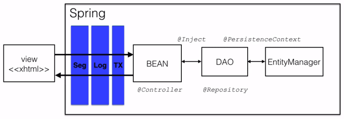
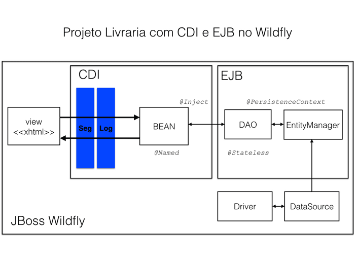

# JAVA EE

### Módulo 3 JSF III
- [Integração do CDI com JSF 2 Ver primeiro vídeo](#anc1)
- [Injeção de dependências com CDI](#anc2)
- [Gerenciando transações com CDI](#anc3)
- [Completando a aplicação](#anc4)
- [Integração com outras tecnologias: Maven, Spring e EJB](#anc5)


# Módulo 7

<a name="anc1"></a>

## Integração do CDI com JSF 2 Ver primeiro vídeo
### Configuração do CDI
- O CDI é uma especificação relativamente nova, mas os conceitos, principalmente a inversão de controle, são discutidos e usados há muito tempo na plataforma Java.
- O primeiro passo é baixar o JAR. A implementação do CDI se chama WELD e como estamos dentro de um servlet container, usaremos o: 
- [weld-servlet.jar](https://mvnrepository.com/artifact/org.jboss.weld.servlet/weld-servlet/2.3.2.Final)

- O CDI também precisa de uma configuração inicial, na verdade são duas pequenas configurações. 
    - A primeira é o arquivo context.xml, que fica no diretório WebContent/META-INF:

```
<?xml version="1.0" encoding="UTF-8"?>
<Context>
    <Resource name="BeanManager"
        auth="Container"
        type="javax.enterprise.inject.spi.BeanManager"
        factory="org.jboss.weld.resources.ManagerObjectFactory"/>
</Context>
```
 - A segunda configuração é o arquivo especifico do CDI. 
    - A especificação servlet tem web.xml, JSF tem o seu faces-config.xml e o CDI tem o seu beans.xml.
    - Esse arquivo deve ser criado na pasta WebContent/WEB-INF (ao lado dos "irmãos" web.xml e faces-config.xml):

```
<!-- WebContent/WEB-INF/beans.xml -->
<beans>
</beans>
```
- Queremos utilizar o CDI na nossa aplicação para gerenciar os Beans.
```
Trocando @ManagedBean por @Named, @ViewScoped passa a vir de javax.faces.view.ViewScoped e @SessionScoped passa a vir de javax.enterprise.context.SessionScoped.
```

<a name="anc2"></a>

## Injeção de dependências com CDI

### Gerenciando DAO e EntityManager com CDI
- O CDI já está tomando conta dos nosso beans, que eram responsabilidade do JSF, mas a nossa motivação para usar o CDI era na verdade a camada de persistência.
- Como o EntityManager é dependência de todos os métodos, dizemos que ele é uma dependência da classe. E o que fazemos com essa dependência? Como a classe precisa dela, vamos adicioná-la ao seu construtor;
- O CDI vai injetar o DAO! Injetar significa passar uma instância pronta para usar. Para isso, vamos utilizar a anotação @Inject no atributo, quando o CDI vê essa anotação, ele saberá que o bean "quer" ou "precisa" de um DAO e consequentemente criará uma instância dele e a disponibilizará para nós:

```
public class AutorBean implements Serializable {

    @Inject
    private DAO<Autor> dao;

    // restante do código, agora sem o construtor
}
```
- O CDI inverte o controle, inverter significa resolver a dependência e injetá-la. Não é mais a classe AutorBean que dá um new no DAO. O CDI está no controle, busca e injeta a dependência.

- Essa forma de inversão de controle é chamado de injeção de dependências.

### Ensinando o CDI a criar um EntityManager
- Queremos que o CDI tome conta desse EntityManager. Então vamos "dizer" para o CDI que o método getEntityManager produz um EntityManager! Vamos devagar, o método getEntityManager devolve um EntityManager novo, então sabe criá-lo, certo? Olhando para os padrões de projeto, podemos dizer que o método é uma fábrica, aplicando o padrão factory method. Só que o CDI chama esses métodos de fábrica de Producer. É apenas um outro nome para algo muito comum.

- Para deixar claro que o método sabe criar um EntityManager, devemos usar a anotação @Produces em cima do método:
- Com isso, o CDI conhece o método e sabe que ele devolve um EntityManager. Mas ele terá uma dúvida, o CDI desejará saber quantas vezes queremos criar um EntityManager dentro da aplicação. Iremos produzir um um novo EntityManager a cada requisição, para dizer isso ao CDI basta adicionar a anotação @RequestScoped:
- Produzimos um EntityManager a cada requisição, mas ainda temos um último problema. Veja na classe DAO que todos os métodos fecham o EntityManager! Ou seja, se removermos um autor, não conseguiremos gravar um novo na mesma requisição, o que não pode acontecer! Só devemos fechar o EntityManager depois da requisição. Então vamos apagar todas linhas que fecham o EntityManager (em.close()) na classe DAO.

- Agora basta avisarmos ao CDI como fechar o EntityManager. Já temos um método close em JPAUtil. E para chamar um método quando a requisição acaba, o CDI possui uma anotação @Disposes:

```
// AutorDAO
@Inject
private EntityManager em;
// Chama o método produtor desse método
// JPAUtil
@Produces
@RequestScoped  // Abre em cada requisição
public EntityManager getEntityManager() {
    return emf.createEntityManager();
}
// fecha em cada requisição
public void close(@Disposes EntityManager em) {
    em.close();
}
```
- Com injeção de dependência temos menos acoplamento no código.
- Com injeção de dependências não estamos criando os objetos, o container assume essa responsabilidade.
> Source > Delegate method `Eclipse`


<a name="anc3"></a>

## Gerenciando transações com CDI
### Centralizar o gerenciamento da transação
- Vamos tentar criar essa classe, que se chamará GerenciadorDeTransacao, no pacote br.com.caelum.livraria.tx, com um método executaTX, que executa o begin e commit:

- Quando criamos uma anotação, deve ficar claro que ela representa uma configuração e não uma implementação. A anotação @Transacional existe para configurar no método que é preciso ter uma transação. Nada mais do que isso, quem realmente vai chamar begin e commit é a nossa classe GerenciadorDeTransacao.

- O CDI passará um parâmetro no método executaTX, que guarda a informação de quem precisa da transação. Esse objeto tem um nome “bonito”: contexto de invocação ou em inglês InvocationContext. Através dele, podemos pedir para chamar o método, mas como não sabemos diretamente o nome do método foi dado um nome bem genérico, proceed():

- Mas como o CDI, ao ver a anotação @Transacional, saberá qual método deve executar? É executado algo antes e depois da chamada do método. O mundo do CDI chama o antes e depois de Around (ao redor), por isso devemos usar a anotação @AroundInvoke em cima do método:

```
@Transacional
@Interceptor
public class GerenciadorDeTransacao implements Serializable {

	private static final long serialVersionUID = 1L;
	@Inject
	private EntityManager em;
	
	@AroundInvoke
	public Object executaTX(InvocationContext context) throws Exception {
		em.getTransaction().begin();
		// chama o dao
		Object obj = context.proceed();
		em.getTransaction().commit();
		return obj;
	}
}
```
### Criando a anotação @Transacional
- Quando definimos uma nova anotação, algumas outras configurações genéricas são necessárias. A JVM deve saber onde esse anotação pode ser utilizada. Existem anotações que podem ser utilizadas em cima da classe (por exemplo @Named), existem outras que funcionam em cima do atributo (como @Inject). A nossa anotação deve funcionar em cima do método, certo? Então vamos deixar isso explicito:
- A nossa anotação é diferente e não há um impacto no compilador, ela deve funcionar na hora de executar (RUNTIME):

```
@InterceptorBinding
@Target( {ElementType.METHOD, ElementType.TYPE})
@Retention(RetentionPolicy.RUNTIME)
public @interface Transacional {

}
```
### Associar a anotação com a transação
- É essa a tarefa do CDI, ajudar a criar essa ligação. Uma vez feito, o CDI sabe que, ao encontrar a anotação @Transacional, deve chamar o método executaTX do GerenciadorDeTransacao

### Configuração do interceptador no beans.xml
- A implementação do método já está perfeita, mas não esqueça de anotar também com @Transacional os métodos gravar e remover de AutorBean.

- Por fim, precisamos configurar o configurar o GerenciadorDeTransacao no arquivo WebContent/WEB-INF/beans.xml:

```
<beans>
    <interceptors>
        <class>br.com.caelum.livraria.tx.GerenciadorDeTransacao</class>
    </interceptors>
</beans>
```

### Interceptadores
- O Interceptador é um dos padrões de projetos (Design Pattern) bem importante do mundo Java e não é exclusividade do CDI. Eles também existem para EJB, Spring e vários outros frameworks do mundo Java!

- Os Interceptadores ajudam a separar as responsabilidades da cada classe. Por exemplo, em vez de o DAO cuidar das chamadas de persistência e transação, tiramos a parte de transação e centralizamos dentro de um interceptador. Isso facilita a manutenção das nossas classes.

- Há desvantagens: podemos dizer que nosso código se torna mais difícil de entender, só olhando no DAO não é suficiente para saber como a transação está sendo gerenciada.


<a name="anc4"></a>

## Completando a aplicação

### Produzindo e injetando o FacesContext
- Classe da injeção
```
 @Inject
FacesContext context;
```
- Classe produtora
```
public class JsfUtil {

    @Produces
    @RequestScoped // javax.enterprise.context.RequestScoped
    public FacesContext getFacesContext() {
        return FacesContext.getCurrentInstance();
    }

}
```

### Relacionamento 

#### EAGER
- Automaticamente carrega os autores
```
@ManyToMany(fetch=FetchType.EAGER) 
```
#### LAZY
- Padrão, não trás os autores
```
@ManyToMany(fetch=FetchType.LAZY)
```
- Erro ao carregar autores quando o LAZY ativado
```
Type Exception Report
Message could not initialize proxy - no Session
Description The server encountered an unexpected condition that prevented it from fulfilling the request.
Exception
```

- Para utilizar o Lazy e deixar em uma condição melhor, quando se clicar em `Alterar` na página de livros, ele chama o método carregar no `livroBean`, a partir dai podemos fazer uma busca pelo id do autor enviado.
```
public void carregar(Livro livro) {
    this.livro = dao.buscaPorId(livro.getId());
    System.out.println("Carregando livro " + livro.getTitulo());
}
```
- Quando tornamos uma de nossa classes uma entidade JPA precisamos no mínimo:
    - Anotar a classe com @Entity e definir algum de seus atributos como chave através da anotação @Id. Além disso, precisamos adicionar a classe no arquivo persistence.xml. O uso de @GeneratedValue é opcional, mas altamente recomendado para atributos numéricos que anotados com @Id

<a name="anc5"></a>

## Integração com outras tecnologias: Maven, Spring e EJB

### Integração com o Maven
- O Maven vem para ajudar no gerenciamento do projeto, não é perfeito, porém é muito utilizado no mercado. Para aprender melhor a como fazer essa integração e a integração com outros projetos

#### Criando um novo projeto
- Vamos criar um novo projeto, que terá a integração com o Maven. Para isso, iremos em New -> Project -> Maven Project. Selecionamos Create a simple project (skip archetype selection), pois iremos criar tudo do zero.

- Algumas configurações na próxima página e depois Finish:
    - Group Id: Esse é o nosso pacote, que no caso é br.com.caelum;
    - Artifact Id: Esse é o nome do projeto. Já temos livraria no workspace, então vamos - colocar livraria-maven;
    - Version: 0.0.1-SNAPSHOT;
    - Packaging: war;
    - Name: Livraria Alura;
#### pom.xml
- O pom.xml é o arquivo XML do Maven. Vamos lembrar que queremos que o Maven gerencie nossos .jar e acabe com o trabalho manual. Para isso, precisamos informar ao Maven quais dependências ele irá gerenciar. Dentro do XML, nós informamos isso ao Maven através da tag `<dependencies></dependencies>`

#### Rodando com o Maven
- Como falado no início, podemos também rodar a aplicação através do Maven, para assim não ficarmos tão ligados ao Eclipse. Para isso, botão direito no projeto, e Run As... -> Maven Build. Em goals, ou seja, quando executarmos com o Maven, queremos que ele, por exemplo, dê um clean, compile o projeto e gere um WAR para deploy, para isso, colocamos:
```
clean compile package
```

### Caso der erro de bloqueio no no repository do maven
- Adicione isso ao arquivo `settings.xml` que fica na pasta .m2
```
<mirrors>
    <mirror>
        <id>maven-default-http-blocker</id>
        <mirrorOf>dummy</mirrorOf>
        <name>Dummy mirror to override default blocking mirror that blocks http</name>
        <url>http://0.0.0.0/</url>
    </mirror>
</mirrors>
```
- Se tiver esse erro:
```
You need either to explicitly disable SSL by setting useSSL=false, or set useSSL=true and provide truststore for server certificate verification.
```
- Pra resolver basta adicionar isso no persistence.xml, na conexão
```
<property name="javax.persistence.jdbc.url" value="jdbc:mysql://localhost:3306/livraria?autoReconnect=true&amp;useSSL=false" />
```

### Integração com o Spring
- Da mesma forma que o CDI, o Spring é um container que irá criar nosso bean, os DAOs e inicializar o JPA. Além disso, também possui interceptadores para transação, log e há até sofisticados interceptadores sobre segurança, que é o Spring Security.

- A diferença dele é que as configurações são um pouco diferentes e vem mais preparado para a utilização, sem a necessidade de criarmos producers e interceptadores da transação, por exemplo, além de outras coisas. Devemos ficar atentos para as anotações que também mudam: o bean se torna um @Controller, apesar de @Named (usado no CDI) também funcionar, e os DAOs se tornam um @Repository. Para as amarrações, temos algumas alternativas, embora o mais comum é utilizarmos um @Inject (similar ao do CDI), atente-se que no caso de um EntityManager devemos usar um @PersistenceContext, em vez de @Inject.




#### Web.xml
- Note que há uma configuração de dois listeners, usados justamente para o servidor iniciar o container do Spring. Essa configuração é análoga ao usada no CDI, com o bean.xml e o context.xml.

- Esse filtro, OpenEntityManagerInViewFilter, é usado para abertura e fechamento de um EntityManager no início e fim de uma requisição, respectivamente. Fazendo um comparativo com o CDI, nós tínhamos utilizado um producer, onde implementávamos essa forma de abrir e fechar o EntityManager. Com o Spring, já temos esses facilitadores prontos e nos preocupamos somente em configurá-lo.


```
<?xml version="1.0" encoding="UTF-8"?>
<web-app xmlns:xsi="http://www.w3.org/2001/XMLSchema-instance"
    xmlns:web="http://java.sun.com/xml/ns/javaee"
    xsi:schemaLocation="http://java.sun.com/xml/ns/javaee http://java.sun.com/xml/ns/javaee/web-app_3_0.xsd"
    version="3.0">

    <display-name>livraria</display-name>

    <listener>
        <listener-class>
            org.springframework.web.context.ContextLoaderListener
        </listener-class>
    </listener>
    <listener>
        <listener-class>
            org.springframework.web.context.request.RequestContextListener
        </listener-class>
    </listener>

    <!-- restante do arquivo -->

</web-app>
```

#### faces-config.xml
- Esse el-resolver, como pode-se imaginar, serve justamente para que as Strings das Expression Languages utilizadas nas nossas views do JSF possam ser processadas por um bean. Lembre-se que quem faz essa ligação é o próprio Spring.

```
<?xml version="1.0" encoding="UTF-8"?>

<faces-config version="2.2" xmlns="http://xmlns.jcp.org/xml/ns/javaee"
    xmlns:xsi="http://www.w3.org/2001/XMLSchema-instance"
    xsi:schemaLocation="http://xmlns.jcp.org/xml/ns/javaee http://xmlns.jcp.org/xml/ns/javaee/web-facesconfig_2_2.xsd">

    <application>
        <message-bundle>resources.application</message-bundle>
        <el-resolver>org.springframework.web.jsf.el.SpringBeanFacesELResolver</el-resolver>
        <locale-config>
            <default-locale>en</default-locale>
        </locale-config>
    </application>

    <lifecycle>
        <phase-listener>br.com.caelum.livraria.util.Autorizador</phase-listener>
        <phase-listener>br.com.caelum.livraria.util.LogPhaseListener</phase-listener>
    </lifecycle>

</faces-config>
```

#### bean.xml

- Por último, mas não menos importante, temos o arquivo applicationContext.xml, que é bem similar ao arquivo bean.xml do CDI

```
<?xml version="1.0" encoding="UTF-8"?>
<beans xmlns="http://www.springframework.org/schema/beans"
    xmlns:context="http://www.springframework.org/schema/context"
    xmlns:mvc="http://www.springframework.org/schema/mvc" xmlns:tx="http://www.springframework.org/schema/tx"
    xmlns:xsi="http://www.w3.org/2001/XMLSchema-instance"
    xsi:schemaLocation="
        http://www.springframework.org/schema/beans
        http://www.springframework.org/schema/beans/spring-beans-4.1.xsd
        http://www.springframework.org/schema/mvc
        http://www.springframework.org/schema/mvc/spring-mvc-4.1.xsd
        http://www.springframework.org/schema/context
        http://www.springframework.org/schema/context/spring-context-4.1.xsd
        http://www.springframework.org/schema/tx
        http://www.springframework.org/schema/tx/spring-tx-4.1.xsd">

    <!-- For Scanning the packages net.javaonline.spring.inventory & net.javaonline.web.jsf.inventory 
        and registering the beans with the applicationContext -->
    <context:component-scan base-package="br.com.caelum.livraria" />
    <context:annotation-config />
    <tx:annotation-driven />


    <bean id="transactionManager" class="org.springframework.orm.jpa.JpaTransactionManager">
        <property name="entityManagerFactory" ref="entityManagerFactory" />
    </bean>

    <bean id="entityManagerFactory"
        class="org.springframework.orm.jpa.LocalContainerEntityManagerFactoryBean">
        <property name="persistenceUnitName" value="livraria" />
    </bean>

</beans>
```
- Esse bean é o responsável por ler as informações do nosso persistence.xml. A property de name persistenceUnitName recebe como livraria como valor, que é o mesmo valor usado no src/main/resources/META-INF/persistence.xml:

- Logo que a aplicação é inicializada pelo servidor, essa configuração sobe a JPA com essa unidade de persistência.

#### applicationContext.xml

- Ainda no applicationContext.xml, encontramos a configuração do gerenciador de transação. Nele fazemos uso de uma própria classe do Spring, que resolve isso para nós:

- Perceba que além das configurações vistas acima, temos ainda as que habilitam o uso de anotações:

```
<bean id="transactionManager" class="org.springframework.orm.jpa.JpaTransactionManager">
    <property name="entityManagerFactory" ref="entityManagerFactory" />
</bean>
```

###  JBoss WildFly 
- [Aplicação](http://localhost:8081/livraria-wildfly-0.0.1-SNAPSHOT/login.xhtml)
- O que faremos agora é utilizar o JBoss WildFly para rodar nosso projeto. O que será que iremos precisar alterar no projeto? Vamos continuar usando JSF e o CDI, mas em um servidor de aplicação quem gerencia a JPA e as transações é um container, mais sofisticado que o CDI, chamado EJB. Então no nosso código, pra injetar oEntityManager vamos utilizar o EJB container que fará a injeção para nós. Contudo, não mexeremos em nada de JSF e CDI.

#### Provided
- Isso significa que a dependência fará parte do projeto apenas na hora de compilar (e não no WAR), porque ela será fornecida pelo servidor de aplicação. JSF, CDI, JPA e toda especificação JavaEE será suprimida pelo nosso servidor de aplicação WildFly.

#### Entendendo o projeto
- Agora que como usamos EJB no projeto, nossa camada de persistência mudou um pouco. Se olharmos o pocote br.com.caelum.livraria.bean , vemos que não precisamos mexer em nada. A única coisa que mudou é que agora não temos mais nosso pacote br.com.caelum.livraria.tx, pois assim como o Spring, agora nós temos um servidor mais sofisticado, que assume o gerenciamento da transação e assume essa responsabilidade.



#### EJB Stateless
- Se olharmos no nosso AutorDao vemos que agora temos a anotação @Stateless, que significa que esse DAO agora é um EJB, o que nos diz que agora ele pode receber um EntityManager aonde anotamos com @PersistenceContext.

#### Preparando o DataSource
- Se tentarmos rodar agora, vamos ver que o nosso servidor irá quebrar. Vemos nos erros que ele já encontra nossos DAO's, e carrega eles corretamente, mas vemos que ele dá um erro em uma livraria-ds, acusando uma dependência não satisfeita. Mas o que será isso ? Bom, o que mudou no projeto foi a nossa camada de persistência, então vamos dar uma olhada no nosso persistence.xml. Observamos que ele não tem mais nenhuma configuração, não tem mais usuários, url's de banco de dados e nem mais nada disso. Mas podemos notar que aqui encontramos a nossa configuração de datasource, que é exatamente o livraria-ds.

```
<?xml version="1.0" encoding="UTF-8"?>
<persistence xmlns="http://java.sun.com/xml/ns/persistence"
    xmlns:xsi="http://www.w3.org/2001/XMLSchema-instance"
    xsi:schemaLocation="http://java.sun.com/xml/ns/persistence http://java.sun.com/xml/ns/persistence/persistence_2_0.xsd"
    version="2.0">

    <persistence-unit name="livraria" transaction-type="JTA"><!-- aqui temos o datasource -->

        <jta-data-source>java:/livraria-ds</jta-data-source>

        <class>br.com.caelum.livraria.modelo.Usuario</class>
        <class>br.com.caelum.livraria.modelo.Livro</class>
        <class>br.com.caelum.livraria.modelo.Autor</class>
        <class>br.com.caelum.livraria.modelo.Venda</class>

        <properties>
            <property name="hibernate.hbm2ddl.auto" value="update" />
            <property name="hibernate.show_sql" value="true" />
            <property name="hibernate.dialect" value="org.hibernate.dialect.MySQL5InnoDBDialect" />
        </properties>
    </persistence-unit>

</persistence>
```

- Um dos recursos que o Wildfly nos oferece é um datasource. Um datasource é normalmente um provedor de conexões, um pool de conexões. Quando o Wildfly inicializa, ele inicializa esses provedores de conexões, e a nossa aplicação faz uma solicitação a esse datasource através do nome livrariads. Só que quando subimos a aplicação, ela solicitou um datasource que ainda não configuramos. Ou seja, temos essa dependência a configurar.

#### Configurando o modulo
- Vamos acesar o JBoss Wildflay fora do Eclipse. Entrando em wildfly -> modules -> system -> layers -> base -> com, vamos criar uma nova pasta: mysql. A ideia é que cadastremos o driver dentro do JBoss, e esse driver é o módulo que o JBoss irá carregar. Dentro da pasta mysql, vamos criar outra: main, e dentro dela colocaremos o .jar do mysql. Para que o JBoss interprete essa pasta e esse arquivo como módulo, é necessário um arquivo de configuração module.xml, que disponibilizamos para você aqui. O que esse arquivo faz é cadastrar o .jar como módulo do JBoss.

```
<?xml version="1.0" encoding="UTF-8"?>
<module xmlns="urn:jboss:module:1.1" name="com.mysql">
  <resources>
    <resource-root path="mysql-connector-java-5.1.38.jar"/>
  </resources>
  <dependencies>
    <module name="javax.api"/>
  </dependencies>
</module>
```

#### Configurar o datasource
- Porém agora temos um módulo do JBoss, como se fosse uma biblioteca disponível para ele usar. O que queremos é um dizer para o JBoss que esse módulo é um Driver. Por isso, voltamos a pasta raiz do Wildfly -> standalone -> configuration, e vamos mexer no arquivo standalone.xml. Vamos procurar por um elemento <drivers>, e cadastrar o nosso novo driver. Devemos adicionar:

```
<driver name="com.mysql" module="com.mysql">
    <xa-datasource-class>com.mysql.jdbc.jdbc2.optional.MysqlXADataSource</xa-datasource-class>
</driver>
```
- Após isso, só falta configurar o datasource, adicione o seguinte xml dentro do elemento <datasources>:

```
<datasource jndi-name="java:/livraria-ds" pool-name="livrariaDS" enabled="true" use-java-context="true">
    <connection-url>jdbc:mysql://localhost:3306/livrariadb</connection-url>
    <driver>com.mysql</driver>
    <pool>
        <min-pool-size>10</min-pool-size>
        <max-pool-size>100</max-pool-size>
        <prefill>true</prefill>
    </pool>
    <security>
        <user-name>root</user-name>
    </security>
</datasource>
```